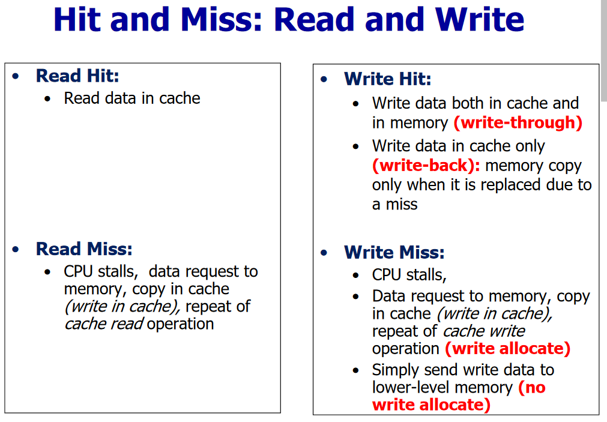

# Caches

The main goal of caches is to increase the performance of a computer through the memory system in order to:
- Provide the user the illusion to use a memory that is simultaneously large and fast
- Provide the data to the processor at high frequency

For this reason two principles are exploited:
1. **Temporal Locality**: when there is a reference to one memory element, the trend is to refer again to the same memory element soon (i.e., instruction and data reused in loop bodies)
2. **Spatial Locality**: when there is a reference to one memory element, the trend is to refer soon at other memory elements whose addresses are close by (i.e., sequence of instructions or accesses to data organized as arrays or matrices)

The resulting **memory hierarchy** is composed of **several levels** (main memory + levels of cache).

If the requested data is found in one of the cache blocks (upper level) then there is a **hit** in the cache access. If the requested data is not found in in one of the cache blocks (upper level) then there is a **miss** in the cache access. In case of a data miss, we need to:
1. **Stall** the CPU
2. Require to block from the main memory
3. Copy (write) the block in cache
4. Repeat the cache access (hit)

## Performance metrics
**Hit Rate**: number of memory accesses that find the data in the upper level with respect to the total number of memory accesses.

$$\text{Hit Rate} = \frac{\text{hits}}{\text{memory accesses}}$$

**Hit Time**: time to access the data in the upper level of the hierarchy, including the time needed to decide if the attempt of access will result in a hit or miss.

**Miss Rate**: number of memory accesses that do not find the data in the upper level with respect to the total number of memory accesses. Note that $\text{Hit Rate} + \text{Miss Rate} = 1$.

$$\text{Miss Rate} = \frac{\text{misses}}{\text{memory accesses}}$$

**Miss Penalty**: time needed to access the lower level and to replace the block in the upper level.

**Miss Time**: time needed to access a block wihich is not in the cache.

$$\text{Miss Time} = \text{Hit Time} + \text{Miss Penalty}$$

**Average Memory Access Time**

$$\text{AMAT} = \text{Hit Rate} \times \text{Miss Time} + \text{Miss Rate} \times \text{Miss Time}$$
$$\text{AMAT} = \text{Hit Time} + \text{Miss Rate} \times \text{Miss Penalty}$$

## Cache structure
Each entry in the cache includes:
- **Valid bit** to indicate if this position contains valid data or not. At the bootstrap, all the entries in the cache are marked as INVALID.
- **Cache Tag** contains the value that univocally identifies the memory address corresponding to the stored data.
- **Cache Data** contains a copy of data (block or cache line)

## Block placement strategies
Given the address of the block in the main memory, where the block can be placed in the cache (upper level)?

We need to find the correspondence between the memory address of the block and the cache address of the block.

#### 1) Direct Mapped Cache
Each memory location corresponds to one and only one cache location.
The cache address of the block is given by:
$$(\text{Block Address})\_{\text{cache}} = (\text{Block Address})\_{\text{mem}} \bmod (\text{Num. of Cache Blocks})$$

#### 2) Fully associative cache
In a fully associative cache, the memory block can be placed in any position of the cache.
All the cache blocks must be checked during the search of the block.

The index does not exist in the memory address, there are the tag bits only.

$$\text{Number of blocks} = \frac{\text{Cache Size}}{\text{Block Size}}$$

#### 3) n-way Set Associative Cache
Cache composed of sets, each set composed of $n$ blocks:
$$\text{Number of blocks} = \frac{\text{Cache Size}}{\text{Block Size}}$$
$$\text{Number of sets} = \frac{\text{Cache Size}}{\text{Block Size} \times n}$$

The memory block can be placed in any block of the set so the search must be done on all the blocks of the set.

Each memory block corresponds to a single set of the cache and the block can be placed in whatever block of the $n$ blocks of the set.

$$(\text{Set})\_{\text{cache}} = (\text{Block Address})\_{\text{mem}} \bmod n$$

With increasing $n$ there is a reduction of miss rate but higher implementation cost and higher hit time.
##### Addressing n-way set associative cache

N bit memory address composed of 4 fields:
- B less significant bit for the byte in the block
- K bit offset of the word in the block
- Index to identify the set: M bit
- Tag: N – (M + K + B) bit

**EXAMPLE 2-way 32bit**
Please indicate the structure of the 32-bit memory address of a 2-way set-associative cache with 2 MB cache size and a block size of 512 B.

- 2 MB = 2^21 B
- 512 B/block = 2^9 B/block
- Number of blocks = Cache Size / Block Size = 2^21/2^9 = 2^12 blocks
- Number of sets = Cache Size / (Block size x n) = 2^21 / 2\*2^9 = 2^11 sets

So the structure of the address is:
- Byte Offset: B = 9 bit (the block is of 2^9 B so I need 9 bit to address a Byte inside a block)
- Word Offset: K = 0 bit
- Index: M = 11 bit (2^11 sets)
- Tag: N-M-K-B=32-9-11=12

### Handling misses in different stategies
In case of a miss in a fully associative cache, we need to decide which block to replace: any block is a potential candidate for the replacement.

If the cache is set-associative, we need to select among the locks in the given set.

For a direct mapped cache, there is only one candidate to be replaced (no need of any block replacement strategy).

Main strategies used to choose the block to be replaced in associative caches:
- **Random (or pseudo random)**
- **LRU (Least Recently Used)**
- **FIFO (First In First Out) – oldest block replaced**

## Write policies
#### 1) Write-Through
The information is written to both the block in the cache and to the block in the lower level memory.

Simpler to be implemented, but to be effective it requires a **write buffer** to do not wait for the lower level of the memory hierarchy (to avoid write stalls).

The read misses are cheaper because they do not require any write to the lower level of the memory hierarchy.

#### 2) Write-Back
The information is written only to the block in the cache. The modified cache block is written to the lower level memory only when it is replaced due to a miss. We need to add a **DIRTY bit**: at the end of the write in cache, the cache block becomes dirty (modified) and the main memory will contain a value different with respect to the value in the cache: the main memory and the cache are **not coherent**.

The block can be written by the processor at the frequency at which the cache, and not the main memory, can accept it.

Multiple writes to the same block require only a single write to the main memory.

### Write allocate and no write allocate
In the case of a write miss in cache, the **Write allocate** policy (or “fetch on write”) is used to
allocate a new cache line in cache then write it (with a double write to cache).
The alternative policy (**No Write Allocate**) does not allocate a new cache line on a write miss,
but simply send the block to be written to the lower-level of the memory hierarchy.

Both cache allocation options (Write Allocate and No Write Allocate) **can be used to manage a
write miss for both write policies** (Write-back and Write-through). However, the best combination
is the Write-back with the Write Allocate to take advantage for the next writes to the block that
will be done again in the cache only.

Write Through uses a **no write allocate** (or “write-around”) strategy to handle write misses: Simply send write data to lower-level memory - don’t allocate new cache line!

Write back uses a **write allocate** (or “fetch on write”) strategy to handle write misses: allocate new cache line in cache then write (double write to cache!). Usually means that you have to do a “read miss” to fill in rest of the cache-line!

## Second level cache
The basic idea is to split the single cache in two levels:
- **L1** cache small enough to match the fast CPU cycle time
- **L2** cache large enough to capture many accesses that would go to main memory reducing the effective miss penalty

$$\text{AMAT} = \text{Hit Time}\_{\text{L1}} + \text{Miss Rate}\_{\text{L1}} \times \text{Miss Penalty}\_{\text{L1}}$$
$$\text{AMAT} = \text{Hit Time}\_{\text{L1}} + \text{Miss Rate}\_{\text{L1}} \times \text{Hit Time}\_{\text{L2}} + \text{Miss Rate}\_{\text{L1, L2}} \times \text{Miss Penalty}\_{\text{L2}}$$

## Memory technologies
There are two main options for memory technology:
1. **SRAM**: Is faster but more pricey (requires 6 transistors/bit) and requires only low power to retain bit. For this reasons is the technology **used in caches**.
2. **DRAM**: Is cheaper (1 transistors/bit) but must be re-written after being read and must also be periodically refreshed. It is the technology used for the **main memory**.

## Classifying Cache Misses
Three major categories of cache misses:
1. **Compulsory Misses**: cold start misses or first reference misses. The first access to a block is not in the cache, so the block must be loaded in the cache from the MM. These are compulsory misses even in an infinite cache.
2. **Capacity Misses**: can be reduced by increasing cache size. If the cache cannot contain all the blocks needed during execution of a program, capacity misses will occur due to blocks being replaced and later retrieved.
3. **Conflict Misses**: can be reduced by increasing cache size and/or associativity. If the block-placement strategy is set associative or direct mapped, conflict misses will occur because a block can be replaced and later retrieved when other blocks map to the same location in the cache.