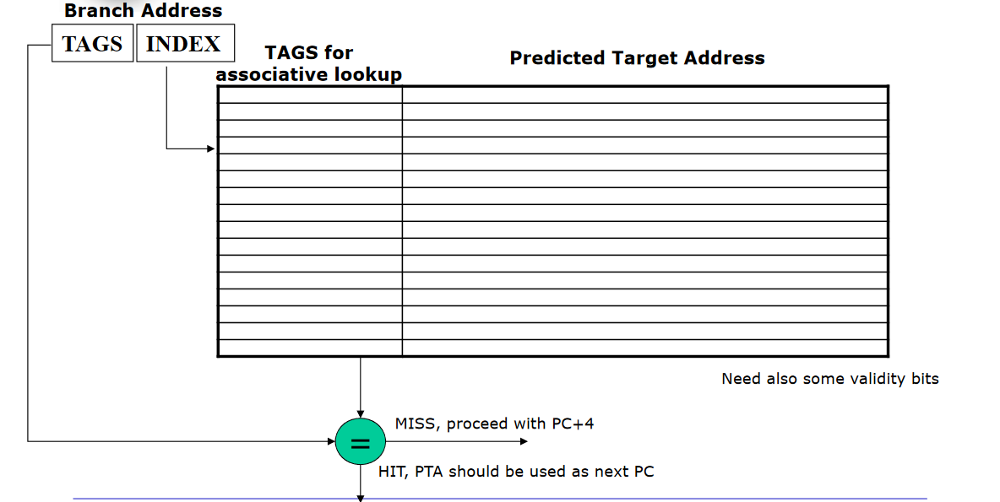
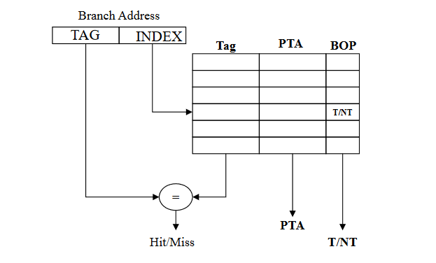
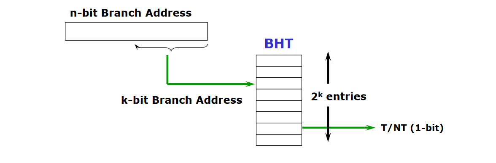
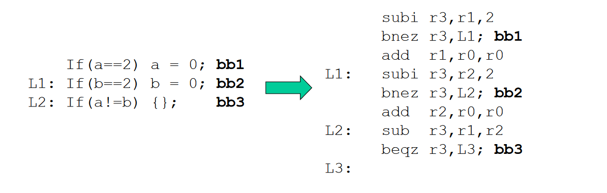
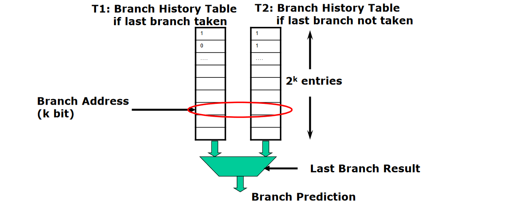
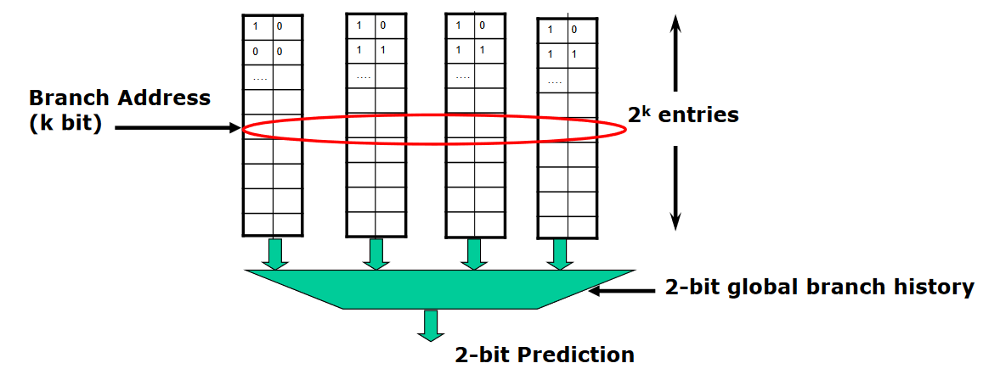

# Dynamic Branch Prediction

The basic idea of dynamic branch prediction is to use the past branch behavior to predict the future. We need hardaware to dynamiccaly predict the outcome of a branch: the prediction will depend on the behavior at **run time**.

Two interacting hardware blocks placed in the **instruction fetch stage** are needed to predict the next instruction to fetch:
1. **Branch Outcome Predictor (BOP)**: predicts the direction of a branch (taken or not)
2. **Branch Target Predictor / Branch Target Buffer (BTB)**: predicts the branch target address (PTA _ Predicted Target Address) in case of taken branch

If the predicted outcome is a misspediction we will need to flush the fetched instruction resulting in a **one cycle penalty** (optimized MIPS).

## Branch Target Buffer
Branch Target Buffer (Branch Target Predictor) is a **cache storing the Predicted Target Address (PTA)**. We access the BTB in the **IF stage** by using the address of the fetched branch instruction to index the cache.

A typical entry of the BTB is made by:
- **Tags of Branch Address**
- **Predicted Target Address** (expressed as PC-relative for conditional branches)
- **Branch Outcome Prediction** (prediction state bits)

## Outcome prediction techniques
### 1) Branch History Table (or Branch Prediction Buffer)
Table containing **1 bit** for each entry that says whether the branch was recentky taken or not.

The table is indexed by the lower porition k-bit of the address of the branch instruction and, for locality, we would expect that the most significant bits of the branch address are not changed.

The table has **no tags** (every access is a hit) and the prediction bit could has been put there by another branch with the same low-order address bits: but it doesn’t matter. *The prediction is just a hint!*

A **misprediction** occurs when one of the following:
- The prediction is incorrect for that branch
- The same index has been referenced by two different branches, and the previous history refers to the other branch (This can occur because there is no tag check). To reduce this problem it is enough to increase the number of rows in the BHT (that is to increase k) or to use a hashing function (such as in GShare).

A major shortcoming of the 1-bit BHT is that in a loop branch, even if a branch is almost always taken and then not taken once, the 1-bit BHT will mispredict twice:
1. At the last loop iteration, since the prediction bit will say taken, while we need to exit from the loop
2. When we re-enter the loop, at the end of the first loop iteration we need to take the branch to stay in the loop, while the prediction bit say to exit from the loop.

We can consider a BHT with **2 bits** to fix this shortcoming and allowing only one missprediction in loops.

In general it is possible to build an **n bits** BHT where when the counter is greater than or equal to one-half of its maximum value ($2^n-1$), the branch is predicted as taken. Studies on n-bit predictors have shown that 2-bit predictors behave almost as well at lower cost.

### 2) Correlating Branch Predictors
The basic idea is that the behavior of recent branches are correlated, that is the recent behavior of other branches rather than just the current branch (we are trying to predict) can influence the prediction of the current branch.

This is because branches are partially based on the same conditions so they can generate information that can influence the behavior of other branches.

For example:

Branch bb3 is correlated to previous branches bb1 and bb2. If previous branches are both not taken, then bb3 will be taken (a!=b).

A **(1,1) Correlating Predictors** means a 1-bit predictor with 1-bit of correlation: the behavior of last branch is used to choose among a pair of 1-bit branch predictors.

In general, the last branch executed is not the same instruction as the branch being predicted (although this can occur in simple loops with no other branches in the loops).

In general **(m, n)** correlating predictor records last *m* branches to choose from *2^m* BHTs, each of which is a n-bit predictor.

For example a (3,2) Correlating Branch Predictor with 128 total entries has: 7-bit index (2^7=128) composed of 3-bit (because there are 3 branches) global history and 4-bit branch address (4=7-3).

Studies have shown that the (2,2) predictor not only outperforms the simply 2-bit predictor with the same number of total bits (4K total bits), it often outperforms a 2-bit predictor with an unlimited number of entries.

### 3) Two-level Adaptive Branch Predictors
The first level history is recorded in one (or more) k-bit shift register called **Branch History Register (BHR)**, which records the outcomes of the k most recent branches (i.e. T, NT, NT, T) (used as a global history)

The second level history is recorded in one (or more) tables called **Pattern History Table (PHT)** of two-bit saturating counters (used as a local history).

The BHR is used to index the PHT to select which 2-bit counter to use. Once the two-bit counter is selected, the prediction is made using the same method as in the two-bit counter scheme.

##### 3.1) GA Predictor
The global 2-level predictor uses the correlation between the current branch and the other branches in the global history to make the prediction.

2-level predictor: PHT (local history) indexed by the content of BHR (global history).

##### 3.2) GShare Predictor
Variation of the GA predictor where want to correlate the BHR recording the outcomes of the most recent branches (global history) with the low-order bits of the branch address.

GShare: We make the XOR of 4-bit BHR (global history) with the low-order 4-bit of PC (branch address) to index the PHT (local history).
