# Improving cache performance

$$\text{AMAT} = \text{Hit Time} + \text{Miss Rate} \times \text{Miss Penalty}$$

In order to improve the AMAT we need to:
- Reduce the miss rate
- Reduce the miss penalty
- Reduce the hit time

The overall goal is to **balance fast hits and few misses**.

### 1) Reducting the miss rate
#### 1.1) Larger Cache Size
Obvious way to reduce capacity misses: to increase the cache capacity.

**Drawbacks**: Increases hit time, area, power consumption and cost

#### 1.2) Larger Block Size
Increasing the block size reduces the miss rate up to a point when the block size is too large with respect to the cache size.

Larger block size will reduce compulsory misses taking advantage of spatial locality.

**Drawbacks**:
- Larger blocks increase miss penalty
- Larger blocks reduce the number of blocks so increase conflict misses (and even capacity misses) if the cache is small.

[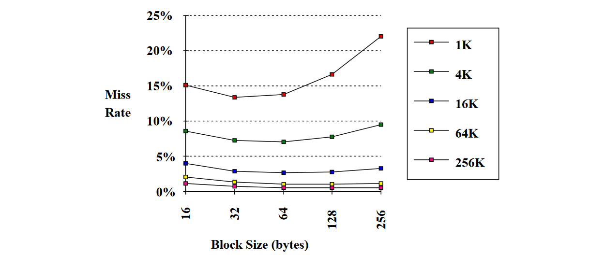](../../images/da149cf19c_6ZnGLVFupsR7LZfr-image-1651413682765.png)

#### 1.3) Higher Associativity
Higher associativity decreases the conflict misses.

**Drawbacks**: The complexity increases hit time, area, power consumption and cost.

A rule of thumb called "**2:1 cache rule**": Miss Rate Cache Size N = Miss Rate 2-way Cache Size N/2

##### Multibanked Caches
Multibanked caches introduce a sort of associativity. Organize cache as independent banks to support simultaneous access to increase the cache bandwidth.

Interleave banks according to block address to access each bank in turn (sequential interleaving):
[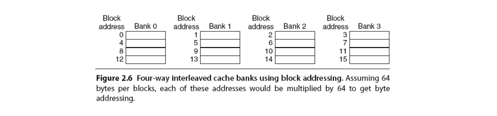](../../images/fe628beacf_eGr58WAs9XIAgFIX-image-1651413833426.png)

#### 1.4) Victim Cache
Victim cache is a small fully associative cache used as a buffer to place data discarded from cache to better exploit temporal locality. It is placed between cache and its refilling path towards the next lower-level in the hierarchy and it is checked on a miss to see if it has the required data before going to lower-level memory.

If the block is found in Victim cache the victim block and the cache block are swapped.

[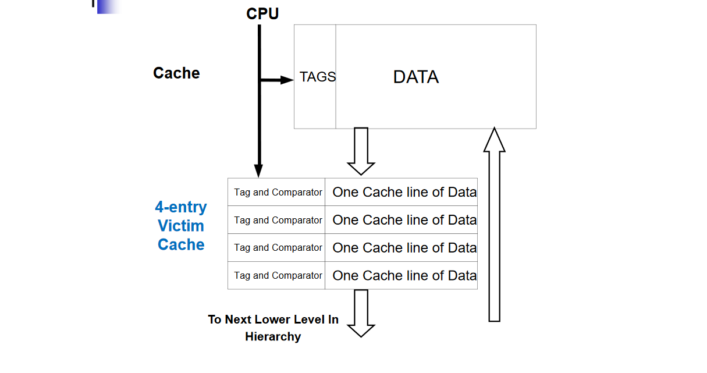](../../images/29026320c2_QYiyvRF6kJTScOPw-image-1651413939550.png)

#### 1.5) Pseudo-Associativity and Way Prediction
In n-way set associative caches (**way prediction**) use extra bits to predict for each set which of the n ways to try on the next cache access (predict the way to pre-set the mux):
- If the way prediction is correct  Hit time
- If way misprediction  **Pseudo hit** time in the other way and change the way predictor
- Otherwise go to the lower level of hierarchy (Miss penalty)

In direct mapped caches (**Pseudo-Associativity**) divide the cache in two banks in a sort of associativity.
- If the bank prediction is correct  Hit time
- If misprediction on the first bank, check the other bank to see if there, if so have a **pseudo hit** (slow hit) and change the bank predictor
- Otherwise go to the lower level of hierarchy (Miss penalty)

[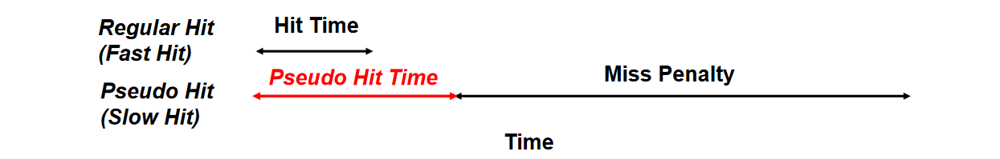](../../images/9566b2fbb0_qzN8hE0eorRXUMkb-image-1651414479402.png)

#### 1.6) *Hardware* Pre-fetching of Instructions and Data
To exploit locality, pre-fetch next instructions (or data) before they are requested by the processor. Pre-fetching can be done in cache or in an external **stream buffer**.

**Drawback**: If pre-fetching interferes with demand misses, it can lower performance

##### Instruction pre-fetch in Alpha AXP 21064
Fetch two blocks on a miss; the requested block (i) and the next consecutive block (i+1).
Requested block placed in cache, while next block in instruction stream buffer.

If miss in cache, but hit in stream buffer, move stream buffer block into cache and pre-fetch next block (i+2).

[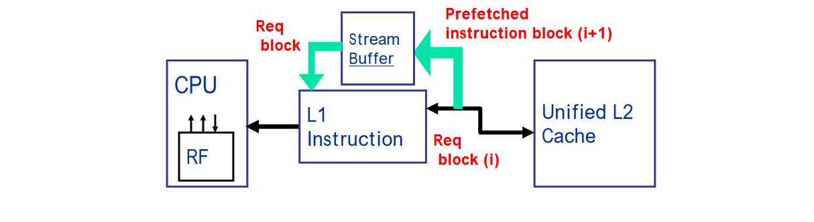](../../images/9da3b2f65d_XD7BW85u9vJHPNLF-image-1651414623646.png)

#### 1.7) *Software* Pre-fetching Data
**Compiler-controlled pre-fetching** (the compiler can help in reducing useless pre-fetching): Compiler inserts pre- fetch LOAD instructions to load data in registers/cache before they are needed.
- Register Pre-fetch: Load data into register
- Cache Pre-fetch: Load data into cache

Note: Issuing pre-fetch instructions takes time (instr. overhead).

#### 1.8) Compiler Optimizations
Apply profiling on SW applications, then use profiling info to apply code transformations.

##### Managing instructions
Reorder instructions in memory so as to reduce
conflict misses and use profiling to look at instruction conflicts

##### Managing Data
- **Merging Arrays**: improve spatial locality by single array of compound elements vs. 2 arrays (to operate on data in the same cache block)
[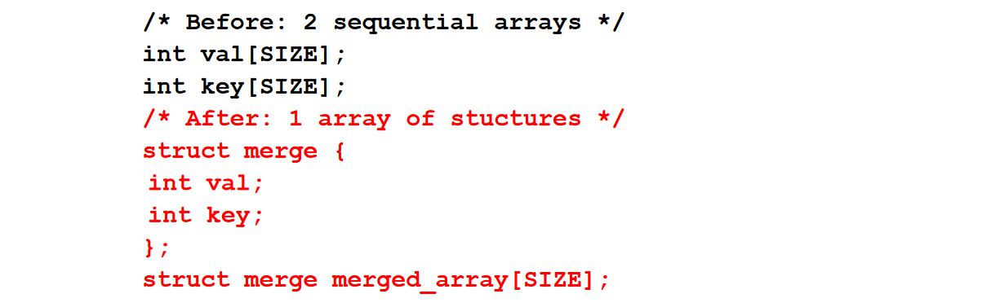](../../images/306c098038_94H1bRzxifvG25Oz-image-1651414999305.png)
- **Loop Interchange**: improve spatial locality by changing loops nesting to access data in the order stored in memory (re-ordering maximizes re-use of data in a cache block)
[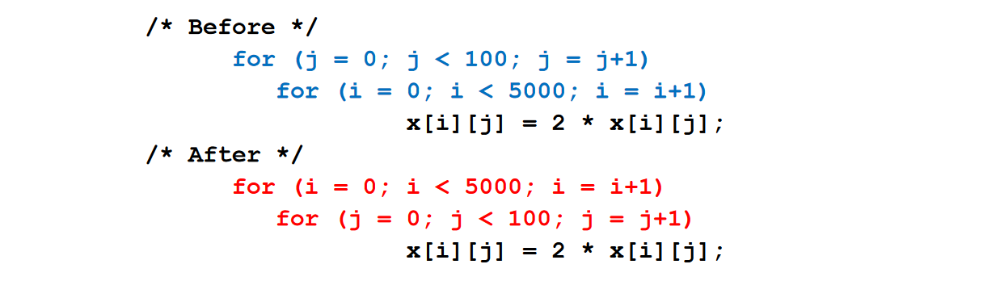](../../images/28b5956f36_yuHYaZgFmGY2urRF-image-1651415010900.png)
- **Loop Fusion**: improve spatial locality by combining 2 independent loops that have same looping and some variables overlap
[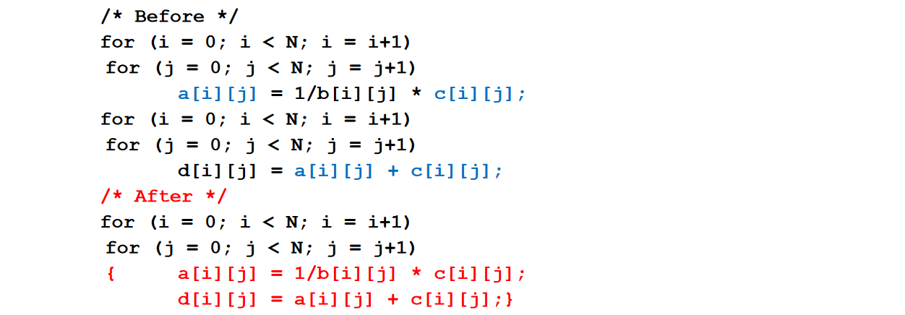](../../images/06c4680258_V2agfG8S6mfBkZLi-image-1651415023443.png)
- **Loop Blocking**: Improve temporal locality by accessing “sub-blocks” of data repeatedly vs. accessing by entire columns or rows. Subdivide the matrix into BxB blocks that fit the cache size to maximize accesses to data loaded in the cache before they are replaced

### 2) Reducing miss penalty
#### 2.1) Read Priority over Write on Miss
Giving higher priority to read misses over writes to reduce the miss penalty. The write buffer must be properly sized: Larger than usual to keep more writes in hold.

**Drawback**: This approach can complicate the memory access because the write buffer might hold the updated value of a memory location needed on a read miss => RAW hazard through memory.
[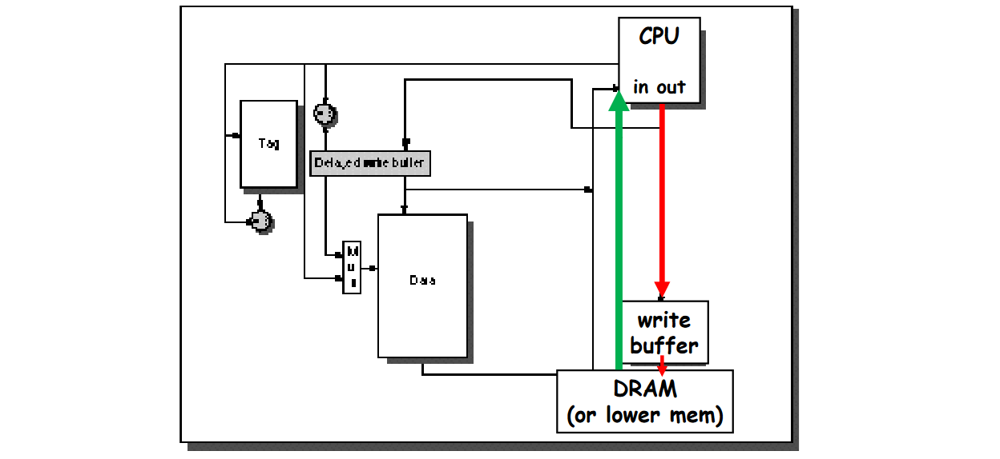](../../images/7860e2e32d_IhQ0L6mRPdwBrBFX-image-1651415134393.png)

There are two cases depending on the write policy:
1. **Write through** with write buffers might generate RAW conflicts with main memory reads on cache misses. Check the contents of the write buffer on a read miss: if there are no conflicts, let the memory access continue sending the read miss before the write. Otherwise, the read miss has to wait until thewrite buffer is empty, but this might increase the read miss penalty.
2. **Write Back**: When we consider a read miss replacing a dirty block instead of writing the dirty block to memory, then reading from memory, we could copy the dirty block to a write buffer, then do the read miss, and then do the write to memory.

#### 2.2) Sub-block Placement
Don’t have to load full block on a miss: move sub-blocks.We need valid bits per sub-block to indicate validity.

**Drawback**: no exploiting enough the spatial locality.

#### 2.3) Early Restart and Critical Word First
Usually the CPU needs just one word of the block on a miss. The idea is to don’t wait for full block to be loaded before restarting CPU (by sending the requested missed word).
- **Early restart**: Request the words in normal order from memory, but as soon as the requested word of the block arrives, send it to the CPU to let the CPU continue execution, while filling in the rest of the words in the cache block;
- **Critical Word First**: Request the missed word first from memory and send it to the CPU as soon as it arrives to let the CPU continue execution, while filling the rest of the words in the cache block. This approach is also called requested word first.

The benefits of this approach depend on the size of the cache block and the likelihood of another access to the portion of the block not yet been fetched.

When the least significant word of a block is missing, the Critical Word First technique is the best choice because it provide the least significant word as first, while in the Early Restart we need to wait for the full block to be loaded to get the least significant word.

#### 2.4) Non-blocking Caches (Hit under Miss)
Non-blocking cache (or lockup-free cache) allows data cache to continue to supply cache hits during a previous miss (Hit under Miss). It reduces the effective miss penalty by working during a miss instead of stalling CPUs on misses.

This technique **requires out-of-order execution** CPU: the CPU needs to do not stall on a cache miss. For example, the CPU can continue fetching instructions from I-cache while waiting for D-cache to return the missing data.

**Hit under Multiple Miss** or “Miss under Miss” may further lower the effective miss penalty by overlapping multiple misses.

#### 2.5) Second Level Cache
Introduce a second level cache.

- **L1** cache small enough to match the fast CPU clock cycle
- **L2** cache large enough to capture many accesses that would go to main memory reducing the effective miss penalty

More in general, the second level cache concept can be applied recursively to introduce multi-level caches to reduce overall memory access time.

#### 2.6) Merging Write Buffer
Reduce stalls due to full write buffer. Each entry of the Write Buffer can merge words from different memory addresses.

[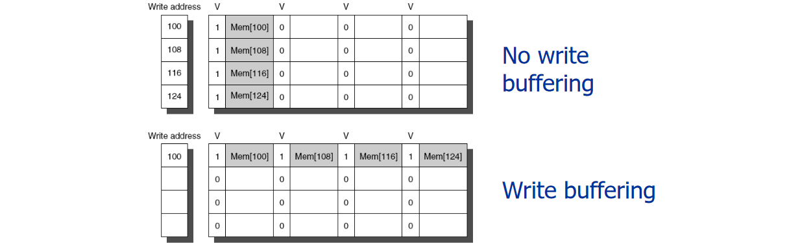](../../images/86930520c4_xCOt3KIwwFP2Vbl0-image-1651416415977.png)

### 3) Reducing hit time
Very important because the speed of L1 (hit time) affects the CPU clock rate!

#### 3.1) Small and Simple L1 Caches
Use Direct Mapped, small and simple on-chip L1 cache.

Critical timing path:
- addressing tag memory, then
- comparing tags, then
- selecting correct set

Direct-mapped caches can overlap tag compare and transmission of data.

Lower associativity reduces power because fewer cache lines are accessed.

#### 3.2) Avoiding Address Translation
Avoiding virtual address translation during indexing of cache.

##### Virtually Addressed Cache
Send virtual address to cache. Called **Virtually Addressed Cache** or just Virtual Cache.

**Drawbacks**:
- Every time process is switched logically must flush the cache; otherwise get false hits.
- Dealing with aliases (sometimes called synonyms): two different virtual addresses map to same physical address
- I/O must interact with cache, so need virtual address

##### Index with Physical Portion of Virtual Address
If index is physical part of address, can start tag access in parallel with address translation so that can compare to physical tag.
[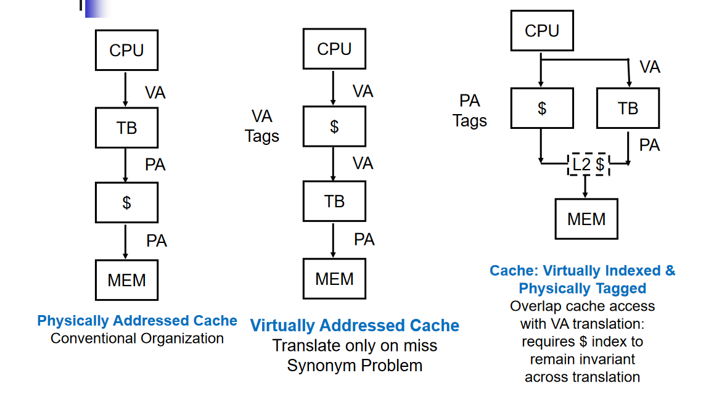](../../images/9ebd17aed1_fvB4A4rjQubOWYw8-image-1651416725037.png)

#### 3.3) Pipelined Writes
Pipeline Tag Check and Update Cache Data as separate stages: current write tag check & previous write cache update.

The “Delayed Write Buffer”; must be checked on reads; either complete write or read from write buffer.

#### 3.4) Fast Writes on Misses Via Small Sub-blocks for Write Through
If most writes are 1 word, sub-block size is 1 word, & write through then always write sub-block & tag immediately.

There are a few cases possible:
- **Tag match and valid bit already set**: Writing the block was proper, & nothing lost by setting valid bit on again.
- **Tag match and valid bit not set**: The tag match means that this is the proper block; writing the data into the sub-block makes it appropriate to turn the valid bit on.
- **Tag mismatch**: This is a miss and will modify the data portion of the block. Since write-through cache, no harm was done; memory still has an up-to-date copy of the old value. Only the tag to the address of the write and the valid bits of the other sub-block need be changed because the valid bit for this sub-block has already been set

Doesn’t work with write back due to last case

## Cache Optimization Summary
[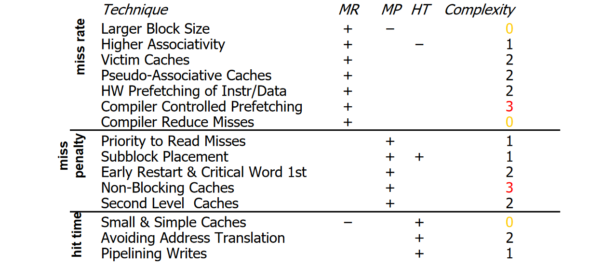](../../images/863bb7c4f0_MEzz3pj4pDgp4dxE-image-1651414084333.png)
[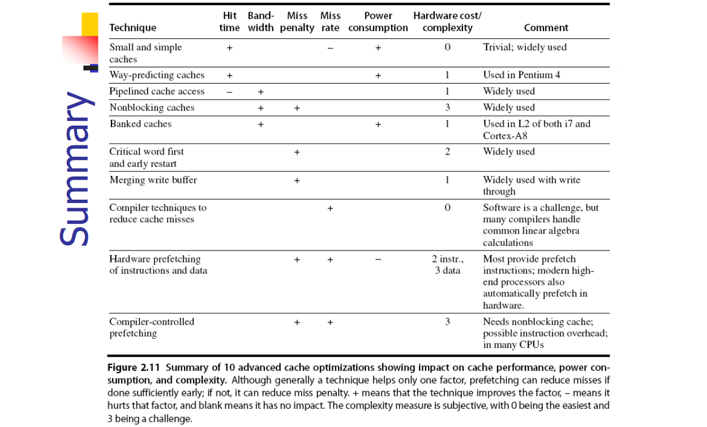](../../images/935daaef92_SOUqaUVo4lcF8WMk-image-1651414097234.png)