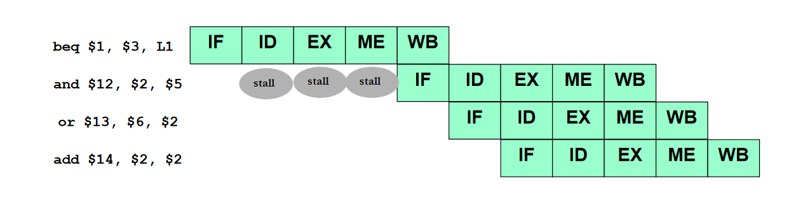
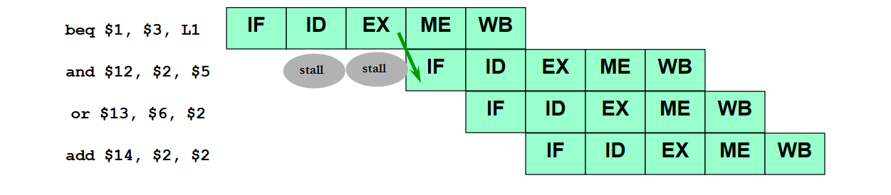
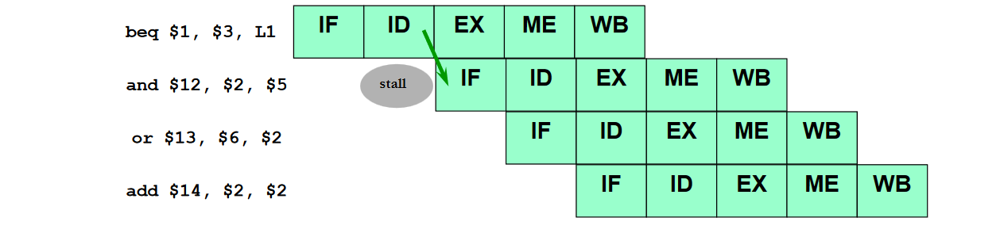

# Pipeline hazards

An **hazard** is created when there is a dependence between instructions and the instructions are close enouth that the overlap caused by pipelining would change the order of access to the operands involved in the dependence.

Hazards prevent the next instruction in the pipeline from executing therefore they **reduce the performance** of the pipeline.

## Hazards classification
#### 1) Structural hazards
Attempt to use the ame resource from different instructions simultaneously. In other words, the hardware resources needed for an instruction are busy because they are used by another instruction therefore preventing the execution.

In the optimized MIPS pipeline the are not these hazards since the instruction and data memory are separated and in is possible to write and read the same registry in the same clock cycle (write in the first half and read in the second half).

#### 2) Data hazards
Attempt to use a result of an instruction before the result is ready.

Some possible solutions to data hazards are:
1. **Insertion of nop**
2. **Instruction scheduling**: avoid that dependent instruction are too close inserting independent instruction between the dependent ones.
3. **Insertion of stalls**
4. **Data forwarding**: temporary results are stored in buffer inside the pipeline and they can be used instead of waiting for the write back of the result in the register file.

There are different types of data hazards:
1. **Read after write (RAW)**: instruction *n+c* tries to read a source register before the previus instruction *n* has written the result in the RF. For example
```assembly
add $r1, $r2, $r3
sub $r4, $r1, $r5
```
When using forwarding these hazards are solved exept for the load use hazard where it is necessary to add one stall.
2. **Write after write (WAW)**: instruction *n+c* tries to write to a register before it has writte by the previous instruction *n* (**out of order**). This hazard does not occur in the MIPS architecture because all write operations occur in order.
3. **Write after read (WAR)**: instruction *n+c* tries to write to a register before it has been read from the previus instruction *n*. This hazard does not occur in the MIPS architecture because read occurs in the ID stage while write in the WB stage and the issue of instructions is in order.

#### 3) Control hazards
Attempt to make a decision on the next instruction to execute before the condition is evaluated.

According to the ALU operations a **bransh outcome** (taken or not taken) is decided and the program counter is updated to the **branch target address** (*PC+4+offset*) or to the next instruction (*PC+4*).

In the mIPS pipeline the branch outcome and branch target address are ready at the end of the execution stage. The branch instruction may or may not change the PC in MEM stage but the next 3 instructions are already fetched and their execution is started.

If the branch is taken it is necessary to **flush** the next 3 instructions before they write the results.

Another, more conservative assumption, is to stall the pipeline until the branch decision is ready.
[](../../images/ae493851a5_1Bs8QNkWI9OcsIWT-image-1651308930062.png)
[](../../images/2dab5f1ce7_pGpzItwKRaE7ST0G-image-1651308949817.png)

If we are considering an optimized MIPS processor where the branch decisions are in the ID stage then:
[](../../images/5b7de6bd3c_mHHc1f4RzttOXFnR-image-1651309115867.png)