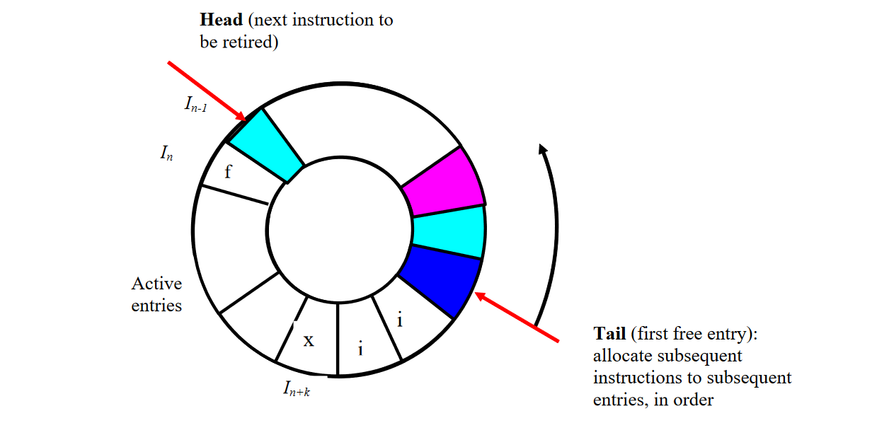
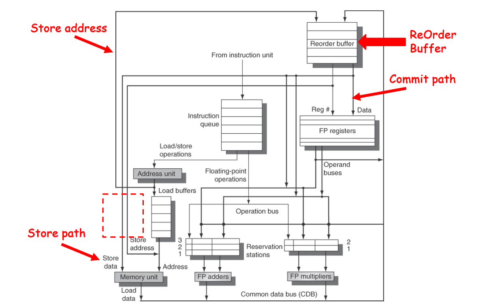

# Speculation and reorder buffer

## Hardware-based Speculation
Extends the ideas of dynamic scheduling beyond branches combining 3 concepts:
1. Dynamic branch prediction
2. Speculation to **enable the execution of instructions before the control dependences are solved** by **undoing the effects of an incorrectly speculated sequence**
3. Dynamic scheduling beyond branches

Therefore we need to **separate the process of execution completion from the commit** of the instruction result in the RF or in memory. The solution to this problem is introducing an HW buffer, called **Reorder
Buffer**, to **hold the result of an instruction that has finished execution, but not yet committed in RF/memory**.

## Reorder Buffer (ROB)
It is a buffer introduced to support **out-of-order execution but in-order commit**.

Buffer to *hold the results of instructions that have finished execution but not yet committed* and *pass results among instructions* that have started speculatively after a branch. Moreover, it mantains a **precise interrupt model** because instruction commit happens in order.

The ROB is a **circular buffer** with the head pointer indicating the instruction that will commit (leaving ROB) first and with the tail pointer (indicating next free entry)

Instructions are written in ROB in strict program order: when an instruction is issued, an entry is allocated to the ROB in sequence (in-order).

Each entry must:
- **keep the status of an instruction**: issued, execution started, execution completed, ready to commit.
- **include a speculative status flag**: indicating whether the instruction is being speculatively executed or not.

An instruction is ready to commit (retire) if and only if:
1. It has finished, and
2. It is not marked as speculative, and
3. All previous instructions have already retired.

The ROB allows instructions to **commit in-order** (and to modify the memory/registers in-order),
even if instrcution execution is out-of-order. Furthermore, an exception/interrupt is taken only
when the corresponding instruction reaches the head of the ROB and the instruction is not
speculative. This implies that **exceptions/interrupts are accepted (and executed) in-order** at the
commit stage, that means a **precise interrupt model by definition**.

## Speculative Tomasulo Architecture with ROB
The ROB buffer can also be used to pass results among instructions to start execution as soon as possible. Therefore, the **renaming function of Reservation Stations in Tomasulo is replaced by ROB entries**. In this setup reservation stations are used only to buffer instructions and operands to FUs (to reduce structural hazards).

Implicit register renaming by using the ROB entries to eliminate WAR and WAW hazards and enable dynamic loop unrolling.

The content of the ROB in this architecture is:
- **Instruction type field**: indicates whether instruction is a branch (no destination result), a store (has memory address destination), or a load/ALU (register destination);
- **Destination field**: supplies register number (for loads and ALU instructions) or memory address (for stores) where results should be written;
- **Value field**: used to hold value of result until instruction commits;
- **Ready field**: indicates that instruction has completed execution, value is ready;
- **Speculative field**: indicates whether instruction is executed speculatively or not;

The **Common Data Bus** broadcasts the results from the Functional Units to the Reservations Stations and the ReOrder Buffer.

#### 1) Issue
Get instruction from instructions queue.

If there are one RS entry free and one ROB entry free then instruction issued;

If its operands are available in RF or in ROB, they are sent to RS; Number of ROB entry allocated for result is sent to RSs (to tag the result when it will be placed on the CDB).

If RS full or/and ROB full: instruction stalls.

#### 2) Execution started
When both operands are ready in the RS (RAW solved) start to execute. If one or more operands are not yet ready then check for RAW solved by monitoring CDB for result.

#### 3) Execution completed & Write result in ROB
Write result on Common Data Bus to all awaiting FUs and to the ROB value field. Also Mark RS as available.

#### 4) Commit
When instruction at the head of ROB and the result are ready, update RF with result (or store to memory) and remove instruction from ROB.

Mispredicted branch flushes speculative ROB entities (sometimes called “graduation”).

There are 3 different possible sequences:
1. **Normal commit**: instruction reaches the head of the ROB, result is present in the buffer. Result is stored in the Register File, instruction is removed from ROB;
2. **Store commit**: as above, but result is stored in memory rather than in the RF;
3. **Instruction is a branch with incorrect prediction**: it indicates that speculation was wrong. Speculative ROB entities are flushed (“graduation”), execution restarts at correct successor of the branch. If the branch was correctly predicted, branch is finished.