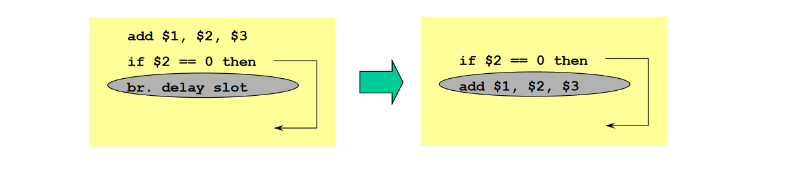
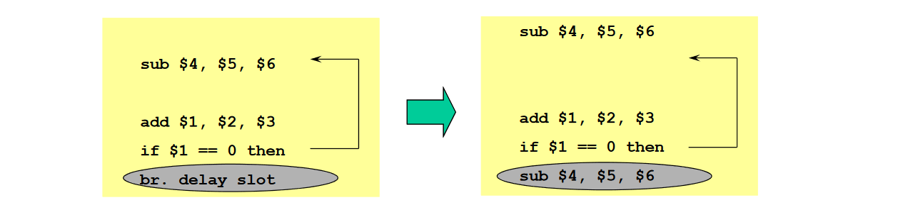
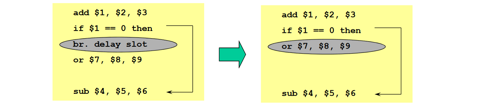

# Static Branch Prediction

Static branch prediction is done and fixed at **compile time**. This technique is typically used when the branch behavior for the target application is highlyh predictable at compile time.

*Note: we assume to use the optimized MIPS pipeline*

### 1) Branch always not taken (Predicted-Not-Taken)
Is the easiest form of prediction: we assume the branch as not taken thus the sequential instruction flow that we have fetched can continue.

If the BO at the end of the ID stage will result in taken then there is a **missprediction** and we need to flush the next instruction already fetched (it is turned into a nop) and we need to fetch the instruction at the branch target address so there will be a **one cycle performance penalty**.

If on average the 50% of branches are not taken with this hypothesis we can halve the cost of control hazards. This type of prediction could be applied to **IF_THEN_ELSE** conditional statements, expecially if the ELSE clause is less probable.

### 2) Branch always taken (Predicted-Taken)
We assume the branch as taken.

If the BO at the end of the ID stage will result in not taken then there is a **missprediction** and we need to flush the next instruction already fetched (it is turned into a nop) and we need to fetch the next instruction so there will be a **one cycle performance penalty**.

This prediction scheme *makes sense only for pipelines where the branch target address is known before the branch outcome*. In the optimized MIPS we anticipated the computation of both the branch outcome and the branch target address in the ID stage, we need:
- Either to **anticipate the computation of BTA at the IF stage** (before the ID stage where we compute the Branch Outcome);
- Or to **add in the IF stage a Branch Target Buffer**, a cache where to store the predicted values of the BTA for the next instruction after each branch.

### 3) Backward Taken Forward Not Taken (BTFNT)
The prediction is based on the branch direction:
- Backward-going branches are predicted as taken. Example: the branches at the end of DO-WHILE loops
- Forward-going branches are predicted as not taken. Example: the branches of IF-THEN-ELSE

### 4) Profile-Driven Prediction
We assume to profile the behavior of the target application program by several early runs by using different data sets.

The branch prediction is based on profiling information collected during earlier runs.

The profile-driven prediction method can use **compiler hints** associated to each branch instruction.

### 5) Delayed Branch
The job of the compiler is to find a valid and useful instruction to be scheduled in the **branch delay slot**.

In deeply pipelined processors, the delayed branch is longer that one cycle: many slots must be filled for every branch. Compilers can fill the remaining slots with nops.

The main limitations on delayed branch scheduling arise from:
- The restrictions on the instructions that can be scheduled in the delay slot.
- The ability of the compiler to statically predict the outcome of the branch.

To improve the ability of the compiler to fill the branch delay slot most processors have introduced a **canceling or nullifying branch**: the instruction includes the hint direction that the branch was predicted.

MIPS architecture has the **branch-likely instruction**, that can be used as cancel-if-not-taken branch:
- The instruction in the branch delay slot is executed whether the branch is taken.
- The instruction in the branch delay slot is not executed (it is turned to a nop) whether the branch is not taken.

##### From before
The branch delay slot is scheduled with an independent instruction from before the branch. The instruction in the branch delay slot is always executed, whether the branch will be taken or not taken.

##### From Target
The branch delay slot is scheduled with one instruction from the target of the branch (branch taken).

Drawback: Usually the target instruction  needs to be copied, whenever it can be reached by another path.

This strategy is preferred when the branch is taken with high probability, such as DO-WHILE loop branches (backward branches).

If the branch is not taken (misprediction), the instruction in the delay slot needs to be flushed or it must be OK to be executed also when the branch goes in the unexpected direction.

##### From Fall-Through
The branch delay slot is scheduled with one instruction from the fall-through path (branch not taken).

This strategy is preferred when the branch is not taken with high probability, such as IF-THEN-ELSE statement where the ELSE path is less probable.

If the branch is taken (misprediction), the instruction in the delay slot needs to be flushed or it must be OK to be executed also when the branch goes in the unexpected direction.

##### From after
The branch delay slot is scheduled with one instruction from after the branch.