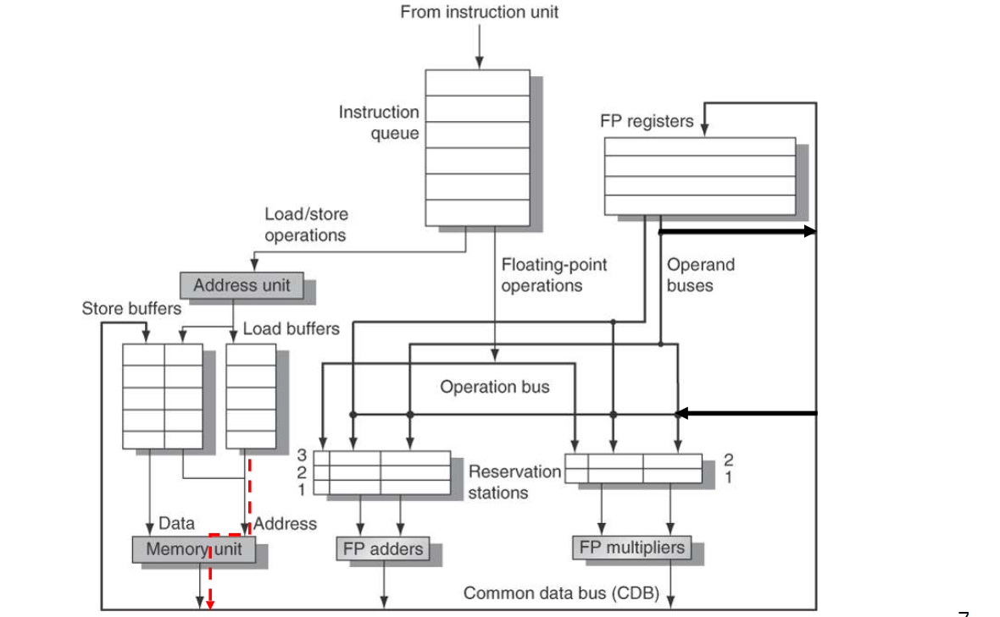

# Tomasulo Algorithm

Tomasulo introduces the **Implicit Register Renaming to avoid WAR & WAW hazards**.

In the Tomasulo architecture some buffers called **Reservation Stations (RS)** are placed in front of the functional units to store pending operands. Registers in instructions are replaced by their values or pointers to RS to enable Implicit Register Renaming.

In this way we avoid WAR and WAW hazards by renaming results by using RS numbers instead of register file. And, in generall, there are more RS than registers so more optimizations are possible.

Results are passed to the functional units from Reservation Stations, not through Registers, over to **Common Data Bus** that broadcasts results to all functional units and to Store buffers.

**Main advantages** of using reservation stations are:
- To enable implicit register renaming to avoid WAR and WAW hazards;
- To enable a sort of data forwarding to shorten the solution of RAW hazards without waiting the
- data write-back in the RF.
- To reduce structural hazards by buffering instructions and source operands for FUs

The **Common Data Bus** broadcasts the results of the Functional Units to the
Reservations Stations, the Register File and the Store Buffers.

## Tomasulo architecture components
#### Reservation Station Components
- **Tag** identifying the RS
- **Busy** = Indicates RS Busy
- **OP** = Type of operation to perform on the component.
- **Vj, Vk** = Value of the source operands j and k. Vj holds memory address for loads/stores.
- **Qj, Qk** = Pointers to RS that produce Vj, Vk

Note: Only one of V-field or Q-field is valid for each operand

#### Register File and Store Buffers
Each entry in the RF and in the Store buffers have:
- A **value (Vi)** field which holds the register/buffer content;
- A **pointer (Qi)** field which corresponds to the number of the RS producing the result to be stored in this register (or store buffer). If the pointer is zero means that the value is simply the register/buffer content (no active instruction is computing the result).

#### Load/Store Buffers
Load/Store buffers have **Busy** and an **Address field**.

Address field holds information for memory address calculation for load/stores. Initially it contains the instruction offset (immediate field); after address calculation, it stores the effective address.

## Stages of the Tomasulo Algorithm
#### 1) Issue
Get an instruction *I* from the head of instruction queue (maintained in FIFO order to ensure in-order issue).

Check if an RS is empty (i.e., check for structural hazards in RS) otherwise stalls. If operands are not in RF, keep track of FU that will produce the operands (Q pointers).

If there is not an empty RS  structural hazard in RS and the instruction stalls.

- **WAR resolution**: If *I* writes *Rx*, read by an instruction *K* already issued, *K* knows already the value of *Rx* read in RS buffer or knows what instruction (previously issued) will write it. So the RF can be linked to *I*.
- **WAW resolution**: Since we use in-order issue, the RF can be linked to *I*.

#### 2) Execution
**When both operands are ready and execution unit available, then start execution.** If not ready, **monitor the Common Data Bus** for results.

By delaying execution until operands are available, **RAW hazards are avoided** at this stage.

For load and stores a **two-step execution process** is implemented:
1. Compute effective address when base register is available, place it in load or store buffer.
2. Loads in Load Buffers execute as soon as memory unit is available; stores in store buffer wait for the value to be stored before being sent to memory unit. 

Loads and Stores are kept in program order through effective address calculation, this helps in preventing hazards through memory.

**To preserve exception behavior:**
1. No instruction can initiate execution until all branches preceding it in program order have completed. This restriction guarantees that an instruction that generates an exception really would have been executed.
2. If branch prediction is used, CPU must know prediction correctness before beginning execution of following instructions. 

#### 3) Write
When result is available, write it on Common Data Bus and from there into Register File and into all RSs (including store buffers) waiting for this result.

Stores also write data to memory unit during this stage (when memory address and result data are available).

Mark reservation station available.

## Tomasulo drawbacks
- Complexity
- Large amount of hardware
- Delays of 360/91, MIPS 10000, IBM 620?
- Many associative stores (CDB) at high speed
- Performance limited by Common Data Bus
- Multiple CDBs  More FU logic for parallel assoc stores