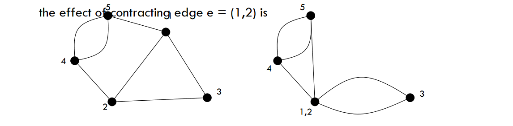
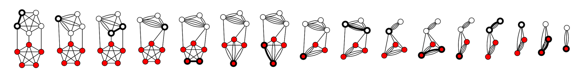

# Kerger's Min-Cut algorithm

## The Minimum Cut problem
A cut $(S,T)$ in an undirected graph $G=(V,E)$ is a partition of the vertices $V$ into two non-empty, disjoint sets $S\cup T=V$. The cutset of a cut consists of the edges $\lbrace uv\in E\colon u\in S,v\in T\rbrace$ between the two parts. The size (or weight) of a cut in an unweighted graph is the cardinality of the cutset, i.e., the number of edges between the two parts:

$$w(S,T)=|\lbrace uv\in E\colon u\in S,v\in T\rbrace|\,$$

There are $2^{{|V|}}$ ways of choosing for each vertex whether it belongs to $S$ or to $T$, but two of these choices make $S$ or $T$ empty and do not give rise to cuts. Among the remaining choices, swapping the roles of $S$ and $T$ does not change the cut, so each cut is counted twice; therefore, there are $2^{{|V|-1}}-1$ distinct cuts. The minimum cut problem is to find a cut of smallest size among these cuts.

For weighted graphs with positive edge weights $w\colon E\rightarrow {\mathbf R}^{+}$ the weight of the cut is the sum of the weights of edges between vertices in each part
$$w(S,T)=\sum _{{uv\in E\colon u\in S,v\in T}}w(uv)$$,

which agrees with the unweighted definition for $w=1$.

A cut is sometimes called a “global cut” to distinguish it from an “$s-t$ cut” for a given pair of vertices, which has the additional requirement that $s\in S$ and $t\in T$. Every global cut is an $s-t$ cut for some $s,t\in V$. Thus, the minimum cut problem can be solved in polynomial time by iterating over all choices of $s,t\in V$ and solving the resulting minimum $s-t$ cut problem using the max-flow min-cut theorem and a polynomial time algorithm for maximum flow, such as the push-relabel algorithm, though this approach is not optimal. Better deterministic algorithms for the global minimum cut problem include the Stoer–Wagner algorithm, which has a running time of $O(mn+n^{2}\log n)$.

## Karger's algorithm - contraction algorithm
The fundamental operation of Karger’s algorithm is a form of **edge contraction**. The result of contracting the edge $e=\lbrace u,v\rbrace$ is new node $uv$. Every edge $\lbrace w,u\rbrace$ or $\lbrace w,v\rbrace$ for $w\notin \lbrace u,v\rbrace$ to the endpoints of the contracted edge is replaced by an edge $\lbrace w,uv\rbrace$ to the new node. Finally, the contracted nodes $u$ and $v$ with all their incident edges are removed. In particular, the resulting graph contains no self-loops. The result of contracting edge $e$ is denoted $G/e$. 

[](../../images/1bf1fa9ba4_xST97r39dmX16tta-image-1667560778000.png)

The contraction algorithm repeatedly contracts random edges in the graph, until only two nodes remain, at which point there is only a single cut. 

The key idea of the algorithm is that it is far more likely for non min-cut edges than min-cut edges to be randomly selected and lost to contraction, since min-cut edges are usually vastly outnumbered by non min-cut edges. Subsequently, it is plausible that the min-cut edges will survive all the edge contraction, and the algorithm will correctly identify the min-cut edge. 

[](../../images/38b4cc6592_FVW2WNE2AJXpVQhu-single-run-of-kargers-mincut-algorithm-svg.png)

```
contract(G=(V,E)):
	while |V| > 2:
    	choose e in E at random
        G = G/e
    return the oly cut in G
```

### Success probability of the contraction algorithm
In a graph $G=(V,E)$ with $n=|V|$ vertices the contraction algorithm returns a minimum cut with polynomially small probability $\binom{n}{2}^{-1}$. Every graph has $2^{n-1} -1 $ cuts among which at most $\tbinom{n}{2}$ can be minimum cuts. Therefore the success probability for this algorithm is much better than the probability for picking a cut at random which is at most $\tbinom{n}{2}/( 2^{n-1} -1 )$.

For instance the cycle graph on $n$ vertices has exactly $\binom{n}{2}$ minimum cuts given by every choice of 2 edges. The contraction procedure finds each of these with equal probability.

To further establish the lower bound on the success probability let $C$ denote the edges of a specific minimum cut of size $k$. The contraction algorithm returns $C$ if none of the random edges belongs to the cutset of $C$. In particular the first edge contraction avoids $C$ which happens with probability $1-k/|E|$. The minimum Degree of $G$ is at least $k$ (otherwise a minimum degree vertex would induce a smaller cut where one of the two partitions contains only the minimum degree vertex) so $|E|\geqslant nk/2$. Thus the probability that the contraction algorithm picks an edge from $C$ is
$$\frac{k}{|E|} \leqslant \frac{k}{nk/2} = \frac{2}{n}.$$
The probability $p_n$ that the contraction algorithm on an $n$-vertex graph avoids $C$ satisfies the recurrence $p_n \geqslant \left( 1 - \frac{2}{n} \right) p_{n-1}$ with $p_2 = 1$ which can be expanded as
$$
p_n \geqslant \prod_{i=0}^{n-3} \Bigl(1-\frac{2}{n-i}\Bigr) =
 \prod_{i=0}^{n-3} {\frac{n-i-2}{n-i}}
      = \frac{n-2}{n}\cdot \frac{n-3}{n-1} \cdot \frac{n-4}{n-2}\cdots \frac{3}{5}\cdot \frac{2}{4} \cdot \frac{1}{3}
      = \binom{n}{2}^{-1}\.
$$

By **repeating the contraction algorithm** $ T = \binom{n}{2}\ln n $ times with independent random choices and returning the smallest cut, the probability of not finding a minimum cut is
$$
\left[1-\binom{n}{2}^{-1}\right]^T
      \leq \frac{1}{e^{\ln n}} = \frac{1}{n}\,.
$$

The total running time for $T$ repetitions for a graph with $n$ vertices and $m$ edges is $ O(Tm) = O(n^2 m \log n)$.

### Karger–Stein algorithm
An extension of Karger’s algorithm due to David Karger and Clifford Stein achieves an order of magnitude improvement.

The basic idea is to perform the contraction procedure until the graph reaches $t$ vertices.
```
contract(G=(V,E), t):
	while |V| > t:
    	choose e in E at random
        G = G/e
    return the oly cut in G
```

In initial contractions is very unlikely that we contracted an edge belonging to the minimum cutset. Towards the end of the algorithm this probability grows.

The probability $p_{n,t}$ that this contraction procedure avoids a specific cut $C$ in an $n$-vertex graph is
$$p_{n,t} \ge \prod_{i=0}^{n-t-1} \Bigl(1-\frac{2}{n-i}\Bigr) = \binom{t}{2}\Bigg/\binom{n}{2}$$

This expression is approximately $t^2/n^2$ and becomes less than $\frac{1}{2}$ around $ t= n/\sqrt 2 $. In particular, the probability that an edge from $C$ is contracted grows towards the end. This motivates the idea of switching to a slower algorithm  after a certain number of contraction steps.

If $G$ has at least 6 vertex then repeat twice:
- run the original algorithms down to $ t= n/\sqrt 2 +1$ vertices
- recurse on the resulting graph
```
fastMinCut(G=(V,E)):
	if |V| <= 6:
    	return mincut(V)
    else:
    	t = ceil(1 + |V|/sqrt(2))
        G1 = contract(G, t)
        G2 = contract(G, t)
    return min(fastMinCut(G1), fastMinCut(G2))
```

#### Karger–Stein algorithm analysis
The probability $P(n)$ the algorithm finds a specific cutset $C$  is given by the recurrence relation
$$P(n)= 1-\left(1-\frac{1}{2} P\left(\Bigl\lceil 1 + \frac{n}{\sqrt{2}}\Bigr\rceil \right)\right)^2$$
with solution $P(n) = \Omega\left(\frac{1}{\log n}\right)$. The running time of fastmincut satisfies
$$T(n)= 2T\left(\Bigl\lceil 1+\frac{n}{\sqrt{2}}\Bigr\rceil\right)+O(n^2)$$
with solution $T(n)=O(n^2\log n)$. To achieve error probability $O(1/n)$, the algorithm can be repeated $O(\log n/P(n))$ times, for an overall running time of $T(n) \cdot \frac{\log n}{P(n)} = O(n^2\log ^3 n)$. This is an order of magnitude improvement over Karger’s original algorithm.

To determine a min-cut, one has to touch every edge in the graph at least once, which is $\Theta(n^2)$ time in a dense graph. The Karger–Stein's min-cut algorithm takes the running time of $O(n^2\ln ^{O(1)} n)$, which is very close to that.