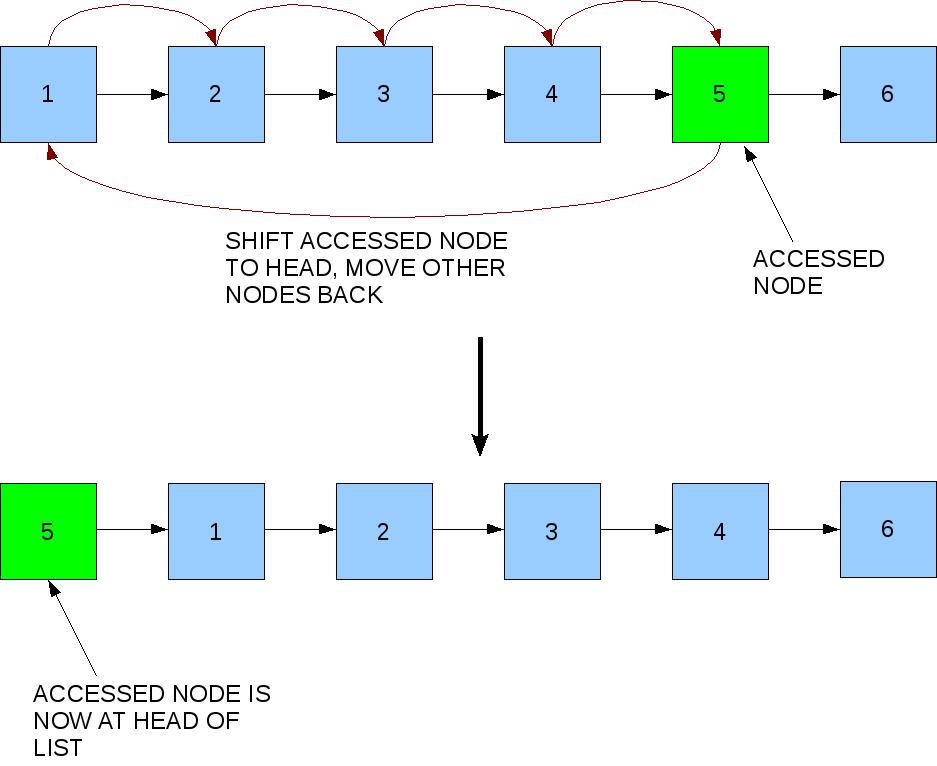

# Self organizing lists and move to front

A self-organizing list is a list that **reorders its elements based on some self-organizing heuristic** to **improve average access time**. The aim of a self-organizing list is to improve efficiency of linear search by moving more frequently accessed items towards the head of the list. A self-organizing list achieves near constant time for element access in the best case. A self-organizing list uses a reorganizing algorithm to adapt to various query distributions at runtime. 

The **worst case** for a self-organiing list happens when an avversary always access the last element of the list (the $n$th element), for any online algorithm $A$ we have:
$$C_A(S) = \Omega(|S|\cdot n)$$
where $C_A(S)$ is the total cost of performing the $S$ operations using algorithm $A$.

In the **average case** element $x$ is accessed with probability $p(x)$ so the expected cost is:
$$\mathbb{E}\[C_A(S)\] = \sum_{x \in L}{p(x)\text{rank}\_L(x)}$$
Which is minimized when $L$ is sorted in decreasing order of $p(x)$.

From this consideration the natural **heuristic** is to kep a count of the number of times each element
is accessed, and maintain $L$ in order of decreasing count.

## Move to front heuristic
In practice works as good as keeping a count of accesses and mantaining the list is order of decreasing count.

The key idea is that after accessing $x$, move it to the head of the list $L$ using $2\cdot\text{rank}\_L(x)$ operations.

### Competitive analysis of MTF
An on-line algorithm A is $\alpha$-competitive if there exists a constant $k$ such that for any
sequence $S$ of operations,
$$C_A(S) \le \alpha \cdot C_{OPT}(S) + k$$
where $OPT$ is the optimal off-line algorithm (“God’s algorithm”).

The **MTF heuristic is 4-competitive** for self-organizing lists. This means that exists a constant $k$ such that, for any sequence $S$: $C_A(S) \le 4 \cdot C_{OPT}(S) + k$.

**PROOF**

Let $L_i$ be MTF’s list after the $i$th access, and let $L_i^\*$ be OPT’s list after the $i$th access.

$$
\begin{align}
	c_i &= \text{MTF’s cost for the }i\text{th operation} \\
	&=2 \cdot \text{rank}\_{L_i–1}(x) \text{ if it accesses } x
\end{align}
$$
$$
\begin{align}
	c_i^* &= \text{OPT’s cost for the }i\text{th operation} \\
	&=\text{rank}\_{{L_{i–1}}^\*}(x) + t_i \text{, where } t_i \text{ is the number of transposes that OPT
performs}
\end{align}
$$