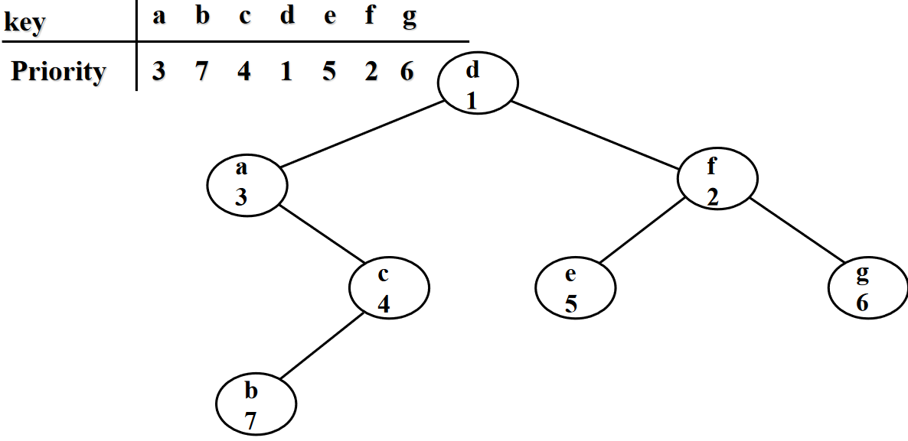

# Treap data structure

A Treap is a data structure that mantains a dynamic set of ordered keys and allows binary searches among the keys. In a treap, after a sequence of insertion and deletions, the height of the tree is **with high probability** proportional to the logarithm of the number of keys. This allows each insertion, search or deletion to take logarithmic time to perform.

The key idea of treaps is that if n elements are inserted in a binary tree **in random order** then the expected depth is $1.39 log{n}$. The way this is done is assigning a random priority to every element in the tree and enforcing the binary search tree properties to the keys and the min-heap properties to the priorities. (Treap = Tree + Heap).

In particular:
- For every element x, y (search tree property):
	- elements y in the left subtree of x satisfy: key(y) < key(x)
	- elements y in the right subtree of x satisfy : key(y) > key(x)
- For every element x, y (heap property):
    - If y is a child of x, then prio(y) > prio(x).
    - All priorities are pairwise distinct.
    
[](../../images/c2410dc63d_AmYySFQZ9nmtaoHY-image-1667490194110.png)

An equivalent way of describing the treap is that it could be formed by inserting the nodes highest priority-first into a binary search tree without doing any rebalancing. Therefore, if the priorities are independent random numbers (from a distribution over a large enough space of possible priorities to ensure that two nodes are very unlikely to have the same priority) then the shape of a treap has the same probability distribution as the shape of a random binary search tree, a search tree formed by inserting the nodes without rebalancing in a randomly chosen insertion order. Because random binary search trees are known to have logarithmic height with high probability, the same is true for treaps.

### Treap uniqueness
For elements x1, ... , xn with key(xi) and prio(xi), there exists a unique treap.

The proof is done by induction:
- $n=1$ OK
- $n > 1$:
	- The root has the smallest priority (k1,p1)
    - All the elements y with key(y) < k1 go on the left subtree
    - All the elements y with key(y) > k1 go on the right subtree
    
## Treap operations
### Insert new key x
```
Insert(x):
  Choose prio(x).
  Search for the position of x in the tree.
  Insert x as a leaf.
  Restore the heap property.
    while prio(parent(x)) > prio(x) do
      if x is left child then
          RotateRight(parent(x))
      else
          RotateLeft(parent(x));
      endif
    endwhile;
```
To insert a new key x into the treap, generate a random priority prio(x) for x. Binary search for x in the tree, and create a new node at the leaf position where the binary search determines a node for x should exist. Then, as long as x is not the root of the tree and has a larger priority number than its parent z, perform a tree rotation that reverses the parent-child relation between x and z.

### Delete key x
```
Delete(x):
  Find x in the tree.
  while x is not a leaf do
    u := child with smaller priority;
    if u is left child then
    	RotateRight(x))
    else
    	RotateLeft(x);
  	endif;
  endwhile;
  Delete x;
```

To delete a node x from the treap, if x is a leaf of the tree, simply remove it. If x has a single child z, remove x from the tree and make z be the child of the parent of x (or make z the root of the tree if x had no parent). Finally, if x has two children, swap its position in the tree with the position of its immediate successor z in the sorted order, resulting in one of the previous cases. In this final case, the swap may violate the heap-ordering property for z, so additional rotations may need to be performed to restore this property.

The expected running time delete operation is
$O(log n)$. The expected number of rotations is 2.

### Split
Split $T$ into $T_1$ and $T_2$:
$$Split(T,k,T_1,T_2): \forall x_1 \in T_1, x_2 \in T_2: key(x_1) \le k and k < key(x_2)$$

To split a treap into two smaller treaps, those smaller than key x, and those larger than key x, insert x into the treap with minimum priority. After this insertion, x will be the root node of the treap, all values less than x will be found in the left subtreap, and all values greater than x will be found in the right subtreap. This costs as much as a single insertion into the treap $O(log n)$.

```
Split(T,k,T1,T2):
  Generate a new element x with key(x)=k and prio(x)=-inf.
  Insert x into T. It will become the root (since it has the smallest priority).
  Delete the new root. The left subtree is T1, the right subtree is T2.
```

### Union
Merge $T_1$ and $T_2$:
$$Union(T_1,T_2): \forall x_1 \in T_1, x_2 \in T_2: key(x_1) < key(x_2)$$

```
Determine key k with key(x1) < k < key(x2) for all x1 ∈ T1 and x2 ∈ T2.
Generate element x with key(x)=k and prio(x)=-inf.
Generate treap T with root x, left subtree T1 and right subtree T2.
Delete x from T.
```
The expected running time is $O(log n)$.