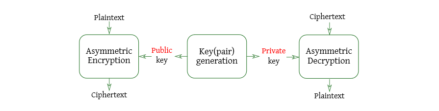
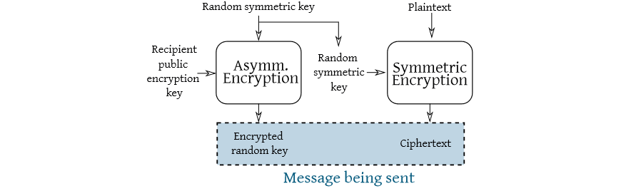

# Asymmetric cryptosystems

We would like to have the following features:
- Agreeing on a short secret over a public channel
- Confidentially sending a message over a public authenticated channel without sharing a secret with the recipient
- Actual data authentication

This features are implemented with asymmetric cryptosystems: cryptography systems where the keys to encrypt and decrypt are different.

Asymmetric cryptosystems rely on hard problems for which bruteforcing the secret
parameter is not the best attack.

## Diffie-Hellman key agreement (CDH)
The goal of CDH is to make two parties share secret value with only public messages.

The attacker model is:
- Can eavesdrop anything, but not tamper
- The Computational Diffie-Hellman assumption should hold

Assumption: Let $(G, ·)$ ≡ $\lang g \rang$ be a finite cyclic group, and two numbers $a$, $b$ sampled unif. from $\lbrace 0, . . . , |G| − 1 \rbrace (\lambda = len(a) \approx \log_{2}|G|)$
- given $g^a$, $g^b$ finding $g^ab$ costs more than poly($log|G|$)
- Best current attack approach: find either $b$ or $a$ (discrete log problem)

Structure:
- Alice: picks $a \gets \lbrace 0, ..., |G| − 1\rbrace$, sends $g^a$ to Bob
- Bob: picks $b \gets \lbrace 0, ..., |G| − 1\rbrace$, sends $g^b$ to Alice
- Alice: gets $g^b$ from Bob and computes $(g^b)^a$
- Bob: gets $g^a$ from Bob and computes $(g^a)^b$
- $(G, ·)$ is commutative $\to (g^b)^a = (g^a)^b$, we’re done!

## Public Key Encryption

Different keys are employed in encryption/decryption

It is computationally hard to:
- Decrypt a ciphertext without the private key
- Compute the private key given only the public key

The most used asymmetric encryption cipher is **RSA**.

## Sharing a secret without agreement
- Alice: generates a keypair $(k_{pri} , k_{pub})$, sends to Bob
- Bob: gets $s \gets \lbrace 0, 1 \rbrace^\lambda$, encrypts it with $k_{pub}$, sends ctx to Alice
- Alice: decrypts ctx with $k_{pri}$, recovers $s$

Note: Bob alone decides the value of the shared secret s

Repeat the procedure with swapped roles and combine the two secrets to achieve similar guarantees to a key agreement.

## Combining asymmetric and symmetric encryption
Asymmetric cryptosystems are from 10× to 1000× slower than their symmetric counterparts. For this reason:
- Asymmetric schemes to provide key transport/agreement
- Symmetric schemes to encrypt the bulk of the data

