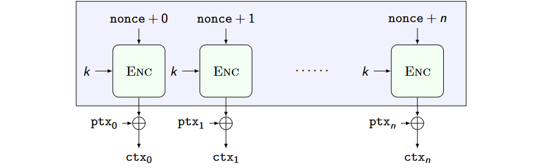

# Chosen Plaintext Attacks (CPAs)

Our attacker knows a set of plaintexts which can be encrypted and he wants to understand which one is being encrypted.

Ideal attacker: cannot tell which plaintext was encrypted out of two he chose (having the same length).

The CTR mode of operation is insecure against CPA: same ptxs means same ctx.

### Decryptable nondeterministic encryption
1. Rekeying: change the key for each block with a ratchet
2. Randomize the encryption: add (removable) randomness to the encryption (change mode of employing PRP)
3. Numbers used ONCE (NONCEs): in the CTR case, pick a NONCE as the counter starting point. NONCE is public

### CPA-Secure Counter (CTR) mode
- Picking the counter start as a NONCE generates different bitstreams to be xor-ed with the ptx each time
- The same plaintext encrypted twice is turned into two different, random-looking, ciphertexts

## Malleability
- Making changes to the ciphertext (not knowing the key) maps to predictable changes in the plaintext
	- Think about AES-CTR and AES-ECB
- Can be creatively abused to build decryption attacks
- Can be turned into a feature (homomorphic encryption)