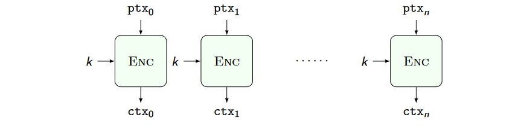
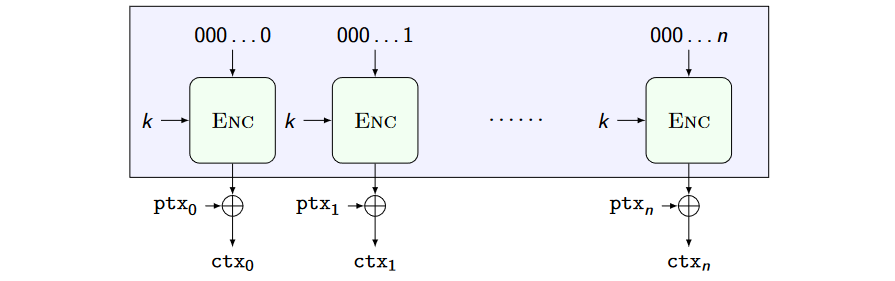

# Computationally secure ciphers and pseudorandom number generators

A modern practical assumption is to build ciphers such that a successful attack is carried only if a computational hard problem is solved. Examples of such hard computational problems are:
- Solve a generic nonlinear bollean sim. equation set
- Factor large integers / find discrete logarithms
- Decode a random code / find shortest lattice vector

The method:
1. Defines the ideal attacker behaviour
2. Assume a given computational problem is hard
3. Prove that any non ideal attacker solves the hard problem

## Cryptographically Safe Pseudorandom Number Generators
A CSPRNG is a deterministic function $\text{PRNG: }\lbrace 0, 1\rbrace^\lambda \to \lbrace 0, 1\rbrace^{\lambda+l}$ whose output cannot be distinguished from an uniform random sampling of $\lbrace 0, 1\rbrace^{\lambda+l}$ in $O(poly(\lambda))$. $l$ is the CSPRNG stretch.

Building a CSPRNG "from scratch" is possible, but it is not the way they are
commonly built (not efficient).

Practically built employing another building block: **PseudoRandom Permutations (PRPs)**.

Modern PRPs are the outcome of public contests where cryptanalytic techniques provide ways (=poly(λ) tests) to detect biases in their outputs: good designs are immune. No formally proven PRP exists.

#### Block ciphers
Concrete PRPs go by the historical name of block ciphers.

Considered broken if, with less than $2^\lambda$ operations, they can be told apart from a PRP, e.g., via:
- Deriving the input corresponding to an output without the key
- Deriving the key identifying the PRP, or reducing the amount of plausible ones
- Identifying non-uniformities in their outputs

The key length $\lambda$ is chosen to be large enough so that computing $2^\lambda$ guesses is not practically feasible.

**Advanced Encryption Standard (AES)** is the most widle used block cipher. Data Encryption Algorithm (DEA or DES) was the previus legacy standard.

### Electronic CodeBook (ECB)
Is the first attempt to encrypt using PRPs.

It is ok to encrypt a plaintext which lenght is less that the block size. 

In order to extend to longer plaintexts we could use multiple blocks and split the plaintext:

### Counter (CTR) mode

The boxed construction is provably a PRNG if Enc is a PRP.