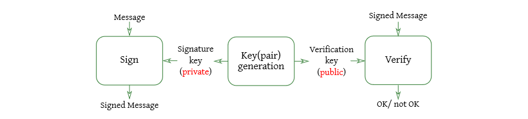

# Data authentication and digital signatures

We’d like to be able to verify the authenticity of a piece of data without a pre-shared secret.

Using asymmetric encryption we can build digital signatures, which:
- Provide strong evidence that data is bound to a specific user
- No shared secret is needed to check (validate) the signature
- Proper signatures cannot be repudiated by the user

The computationally hard problems are:
- Sign a message without the signature key
	- this includes splicing signatures from other messages
- Compute the signature key given only the verification key
- Derive the signature key from signed messages

Again, **RSA** is the most used cipher to build digital signatures.