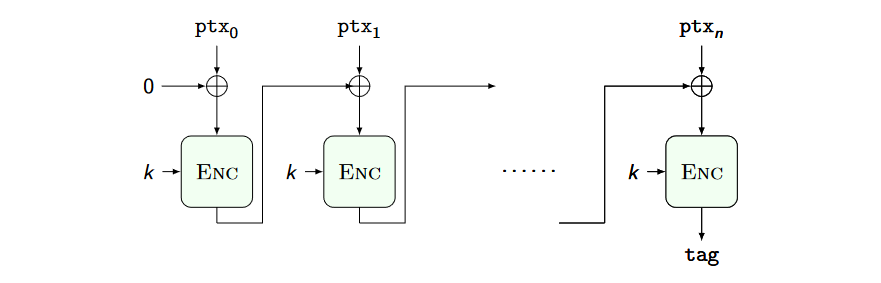

# Data integrity and Message Authentication Codes (MAC)

Confidentiality does not means integrity. Changes in the ciphertext are undetected.

**Message Authentication Codes (MAC)** consists of adding a small piece of information (tag) allowing us to test for the message integrity of the encrypted message itself.

A MAC is constituted by a pair of functions:
- *COMPUTE_TAG*(string,key): returns the tag for the input string
- *VERIFY_TAG*(string,tag,key): returns true or false

Ideal attacker model:
- knows as many message-tag pairs as he wants
- cannot forge a valid tag for a message for which he does not know it already
- forgery also includes tag splicing from valid messages

The CBC_MAC is secure for prefix free messages, encryptiong the tag once more fixes the problem:

Testing the integrity of a file requires us to compare it bit by bit with an intact copy or read it entirely to compute a MAC. It would be fantastic to test only short, fixed length strings independently from the file size, representing the file itself.

Major roadblock: there is a lower bound to the number of bits to encode a given content without information loss.

## Cryptographic hashes
A pseudo-unique labeling function.

A cryptographic hash is a function $H: \lbrace 0,1 \rbrace^* \to \lbrace 0,1 \rbrace^l$ for which the following problems are computationally hard
1. given $d = H(s)$ find $s$ (1st preimage)
2. given $s, d = H(s)$ find $r \neq s$ with $H(r) = d$ (2nd preimage)
3. find $r, s; r \neq s$, with $H(s) = H(r)$ (collision)

Ideal behaviour of a concrete cryptographic hash:
1. finding 1st preimage takes $O(2^d)$ hash computations guessing s
2. finding 2nd preimage takes $O(2^d)$ hash comp.s guessing r
3. finding a collision takes $\approx O(2^\frac{d}{2})$ hash computations

he output bitstring of a hash is known as a **digest**.

**SHA-3** is the most used hashing function. **MD-5** is also used but is is broken.

Hashes are used to:
- Store/compare hashes instead of values (e.g., Signal contact discovery)
- Building MACs: generate tag hashing together the message and a secret string, verify tag recomputing the same hash
- Write down only the hash of the disk image you obtained in official documents