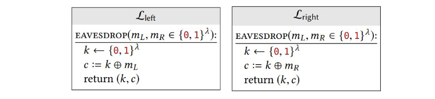
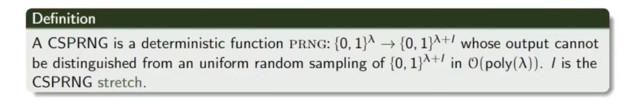
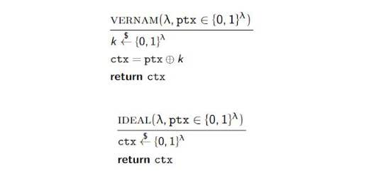
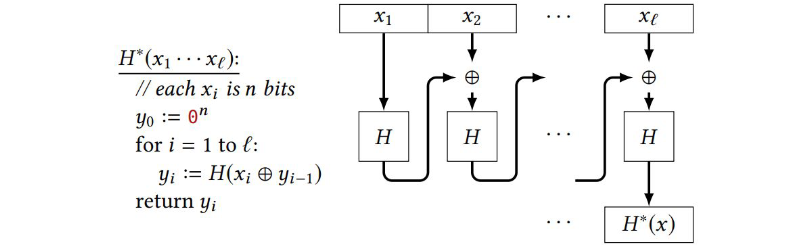
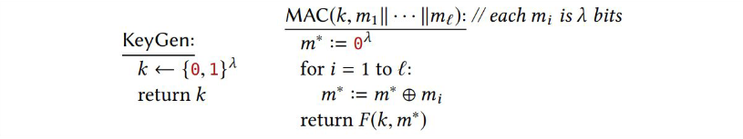

# Exercises on cryptography

  More exercises aviable at <a href="http://overthewire.org/wargames/krypton/">overthewire.org</a>.

## 2021-2022 DEMO Exam exercise 2 (5 points)
You have intercepted two ciphertexts:

- c1 = 1111100101111001110011000001011110000110
- c2 = 1111101001100111110111010000100110001000

You know that both are OTP ciphertexts, encrypted with the same key.

1. [2 points] You know that either c1 is an encryption of alpha and c2 is encryption of bravo or c1 is an encryption of delta and c2 is an encryption of gamma (all converted to binary from ascii in the standard way). Which of these two possibilities is correct, and why?

  
Solution

  
We can say that for sure c1 is the encryption of alpha and c2 of bravo because the last digits of the two ciphertext are different, they would have been the same with the encryptions of gamma and delta (since both end with an a).

2. [1 point] What was the key k? Explain a procedure to obtain the key

  
Solution

  
We can find the key as alpha $\oplus$ c1 = bravo $\oplus$ c2 = 1001100000010101101111000111111111100111.

3. [2 points] Suppose now that the encryption algorithm is modified as follows:

Please, explain the weakness of the proposed approach.

  
Solution

  
We recall that for every $m \in \lbrace 0, 1 \rbrace^\lambda$ the function *EAVESDROP(m)* is the uniform distribution on $\lbrace 0, 1 \rbrace^\lambda$. Hence, for all $m, m' \in \lbrace 0, 1 \rbrace^\lambda$ the distributions *EAVESDROP(m)* and *EAVESDROP(m')* are identical.
  
*EAVESDROP'(m)* returns also the key $k$ which can be used to decrypt the ciphertext in less than polynomial time.

## Question 1
You are having a discussion with a friend about cryptography.

Your friend makes a series of statements. Please tell us how
you would respond (True or False) and motivate your answer.

1. The reason why the 2048bit RSA is more robust to brute forcing that a 256bit AES, is because the key is longer.

  
Solution

  
False. The size of the key cannot be used as a direct comparison criterion because RSA is asymmetric, whereas AES is symmetric.

2. No encryption algorithm is perfect, as they are all vulnerable to brute forcing.

  
Solution

  
False. The one-time pad is invulnerable because each
ciphertext decrypts to every possible plaintext.

3. An encryption algorithm is broken when there is at least one way to derive the key from a given amount of ciphertext.

  
Solution

  
False. Generally, a cryptosystem is broken if there is any
attack faster than brute force to obtain either the key or the plaintext. 

## Question 2
Show that the following libraries are not interchangeable. Describe an explicit distinguishing calling program, and compute its output probabilities when linked to both libraries:

  
Solution

  
The two libraries are not interchangeable because they return the key *k* that we can use to decrypt the ciphertext and find which message was decrypted.

## Question 3
Let $G_1$ and $G_2$ be deterministic functions, each accepting inputs of length $\lambda$ and producing outputs of length $3\lambda$.

  
Hints

  

1. Define the function $H(s_1, s_2) = G_1(s_1) \oplus G_2(s_2)$. Prove that if either of $G_1$ or $G_2$ (or both) is a secure PRG, then so is $H$.

  
Solution

  
This is the definition of a one time pad perfect cipher. If we take a look at the definition of the VERNAM cipher we extract the key randomply (either $G_1$ or $G_2$ is PRG) and then we xor it with the message (either $G_1$ or $G_2$, the one which is not the PRG) to obtain a ciphertext, which will be a PRG.

2. What can you say about the simpler construction $H(s) = G_1(s) \oplus G_2(s)$, when one of $G_1$, $G_2$ is a secure PRG?

## Question 4
Let $H$ be a collision-resistant hash function with output length $n$. Let $H^\*$ denote iterating $H$ in a manner similar to CBC-MAC:

Show that $H^\*$ is **not** collision-resistant. Describe a sucessful attack.

  
Solution

  
Lets imagine a string splitted only in $x_1$ and $x_2$. The xor of the chain is between a controllable variable $x_2$ and the output of the hash function on $x_1$: $H^\*(x_1,x_2) = H(x_2 \oplus H(x_1))$.

To find a collision $H(x_1)=H(x_2)$ we need to find $x_2$ s.t. $x_2 \oplus H(x_1) = x_1$, then $x_2 = x_1 \oplus H(x_1)$.
  
This is feasible because $x_1$ is controllable and we can first calculate $H^\*(x_1)=H(x_1)$ then $x_2 = x_1 \oplus H(x_1)$ is a collision because $H^\*(x_1)=H^\*(x_2)$.
  
For example if $x_1=aaaa$ and $H(x_1)=cccc$, to find a collision we must find $x_2$ s.t. $x_2 \oplus cccc = aaaa$ which means that $x_2 = cccc \oplus aaaa$.
  
We can iterate this procedure for a sting of arbitrary length.

## Question 5
Consider the following MAC scheme, where $F$ is a secure PRF with $in = out = \lambda$:

Show that the scheme is **not** a secure MAC.

  
My solution

  
We can see that $m^\* = m_1 \oplus m_2 \oplus ... \oplus m_l$ because it is initialized to all zeros and then xored to all $m_i$.
  
We can show that two different input can have the same MAC, for example $MAC(k, 0000 0000)$ and $MAC(k, 1111 1111)$ both will have the same MAC $F(k, 0000)$.
  
This is mecause for $0000 0000$, $m^\* = 0000 \oplus 0000 \oplus 0000$ and for $1111 1111$, $m^\* = 0000 \oplus 1111 \oplus 1111$.

