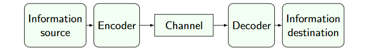

# Fundamentals of Information Theory

Shannon’s information theory is a way to quantify information and to mathematically frame communication.

A communication takes place between two endpoints:
- sender: made of an information source and an encoder
- receiver: made of an information destination and a dencoder

Information is carried by a channel in the form of a sequence of symbols of a finite alphabet.

The receiver gets information only through the channel:
- it will be uncertain on what the next symbol is, until the symbol arrives
- thus we model the sender as a random variable

Acquiring information is modeled as getting to know an outcome of a random variable $X$. The amount of information depends on the distribution of $X$.

Intuitively: the closer is $X$ to a uniform distribution, the higher the amount of information I get from knowing an outcome.

Encoding maps each outcome as a finite sequence of symbols: more symbols should be needed when more information is sent.

## Measuring uncertainty: Entropy
The desiderable properties of a measure of uncertainty are:
1. Non negative measure of uncertainty
2. "combining uncertainties" should map to adding entropies

Let $X$ be a discrete random variable with $n$ outcomes in $\lbrace x_0, ..., x_n−1 \rbrace$ with $Pr(X = x_i) = p_i$ for all $0 \le i \le n$

The entropy of $X$ is $H(X) = \sum_{i=0}^{n-1}{-p_i log_b(p_i)}$

The measurement unit of entropy depends on the base $b$ of the logarithm: typical case for $b = 2$ is bits.

Example:
$X$ is a sequence of 6 unif. random letters ($6^{26} \approx 3.1 \times 10^7$), then $H(X) \approx 28.2b$.

### Shannon’s noiseless coding theorem
It is possible to encode the outcomes $n$ of i.i.d. random variables, each one with
entropy $H(X)$, into no less than $nH(X)$ bits per outcome. If $< nH(X)$ bits are used,
some information will be lost.

Direct conseguence:
- Arbitrarily compression of bitstrings is impossible without loss
	- Cryptographic hashes must discard some information
- Guessing a piece of information (= one outcome of $X$) is at least as hard as guessing a $H(X)$ bit long bitstring
	- overlooking for a moment the effort of decoding the guess
    
### Min-Entropy
It is possible to have distributions with the same entropies.

We define the min-entropy of $X$ as $H_{\infty}(X) = −log(max_{i}p_i)$.

Intuitively: it’s the entropy of a r.v. with uniform distribution, where the
probability of each outcome is $max_{i}p_i$.

Guessing the most common outcome of $X$ is at least as hard as guessing a $H_{\infty}(X)$
bit long bitstring.

#### Example of min-entropy
Consider the function $X$:
$$
\begin{cases}
   X = 0^{128} &\text{with Pr } \frac{1}{2}; \\
   X = a, a \in 1\lbrace 0, 1 \rbrace^{128} &\text{with Pr } \frac{1}{2^{128}}
\end{cases}
$$

Predicting an outcome shouldn’t be too hard: just say $0^{128}$

- $H(X) = \frac{1}{2}(-log_2\frac{1}{2}) + 2^{127}\frac{1}{2^{128}}(-log_2\frac{1}{2^{128}}) = 64.5b$
- $H_{\infty}(X) = -log_2\frac{1}{2} = 1b$

So min-entropy tells us that guessing the most common output is as hard as guessing
a single bit string.