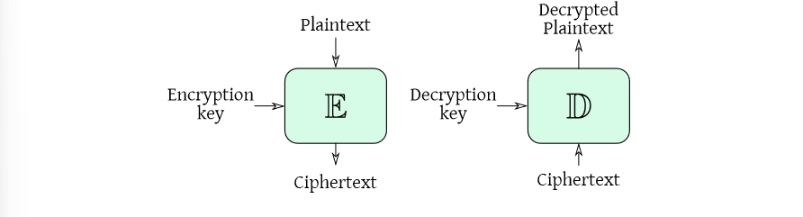

# Introduction to cryptography and perfect ciphers

Cryptography is the study of techniques to allow secure communication and data storage in
presence of attackers.

The features that it aims to provide are:
- Confidentiality: data can be accessed only by chosen entities
- Integrity/freshness: detect/prevent tampering or replays
- Authenticity: data and their origin are guaranteed
- Non-repudiation: data creator cannot repudiate created data
- Advanced features: proofs of knowledge/computation

## Kerchoff’s six principles for a good cipher (apparatus)
1. It must be practically, if not mathematically, unbreakable
2. It should be possible to make it public, even to the enemy
3. The key must be communicable without written notes and changeable whenever the correspondants want
4. It must be applicable to telegraphic communication
5. It must be portable, and should be operable by a single person
6. Finally, given the operating environment, it should be easy to use, it shouldn’t impose excessive mental load, nor require a large set of rules to be known

## Preliminaries
First we need the folowing definitions:
- Plaintext space $\textbf{P}$: set of possible messages $\text{ptx} \in \textbf{P}$
	- Old times: words, modern times $\lbrace0,1\rbrace^l$
- Ciphertext space $\textbf{C}$: set of possible ciphertext $\text{ctx} \in \textbf{C}$
	- Usually $\lbrace 0,1\rbrace^{l'}$, not necessarily $l = l'$
- Key space $\textbf{k}$: set of possible keys
	- $\lbrace0, 1\rbrace^\lambda$, key with special formats are derived from bitstrings
    
And the following functions:
- Enctryption function $\mathbb{E} \text{ : } \textbf{P} \times \textbf{K} \to \textbf{C}$
- Decryption function $\mathbb{D} \text{ : } \textbf{C} \times \textbf{K} \to \textbf{P}$

And, for all $\text{ptx} \in \textbf{P}$, we need $k, k' \in \textbf{K}$ s.t. $\mathbb{D}(\mathbb{E}(\text{ptx},k),k')=\text{ptx}$.

### Providing confidentiality
The goal is to prevent anyone not authorized from being able to understand data.

The possible attack models are:
- Plain eavesdropper (ciphertext only attack)
- Knows a set of possible plaintexts (known plaintext attack)
	- Limit case: the attacker chooses the set of plaintexts
- Active attacker: may tamper with the data and observe the reactions of adecryption-capable entity
	- Limit case: the attacker sees the actual decrypted value

## Perfectly secure cipher
In a perfect cipher, for all $\text{ptx} \in \textbf{P}$ and $\text{ctx} \in \textbf{C}$:
$$Pr(\text{ptx sent} = \text{ptx}) = Pr(\text{ptx sent} = \text{ptx} \mid \text{ctx sent} = \text{ctx})$$

Which means that seeing a ciphertext gives us no information on what the plaintext coresponding to it could be.

### Shannon theorem
Any symmetric cipher $(\textbf{P},\textbf{K},\textbf{C},\mathbb{E},\mathbb{D})$ with $|\textbf{P}| = |\textbf{K}| = |\textbf{C}|$ is perfectly secure if and only if:
1. Every key is used with probability $\frac{1}{|\textbf{K}|}$
2. A unique kay mas a given plaintext into a given ciphertext: $\forall (\text{ptx},\text{ctx}) \in \textbf{P} \times \textbf{C}, \exists !k \in \textbf{K} \text{ s.t. } \mathbb{E}(\text{ptx},k) = \text{ctx}$

### XOR implementation
A working implementation of the perfectly secure cipher exists using the XOR operation.

Asssume $\textbf{P},\textbf{K},\textbf{C}$ to be a set of binary strings. The encryption function draws a *uniformly random*, fresh key $k$ out of $\textbf{K}$ each time it is called and computes $\text{ctx} = \text{ptx} \oplus k$.

The problem of this implementation are:
- the key must be as long as the message 
- the key must be changed for every message
- it is difficult to generate a perfectly random key