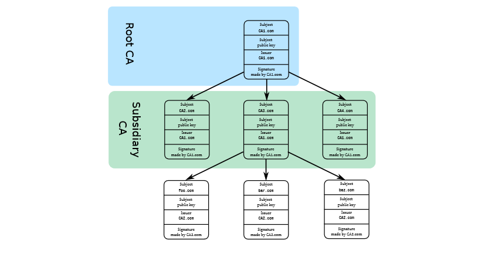
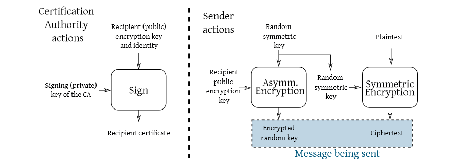

# The public key binding problem and digital certificates

Both in asymmetric encryption and digital signatures, the public key must be
bound to the correct user identity.

If public keys are not authentic:
- A MITM attack is possible on asymmetric encryption
- Anyone can produce a signature on behalf of anyone else

The public key authenticity is guaranteed with... another signature
- We need someone to sign the public-key/identity pair
- We need a format to distribute signed pairs

For this reasons digital certificates were born. They bind a public key to a given identity, which is:
- for humans: an ASCII string
- for machines: either the CNAME or IP address

Digital certificates specify the intended use for the public key contained to avoid ambiguities when a key format is ok for both an encryption and a signature algorithm.

They contain a time interval in which they are valid.

## Certification authorities
The certificate signer is a trusted third party, the CA. The CA public key is authenticated... with another certificate.

