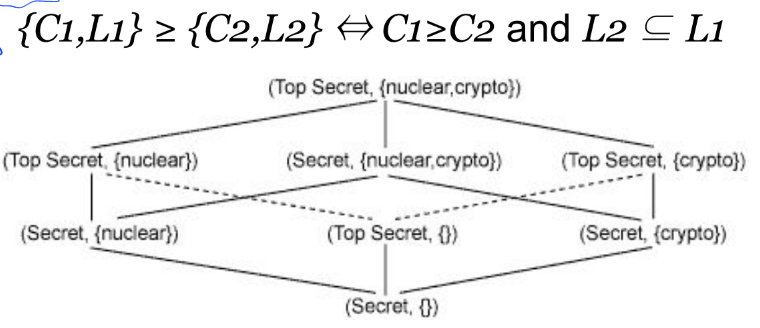

# Access control

## Reference monitor
The reference motior enforces access control policies ("who does what on which resource"). All modern kernels have a reference monitor implementation. The requirements of the reference monitor are:
- Tamper proof
- Connot be bypaased
- Small enouth to be verified and tested with ease

The reference monitor follows the authentication and start the **authorization** for an object.

### Discretionary access control (DAC)
The resource owner discretionarily decides its access privileges. All off-the-shelf OSs are DAC.

In a DAC system the following entities are defined:
- **Subjects** who can exercise privileges
- **Objects** on which privileges are exercised
- **Actions** which can be exercised

For example UNIX is a DAC system where:
- Subjects: user, groups
- Objects: files
- Actions: read, write, execute

We can therefore define the **protection state** as a triple *(S, O, A)*:
- *A* is a matrix with *S* rows and *O* columns
- *A[s,o]* are the privileges of subject *s* over object *o*

| | file1 | file2 |directoryX |
|-|-|-|-|
|Alice| Read | Read, Write, Own | |
|Bob|Read, Write, Own | Read | Read, Write, Own |
|Charlie|Read, Write | | Read|

#### Enstablishing safety
The basic operations are:
- create (or destroy) subject *s*
- create (or destroy) object *o*
- add (or remove) a permission into *[s,o]* matrix

With these basic operations we can create a **transition**.

Given an initial protection state and set of transitions, is there any sequence of transitions that leaks a certain right *r* into the access matrix? If not the system is safe with respect to right *r*.

This problem is **undecidable**.

#### DAC implementations
1. **Authorization table**: record non-null triples *(S, O, A)*, typically used in DBMS (because it suitable for SQL tables).
2. **Access control lists**: records by columns, for each object the list of subjects and authorizations. It is the most used in OSs. This implementation is **efficient per object** operations. They cannot be used to assign multiple owners to the same object (this can be partially addressed with groups).
3. **Capability lists**: records by row, for each subject the list of objects and authorizations. This implementation is **efficient per subject** operations, it is usually used when objects never change.

#### DAC shortcomings
- Cannot prove safety
- Control access to objects but not to the data inside objects (granularity)
	- Susceptible to **malicius user** problem: an user with access can dump the data
    - Susceptible to **trojan horse** problem: programs that acts as user can access files
- Problem of scalability and management: each user-owner can potentially compromise security of the system with teir own decision (for example, using relaxed authorization)

### Mandatory access control (MAC)
Privileges are set by a security **administrator** and not by owners. The administrator defines a classification of subjects and objects.

The **classification** is composed of:
- A strictly ordered set of **secrecy levels**
- A set of **labels**

An example of MAC is the system used in military, where the following classification is defined: top secret > secret > for official use only > unclassified.

In some classification also **labels** are used, forming a **lattice system**.

### Role-based access control (RBAC)
RBAC is sort of a "hybrid" between DAC and MAC.

### Bell-LaPadula model (BLP)
Defines two MAC rules:
1. **Simple security property (no read up)**: A subject *s* at a given secrecy level **cannot read** an object *o* at a **higher** secrecy level.
2. **Star property (no write down)**: A subject *s* at a given secrecy level **cannot write** and object *o* at a **lower** secrecy level.

Defines one DAC rule:
3. **Discretionary security property**: use of an access matrix to specify the discretionary access control.

**Tranquility property**: secrecy levels of objects cannot change dynamically.

The result is a monotonic flow of information toward higher secrecy levels. In the real world there is the need of **trusted subjects** who can declassify (lower the level) or sanitize (create censored versions of lower levels) documents.

This model **does not address integriy**.