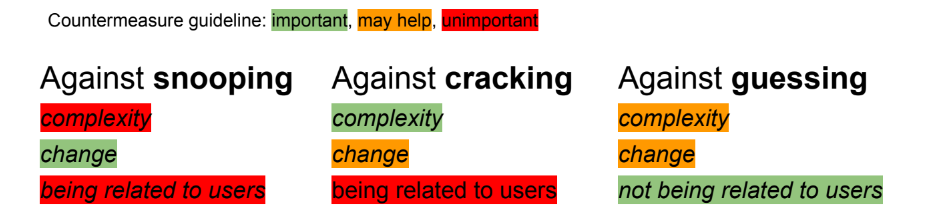

# Authentication

**Identification** is when an entity declares its identity ("I am Stefano", "I am Michele", ...) while **authentication** is whene the entity provides *proof* that verifies its identity.

## The threee factors of authentication
1. **To know**: something that the entity knows. Examples: password, PIN, secrets, etc.
2. **To have**: something that the entity has. Examples: key, smart card, token, etc.
3. **To be**: something that the entity is. Examples: fingerprints, face, voice, etc.

**Multi-factor** authentication uses two or three factors.

## The "to know" factor: passwords and PINs
Passwords are widly used because they present the following key advantages:
- Low cost
- Ease of deployment
- Low technical baries

However secrets could be:
- Stolen/snooped
- Guessed
- Cracked

Some countermeasures can, costly, be put in place:
- Change/expire frequently
- Are long and have a rich character set
- Are not related to the user

But humans are bad with passwords:
- Unable to keep secrets
- Unable to remember complex passwords
- Unable to remember a lot of different passwords

## The "to have" factor
User must prove that it possesses something.

Advantages:
- Human factor (less likely to hand out a key)
- Relatively low cost
- Good level of security

Disadvantages:
- Hard to deploy
- Can be lost or stolen

Countermeasures:
- Use with a second factor

Examples:
- One-time password generators
- Smart cards

## The "to be" factor: biometric authentication
User must prove that it has some specific characteristics.

Advantages:
- high level of security
- No extra hardware to carry around and no secrets to remember

Disadvantages:
- Hard to deploy
- Non deterministic matching
- Invasive
- Clonable
- Bio-characteristics change
- Privacy
- Disabilities

Countermeasures:
- Re-mesure often

## Single Sign On
Managing are rembering unique passwords is complex. This leads users to re-use passwords over multiple services.

A solution is to use one trusted host to identify. THis host should have high level of security (multi-factor authentication). Users authenticate on the trusted host and other hosts ask the trusted host if a user is authenticated.

The insecrity is that there is a single point of trust which, if compromised, makes all the sites compromised.