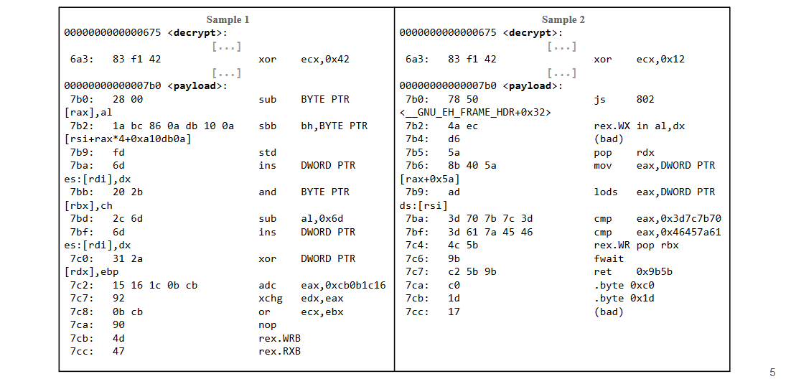
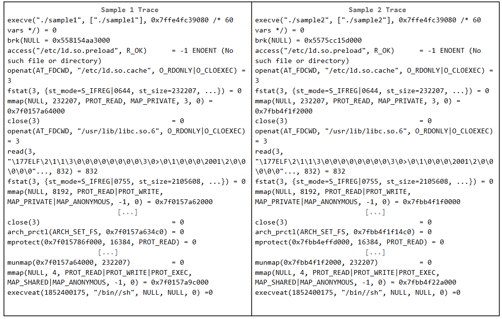

# Exercises on malwares

## 2021-2022 Demo exam exercise 6
Our systems have been compromised by very powerful malware. Luckily, we managed to collect a
sample of the malware. Its code is reported below.
```
.text
0x08048046<do_stuff>:
	0x08048046: push ebp
	0x08048047: mov esp, ebp
	0x08048049: push ebx
	0x08048050: push ebp
	0x08048051: mov esp,ebp
	0x08048053: push ebx
	0x08048054: mov ecx,0x8090000
	0x08048059: mov eax,0x8048078
	0x0804805e: mov dl,BYTE PTR [ecx]
	0x08048060: add dl,0x10
	0x08048063: mov cl,BYTE PTR [eax]
	0x08048065: xor cl,dl
	0x08048067: sub dl,0x10
	0x0804806a: mov BYTE PTR [eax],cl
	0x0804806c: add ecx,0x1
	0x0804806f: add eax,0x1
	0x08048072: mov cl,BYTE PTR [ecx]
	0x08048074: cmp cl,0x0
	0x08048077: jne 0x804805e
	0x08048078: push ebp
	0x08048079: mov eax, ecx
	0x08048071: push eax
	0x08048072: (bad)
	0x08048078: ret
	0x08048079: cmp ax, dx
	0x08048082: (bad)
	0x0804808e: ret
	0x08048090: hlt
	0x08048091: nop
	0x08048098: (bad)
	0x0804809a: mov ax, 0x10
	0x0804809e: ret
	0x0804809f: leave
	0x080480a0: (bad)
	0x080480a2: leave
	0x080480a3: ret
.rodata
0x08090000: <Random data with length 30, null terminated>
0x0809001b: /bin/sh
0x08090024: /bin/cat
0x08090032: /etc/passwd
```

1. [1 point] Is the malware employing any obfuscation technique? If yes, specify which.
2. [2 points]
	1. Given your answer to the previous question, what class does this malware most likely belong to (polymorphic, metamorphic, evasive)?
	2. Can we say for sure that it does not belong to some classes?
3. [2 points] Considering the class this malware most likely belongs to, how would you use signatures to
detect it?
	1. Specify which part(s) of the code you would use for generating the signatures.
	2. Specify which part(s) of the code cannot be used for generating signatures, explaining why.
4. [1 point] It turns out that the obfuscation engine is in truth a commercial code protector, which is also
used by benign software to protect proprietary code.
How does this change your answer to question 4.3? Explain why you think this may invalidate the
solution you proposed.

## Question 1
A new malware just broke out, causing a world-wide infection and a huge
amount of damages. Unfortunately, all the anti-malware systems are not able to detect this
malware. You were able to retrieve a couple of samples.

Consider the code snippets reported below, extracted from the two malware samples you
retrieved:

Sample 1:
```
pop ebx
lea ecx, [ebx + 42h]
push ecx
push eax
push eax
sdt [esp - 02h]
pop ebx
add ebx, 1Ch
cli
mov ebp, [ebx]
```

Sample 2:
```
pop ebx
lea ecx, [ebx + 42h]
push ecx
push eax
nop
push eax
inc eax
sdt [esp - 02h]
dec eax
pop ebx
add ebx, 1Ch
cli
mov ebp, [ebx]
```

It is clear that the malware is showing evasive behavior. What
technique is implemented? How this technique works?
<details>
  <summary>Solution</summary>
  
Metamorphism: create different versions of code that look different but have the same semantics (do the same thing).
</details>

## Question 2
A new malware just broke out, causing a world-wide infection and a huge
amount of damages. Unfortunately, all the anti-malware systems are not able to detect this
malware. You were able to retrieve a couple of samples.

We made a binary diff of the two samples in order to evaluate the difference in their layout
and reported only the differences here:
[](../../../images/cfee4fec99_EhftEsy86OS7uMxm-image-1655472572222.png)

Additionally, we executed the samples and collected the syscalls in
order to evaluate their behaviour (i.e., semantics)
[](../../../images/3c646148f3_Q8G5mJwiF5pRg1Fm-image-1655472596322.png)

It is clear that the malware is showing evasive behavior. What
technique is implemented? How this technique works?

<details>
  <summary>Solution</summary>
  
Polymorphism: change layout (shape) with each infection. The same payload is encrypted with different keys.
</details>

## Question 3
In order to avoid signature detection, a malware sample saves his own assembly code in
text format on the victim machine, and then uses a standard assembler to generate and
execute the real malicious object code on the machine.

How can a signature-based detection method (e.g., antivirus) detect this kind
of malware ?
<details>
  <summary>Solution</summary>
  
Have a signature to detect the malware in its “textual” assembly format. Note that having
a signature to detect the assembler is a wrong solution, as it leads to lots of false positives
(the system assembler it’s a legitimate program, after all!)
</details>

## Question 4
You suspect that your machine have been compromised
with a kernel rootkit. You tried to use network traffic tools from
your machine but you do not see any malicious traffic. Can you
conclude that your machine is safe? If is not there are other way to
prove you have been compromised?

<details>
  <summary>Solution</summary>
  
No you cannot conclude that the machine have not been
compromised. Because the malware can hide its own traffic from
tools running on the compromised machine. You could inspect
network traffic using an external machine as a MitM between
your machine and the router.
</details>

## Question 5
A colleague suggests to replace the hard drive of a
machine to be sure to get rid of a very sophisticated rootkit.
However, after reinstalling the operating system, it seems like that
the machine is infected by the same rootkit. Provide an explanation
of what happened. Whatever your answer is, explain why.

<details>
  <summary>Solution</summary>
  
If it is a BIOS rootkit then No. If it is a kernel rootkin it is ok to just
replace the HD or even just reinstall the OS.

It could even be a firmware rootkit running on network card/GPU.
</details>