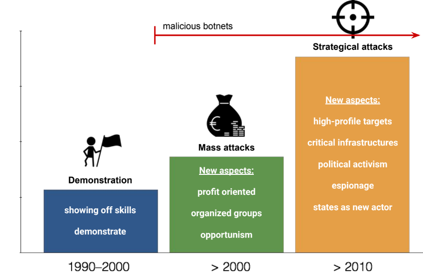

# Malwares introduction

"Malware" is a portmanteau of "malicious software": **code that is intentionally written to violate a security policy**.

Several categories can be defined:
- **Viruses**: **code** that **self-propagate** by infecting other files, usually executables. Therefore, viruses are **not standalone programs**.
- **Worms**: **program** that **self-propagate**, even remotely, often exploiting host vulnerabilities, or by social engineering.
- **Trojan horses**: apparently benign **program** that hide a malicious functionality and allow remote control.

Fred Cohen ('83) theorized the existence and produced the first examples of viruses. It also demostrated that it is **impossible to build the perfect virus detector**.

#### Malware life cycle
Malwares follow a life cycle:
1. Reproduce
2. Infect
3. Stay hidden
4. Run payload: something harmful

#### Infection techniques
- **Boot viruses**: tamper with the Master Boot Record (MBR) of hard disk or boot sector of partitions
- **File infectors**
	- simple overwrite virus (damage original priogram)
    - parasitic virus: append code and modify entry points
    - /multi)cavity virus: inject code in unused regions of program code
    
## Economy of malwares
Since 2004 there were no new major worm outbreaks even if weaponizable vulnerabilities were there.

This is due to the fact that attackers begin to be interested in **monetizing** their malwares:
- **Direct monetization**: abuse of credit cards, ...
- **Indirect monetization**: information gathering, abuse computing resource, botnet (network of bots controlled by a botmaster, used for information gathering and DDoS)

This created a growing **undergorund black economy**.