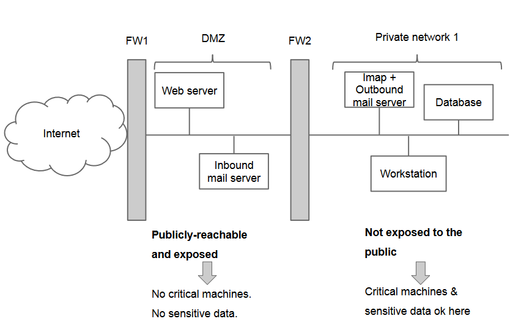
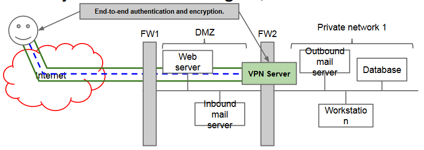

# Architectures for secure networks

## Dual- or Multi-zone Architectures
In most cases, the perimeter defense works on
the assumption that what is “good” is inside,
and what's outside should be kept outside if
possible.

There are two counterexamples:
- Access to resources from remote (i.e., to a web server, to FTP, mail transfer).
- Access from remote users to the corporate network.

**Problem**: if we mix externally accessible
servers with internal clients, we lower the
security of the internal network.

**Solution**: we allow external access to the
accessible servers, but not to the internal
network.

**General idea**: split the network by privileges
levels. Firewalls to regulate access. 

In practice, we create a semi-public zone called **DMZ (demilitarized zone)**.
The DMZ will host public servers (web, FTP,
public DNS server, intake SMTP).
On the DMZ no critical or irreplaceable data.
The DMZ is almost as risky as the Internet. 

## Virtual Private Networks (VPNs)
**Requirements**:
- Remote employees need to work “as if” they were in the office, accessing resources on the private zone.
- Connecting remote sites without using dedicated lines.

Which means:
Ensure CIA to data transmitted over a public
network (i.e., the Internet).

**Solution**: use a VPN, an encrypted overlay
connection over a (public) network.

Two models are aviable:
- **Full tunnelling**
	- Every packet goes through the tunnel.
	- Traffic multiplication, could be inefficient.
	- Single point of control and application of all security policies as if the client were in the corporate network.
- **Split tunnelling**
	- Traffic to the corporate network: in VPN; traffic to the Internet: directly to ISP.
	- More efficient, less control.
	- Just similar to the case of the PC connected via 4G modem to the Internet. 
    
### VPN technologies
**PPTP (Point-to-point Tunnelling Protocol)**:
proprietary Microsoft protocol, variant of PPP with
authentication and cryptography.

VPN over **SSL**, **SSH tunnel**, or **OpenVPN.net** (open source).