# Exercises on network security

## 2021-2022 DEMO Exam exercise 5 (6 points)
[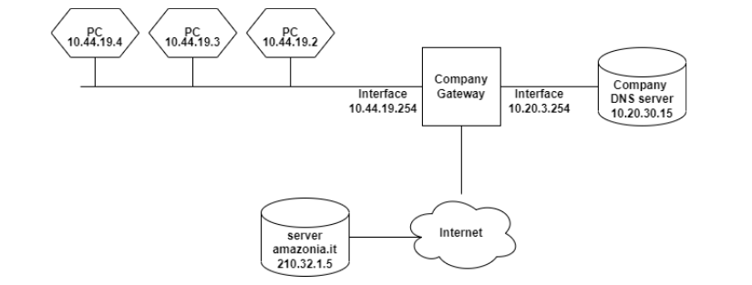](../../../images/35b87ae29b_NE5BKeh9IgaH2oQr-image-1655725935581.png)

Consider the above network diagram, describing a company’s network structure, composed of a
subnetwork with employees computers and another with the company’s local DNS server, and finally the
outside connection towards the internet.

Consider also the following packet capture, observed at the company’s gateway when the employee using
the computer with IP address 10.44.19.4 was accessing the website http://amazonia.it over HTTP (TCP
port 80). Be mindful that the traffic below is the one passing through the interface with IP address
10.44.19.254 and nothing more. Hence, for example, traffic coming from the internet towards the
company DNS server would not appear.

| source | destination | protocol | packet content |
| - | - | - | - |
| 10.44.19.4 | 10.20.30.15 | DNS | Query ID 0x992 where www.amazonia.it |
| 210.32.133.1 | 10.20.30.15 | DNS | Response ID 0x01 www.amazonia.it A 210.32.133.20 |
| 210.32.133.1 | 10.20.30.15 | DNS | Response ID 0x02 www.amazonia.it A 210.32.133.20 |
| 210.32.133.1 | 10.20.30.15 | DNS | Response ID 0x03 www.amazonia.it A 210.32.133.20 |
| ... | ... | ... | ... |
| 210.32.133.1 | 10.20.30.15 | DNS | Response ID 0x2013 www.amazonia.it A 210.32.133.20 |
| 210.32.133.1 | 10.20.30.15 | DNS | Response ID 0x2014 www.amazonia.it A 210.32.133.20 |
| 210.32.133.1 | 10.20.30.15 | DNS | Response ID 0x2015 www.amazonia.it A 210.32.133.20 |
| 10.20.30.15 | 10.44.19.4 | DNS | Response ID 0x992 www.amazonia.it A 210.32.133.20 |
| 210.32.133.1 | 10.20.30.15 | DNS | Response ID 0x2016 www.amazonia.it A 210.32.133.20 |
| 210.32.133.1 | 10.20.30.15 | DNS | Response ID 0x2017 www.amazonia.it A 210.32.133.20 |
| 210.32.133.1 | 10.20.30.15 | DNS | Response ID 0x2018 www.amazonia.it A 210.32.133.20 |
| 10.44.19.4 | 210.32.133.20 | HTTP | GET / HTTP/1.1 |
| 210.32.133.20 | 10.44.19.4 | HTTP | 200 OK |

1. [3 points] The company has noticed that while the employee at 10.44.19.4 was visiting http://www.amazonia.it, an attack took place over the network. Given the log above, can you identify the attack and give a brief explanation of how the specific instance attack that happened through the company’s network works? Please specify: The goal, the location in the network, and the addressing (i.e., IP, MAC) of the attacker.

2. [3 points] Describe (including any assumptions you need to make about the attack) how the attack can be mitigated, or avoided completely, depending on who is taking the measures against it. What can you do if you are: 
	1. the administrator of the website www.amazonia.it (i.e., you control the web server hosting www.amazonia.it)
    2. The administrator of the DNS server used by the network 10.44.19.0/24. (i.e., you control all the software running on the DNS server machine)
    3. the network administrator of the network 10.44.19.0/24 (i.e., you control all the network equipment, such as routers, switches, firewalls, as well as the network topology)
    
## Exercises on Network Protocols Attacks
### Question 1
As part of your job as a security analyst, one of your clients discovers that their network is
compromised. In particular, from an early analysis, they have ground to suspect that the
start of the compromise was a *network attack against the computer of the administrative
assistant*.

Consider the following (simplified) schema of the company network.

[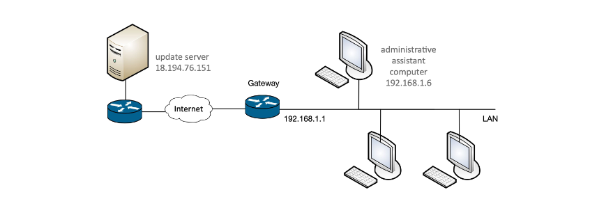](../../../images/dadf7298c1_9oK6AhMtCCM4TII0-image-1655726560854.png)

1. Your client managed to capture the network traffic on the administrative assistant’s computer (IP address 192.168.1.6 and MAC address dc:a9:04:7a:ce:29) when the attack was taking place. During the traffic capture, the computer was automatically updating a well-known accounting software from the software vendor’s web server (IP address 18.194.76.151 and MAC address dc:a6:03:01:02:fe). You also know that the IP address of the LAN interface of the company’s network gateway is 192.168.1.1, and its MAC address is b6:28:97:ca:b7:48.

| source | destination | protocol | content |
| - | - | - | - |
|dc:a9:04:7a:ce:29 | ff:ff:ff:ff:ff:ff |ARP |Who has 192.168.1.1? Tell 192.168.1.6|
|38:60:77:b9:79:98 | dc:a9:04:7a:ce:29 |ARP |192.168.1.1 is at 38:60:77:b9:79:98|
|b6:28:97:ca:b7:48 | dc:a9:04:7a:ce:29 |ARP |192.168.1.1 is at b6:28:97:ca:b7:48|
|192.168.1.6 (dc:a9:04:7a:ce:29) | 18.194.76.151 (38:60:77:b9:79:98) |TCP SYN||
|18.194.76.151 (38:60:77:b9:79:98) | 192.168.1.6 (dc:a9:04:7a:ce:29) |TCP SYN, ACK||
|38:60:77:b9:79:98 | dc:a9:04:7a:ce:29 |ARP |192.168.1.1 is at 38:60:77:b9:79:98|
|192.168.1.6 (dc:a9:04:7a:ce:29) | 18.194.76.151 (38:60:77:b9:79:98) |TCP ACK||
|38:60:77:b9:79:98 | dc:a9:04:7a:ce:29 |ARP |192.168.1.1 is at 38:60:77:b9:79:98|
|192.168.1.6 (dc:a9:04:7a:ce:29) | 18.194.76.151 (38:60:77:b9:79:98) |TCP HTTP |GET /downloads/software-update.exe|
|18.194.76.151 (38:60:77:b9:79:98) | 192.168.1.6 (dc:a9:04:7a:ce:29) |TCP HTTP |200 OK |

Assume that the traffic is captured directly from the network interface card of the employee’s PC.

1. [2 points]. Describe the attack going on in the network, specifying the name and providing a short explanation of how the attack works in general.
<details>
  <summary>Solution</summary>
  
ARP spoofing.
</details>

2. [1 point]. What is the goal of the attack, in this specific case? Motivate your answer.
<details>
  <summary>Solution</summary>
  
Sniffing or manipulation of the traffic to\from the compromised
machine. We can rule out DOS as the traffic passes (there are
responses from the server).
Likely, given the scenario (malware infection), the attack is targeted
at tampering with the data in transit rather than (or in addition to)
sniffing.
</details>

3. [1 point]. Can you tell the IP address of the attacker? And the MAC address?
<details>
  <summary>Solution</summary>
  
IP address: no (note that 18.194.76.151 is the address of the update server)
MAC address: the attacker is using 38:60:77:b9:79:98, but it could
very well be a spoofed address.
</details>

4. [1 point]. Given only the above packet capture, can you tell whether the attacker is located (i.e., on the LAN, on the same network of the web server, or on an arbitrary Internet-connected network)? Why?
<details>
  <summary>Solution</summary>
  
The attacker is located on the same network of the target machine,
i.e., on the LAN.
</details>

### Question 2
Suppose that you are the network security administrator of the
network 131.168.0.0/24, with gateway 131.168.0.1 and
DNS servers 131.168.0.100 and 131.168.0.101. While
examining the network activity, you notice a DHCP offer packet
coming from IP 131.168.0.10 with gateway set to
131.168.0.5. Answer the following questions and provide a
reason. Answers with no reason will not give any point.

1. What kind of attack do you suspect, and how does it work?
<details>
  <summary>Solution</summary>
  
DHCP poisoning. Someone is trying to trick a client connected to
131.168.0.0/24 into believing that 131.168.0.5 is the
gateway, by sending a crafted DHCP offer before, which comes
before the real offer sent out by the real DHCP server.
</details>

2. Why such an attack works?
<details>
  <summary>Solution</summary>
  
Because the DHCP protocol does not support authentication, so
the client must blindly believe any DHCP offer that it sees, and
because an arbitrary client can race (and win) against the real
DHCP server.
</details>

3. Can you tell the IP address of the host where those packets come from?
<details>
  <summary>Solution</summary>
  
Not really. 131.168.0.10 is the sender of the DHCP offer, but the
address may be spoofed. We could look at the MAC address of
the scender, but it could be spoofed as well.
</details>

Can you tell the IP address or network address of the victim?
<details>
  <summary>Solution</summary>
  
From the above information there is little evidence to say that,
although the potential victims are those that will receive and
accept the spoofed DHCP offers. So, likely, 131.168.0.0/24.
</details>

### Question 3
A network analyst is analyzing some traffic captured from a
network belonging to Politecnico di Milano. The network is:
131.175.0.0/16. In particular, we suspect that a database server,
whose IP address is 131.175.14.12, is victim of an attack. Indeed,
observing the network traffic, we notice the following pattern:

| source | destination | protocol | content |
| - | - | - | - |
|131.175.14.12 | 131.175.255.255 (broadcast) | ICMP | Echo (ping) request|
|131.175.0.2 | 131.175.14.12 | ICMP | Echo (ping) reply |
|7a:ce:29 | ff:ff:ff (broadcast) | ARP | Who has 131.175.14.12? Tell 131.175.0.2 |
|4b:74:28 | 7a:ce:29 | ARP | 131.175.14.12 is at 4b:74:28|
|131.175.0.3 | 131.175.14.12 | ICMP | Echo (ping) reply|
|131.175.0.4 | 131.175.14.12 | ICMP | Echo (ping) reply |
|131.175.255.251 | 131.175.14.12 | ICMP | Echo (ping) reply|
|131.175.255.252 | 131.175.14.12 | ICMP | Echo (ping) reply|
|131.175.255.253 | 131.175.14.12 | ICMP | Echo (ping) reply|

1. [2 point] Describe what attack you think is going on, and what is the feature (or lack thereof) of the involved protocol(s) that enable this attack.
<details>
  <summary>Solution</summary>
  
PING Smurf.

No authentication for ICMP.
</details>

2. [2 point] Describe what you think is the concrete goal(s) of the attack in this scenario
<details>
  <summary>Solution</summary>
  
The goal is to saturate the resources of the victim using other
machines on the network as an amplification mean. This results in
a denial of service.
</details>

3. [1 point] Can you tell the IP and MAC address of the attacker? Why?
<details>
  <summary>Solution</summary>
  
No, the IP address is spoofed for sure, and the MAC address can
be spoofed as well.
</details>

### Question 4
Consider the following network diagram:

[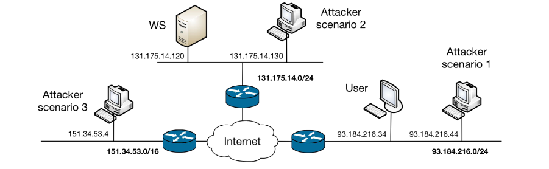](../../../images/fb797d6446_Hly9Ul3KfKwHQ4Pr-image-1655730374011.png)

A user, with IP address 93.184.216.34, is attempting to download a software executable
from a webserver in the Politecnico di Milano network, http://downloads.polimi.it, with IP
address 131.175.14.120, over the HTTP protocol (no HTTPS, no signatures, nothing).
Assume that the user’s browser already cached the IP address of downloads.polimi.it (i.e.,
it does not perform any DNS request), and that there is no firewall involved. An attacker,
who knows that the user is about to download this software, wants to target our user by
carrying out an attack to replace the downloaded software with a piece of malware.

For each of the following attack scenarios, state whether the
attacker is able to fulfill his\her goals. If you deem it possible,
describe an attack that allows to do so: state the name of the class of
attacks, and describe all the steps needed to make it work in this
specific scenarios. If multiple classes of attacks are possible, focus
on the simplest one that gets the job done. If no attack is possible,
please explain why.

Scenario 1 (attacker: 93.184.216.44; same network and broadcast
domain of the user)
<details>
  <summary>Solution</summary>
  
The attack is possible using ARP spoofing.
</details>

Scenario 2 (attacker: 131.175.14.130; same network of web server,
but different than user)
<details>
  <summary>Solution</summary>
  
The attack is possible using ARP spoofing.
</details>

Scenario 3 (attacker: 151.34.53.4; attacker, user and webserver on
three different networks)
<details>
  <summary>Solution</summary>
  
No attack possible, because HTTP uses TCP and, if sequence numbers are
correctly implemented, not possible to perform TCP hijacking. Also, DNS
poisoning not possible as DNS response already cached.
</details>

**For the next questions consider ONLY scenario 3**. Assume that
each involved computer and server implements a custom TCP/IP
stack that, for performance reasons, sets the TCP initial sequence
number in the SYN and SYN+ACK packets as the most significant
bits of the current timestamp.

[2 points]. Describe the security issue with the proposed ISN
implementation, and propose a way to solve the issue
<details>
  <summary>Solution</summary>
  
Can predict ISN -> solve by using random ISN.
</details>

[2 points]. Describe how the attacker can perform the above
attack, this time exploiting the security issues raised by the custom
ISN implementation. Describe all the steps and assumptions that you
need to perform this attack.

<details>
  <summary>Solution</summary>
  
TCP hijacking. We can guess the ISN of the SYN packet sent by the victim (the
user), we can spoof the webserver IP and send a “correct” SYN+ACK to it and, if
we can guess the content of the request (we do), subsequent packets. This way we
can send a different payload. In parallel we can also use TCP hijacking to send a
fake RST to the actual server spoofing the user’s IP address.
Problem\assumption: we need to know the ephemeral port used by the client to
initiate the connection.
</details>

[1 points]. Assume you are the network security administrator of the
network of the attacker (in the scenario 3 and assuming the custom TCP
initial sequence number implementation), and that you control the border
router between the network 151.34.53.0/24 and the rest of the Internet.
Propose a way to prevent the attack. Can the administrator of the other two
border routers in the diagram deploy the same mitigation, and obtain the same
result? Why?
<details>
  <summary>Solution</summary>
  
We can filter the packets with source IPs not belonging to our network.
Other routers can’t do this, they can only filter out packets coming from
“outside” with spoofed IPs belonging to their network, but it’s of little use in
this scenario.
</details>

### Question 5
Consider the “Quake III Arena Network Protocol”, a stateless client-server
protocol used by the classic multi-player game. Quake III supports multiple
game servers (indeed, anyone can run their server, expose it to the whole
Internet, and even have it indexed by the “master server” for easy discovery).

When a client connects to one of the many available servers, it needs to
retrieve some information. To this purpose, the Quake III protocol
implements the command “gestatus”, accessible without authentication.
When the server receives this command (via an UDP packet, destination port
27960), it replies with various information, such as: the list of enabled
options, the hostname, the number of connected clients, and the type of
supported game.

he image below is an example of protocol exchange, as shown in Wireshark, a packet
capture tool: a client (192.168.1.39) sends a getstatus message to a server
(128.66.0.59); the server replies with a statusResponse message, containing the
information about the server in its payload.

[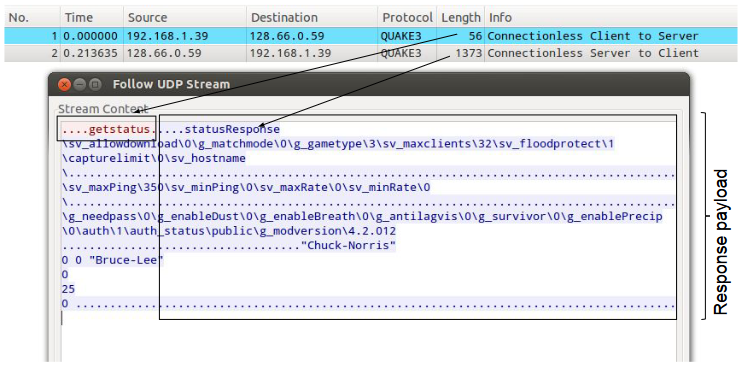](../../../images/fe2790e382_AFgkL6p0la9rqOT6-image-1655730934447.png)

[2 points] The part of the Quake III Arena protocol described in the previous page can
be “misused” to ease a DoS attack against a victim. Please explain how an attack can
misuse this protocol for this purpose, showing a concrete scenario where an attacker (who
controls the server with IP address 93.184.216.32) aims to launch a DoS against the IP
address 131.175.14.19. Make sure you mention in your answer the “feature” of this
protocol that allows the misuse for DoS purpose.
<details>
  <summary>Solution</summary>
  
The protocol allows an amplification-based denial of service: in fact, it is a UDP-based protocol, where a request of length 56 triggers a response of 1373 (in the example above), leading to a bandwidth amplification factor (BAF) of 24, i.e., “amplifying” the attacker’s bandwidth of a factor of 24 (which means that, extremely roughly, if the attacker has a 100 Mbps network, given enough open Quake III servers with enough bandwidth each, it can flood the victim with a 2400 Mbps traffic).
  
Concretely, the attacker (given he\she is in a network that allows IP spoofing) looks on the Internet for N open Quake III servers. It spoofs the victim’s IP address, and sends to such servers M UDP “getstatus” packets. Each server will reply, for each packet received, with with the (long) information packet --- but, as the source IP is spoofed, the M * N packets will go to the victim, instead of the attacker.
</details>

We discovered in the wild a DoS attack that exploits this protocol. The network administrators
of the company that was hit by this attack were able to capture the following headers of some
suspect packets at their network’s border firewall:

```
IP 87.98.244.20 (src port 27960) > 104.28.1.1 (dst port 12345) UDP, length 1373
IP 87.98.244.20 (src port 27960) > 104.28.1.1 (dst port 12345) UDP, length 1373
IP 188.138.125.254 (src port 27960) > 104.28.1.1 (dst port 32451) UDP, length 1400
IP 188.138.125.254 (src port 27960) > 104.28.1.1 (dst port 32451) UDP, length 1400
IP 188.138.125.254 (src port 27960) > 104.28.1.1 (dst port 32451) UDP, length 1400
IP 188.138.125.254 (src port 27960) > 104.28.1.1 (dst port 32451) UDP, length 1400
IP 188.138.125.254 (src port 27960) > 104.28.1.1 (dst port 32451) UDP, length 1400
IP 5.196.85.159 (src port 27960) > 104.28.1.1 (dst port 32451) UDP, length 978
```

[1 point] Can you identify the attacker’s IP address? And the victim’s one? Why?
<details>
  <summary>Solution</summary>
  
Attacker: no, the IP address you see in the logs are the ones of the vulnerable Quake
III servers, not of the victim. Also, the vulnerable Quake servers can’t identify the
attacker’s IP address as they’re spoofed with the victim’s IP.
  
Victim: yes, it’s 104.28.1.1 (actually it could also be the border firewall or, in
general, the company’s network)
</details>

[1 point] As the network security administrator for the network hit by this attack (i.e.,
you control the border firewall and can add arbitrary rules), can you mitigate the effect of
this attack or prevent it altogether? Why?
<details>
  <summary>Solution</summary>
  
No. Due of the amplifying properties of the protocol, if the attacker has enough bandwidth
that, amplified by the 24x factor of the protocol, is >= the victim’s bandwidth, the attacker
always succeeds.
  
However, if in this specific scenario the victim is the specific machine 104.28.1.1 and the
bottleneck is not given by the network bandwidth of the Internet → company link, but from
something else (e.g., the bandwidth of an internal network link, the capabilities of the
machine itself, the capabilities of some network middlebox, ... ) implementing a firewall
rule to drop UDP packet from source port 27960 can mitigate the attack (and thus it would
be a good idea to implement).
  
In general, though, a more powerful DoS attack may be launched to defeat this mitigation...
</details>

[1 point] Consider the following mitigation implemented by the Quake III Arena server:
“when an IP address sends a getstatus command, the server will check if sender IP
address has exceeded a pre-defined rate limit of 10 commands in a period of one second; if
the rate limit is exceeded, the IP address is banned from the server forever”.
Is this solution effective to mitigate the impact of the DoS scenario in the above attack?
Why?

<details>
  <summary>Solution</summary>
  
No. While this mitigation restricts an attacker to exploit a vulnerable server as an amplifier
at most 10 packets per second (i.e., 13730 bytes/s, i.e., about 100 kbps), given that enough
vulnerable servers are available the attacker can just use multiple vulnerable Quake III
servers at once to defeat the rate limit.
  
Moreover, if the attacker is targeting a network and not a specific IP address, it can spoof
multiple IP of the same network, defeating the rate limiting.
</details>

[1 point] As the author(s) of Quake III Arena, you want to change the protocol to
remove completely the issue that allows it from being exploited for DoS attacks. How
would you change the protocol to achieve this goal?

<details>
  <summary>Solution</summary>
  
Solution 1: Implement an handshake at the UDP protocol level (making sure it does not
have amplifying capabilities). E.g., the client sends getinfo, the server responds with a
nonce, and the client sends the nonce back to the server, then the server sends the
“long” information message.
  
Solution 2: Move the protocol to TCP instead of UDP as a transport protocol. Due to the
three-way handshake, TCP is immune to the amplification issue.
</details>

## Exercises on Secure Network Architectures (firewalls)
### Question 1
FreeMail is an anti-spam company that aims to fight spam using an innovative “vigilante”
approach. FreeMail’s customers report their spam e-mails to FreeMail. Then, FreeMail
leaves a generic complaint for each spam e-mail reported by users. FreeMail operates on
the assumption that, as the community grows, the flow of complaints from hundreds of
thousands of computers will apply enough pressure on spammers and their clients to
convince them to stop spamming.

Users can report spam e-mails either through a **web application** (accessible over HTTPS) or
by **forwarding the spam** messages to a dedicated e-mail address (i.e., inbound e-mails are
received by a dedicated SMTP server). The web server uses application logic deployed on
an **application server**. The logic implemented on the application server automatically visits
every website advertised by the URLs in the spam messages and leaves complaints on
those websites. Complaints are left in the website’s **contact forms** or, if the application logic
can’t find any contact form, by **sending an email** to the spammer provider’s abuse contact
(obtained by querying the WHOIS service). Furthermore, the application server saves in a
**SQL database** information about the spam messages that are reported.

Read all the following questions and then answer one by one:

[1 points] Draw FreeMail’s network layout and assign distinct names to any machine and zone.
<details>
  <summary>Solution</summary>
  
[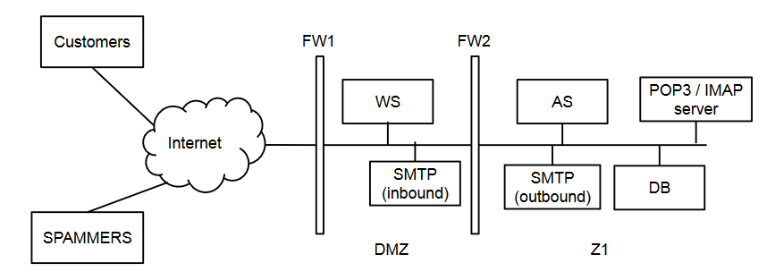](../../../images/e64542f6c3_hZs4q1Y3JXELhhTS-image-1655731608226.png)
</details>

[3 points] Write the firewall rules, assuming firewalls to be
stateful packet filters (i.e. you can consider the response
rules implicit)
<details>
  <summary>Solution</summary>

[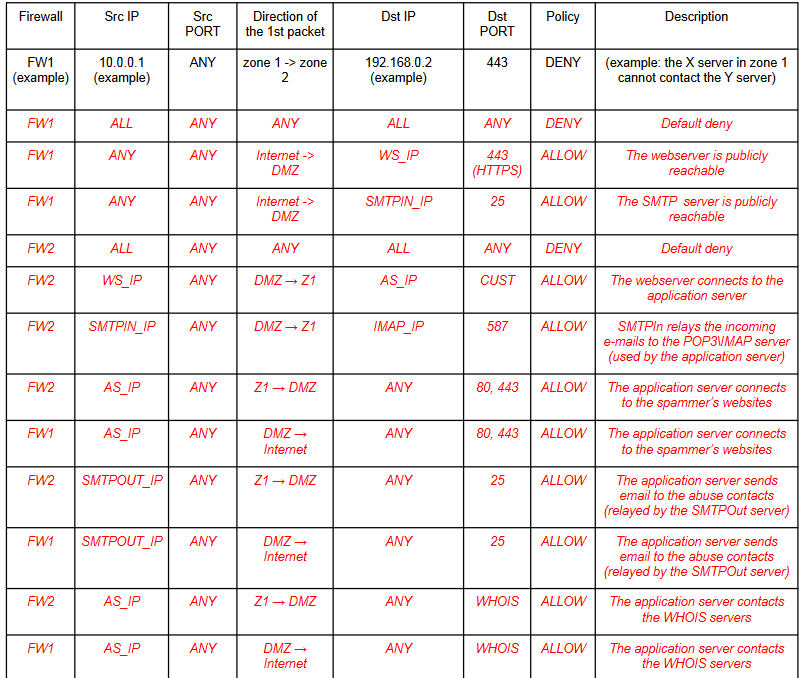](../../../images/a14c832d41_saVqug4xBsMhhEdA-image-1655731674913.png)
</details>

After a short while since the beginning of their operations, FreeMail’s public web
site comes under a massive DDoS attack that uses SYN flooding.

Briefly describe SYN flooding attack and how the attack can cause a
denial-of-service.
<details>
  <summary>Solution</summary>

A SYN flooding attack sends a stream of TCP “initial SYN” packets to the
targeted server. Each packet appears to represent a request to establish a
new connection. An attack that employs a large botnet, for example, might not
use spoofing. : For each incoming SYN packet, the server both responds and
consumes memory because it records information (state) associated with the
impending new connection. The attack primarily aims to exhaust the server’s
available memory for keeping this state.
</details>

[2 points] Briefly describe one countermeasure that FreeMail could use to
defend itself from this attack.
<details>
  <summary>Solution</summary>
  
Syn cookies
</details>

[2 points] Can FreeMail use a stateful packet-filter firewall to defend itself
against the SYN flooding-based DDoS? If so, describe what sort of rule or
rules the firewall would need to apply, and what “collateral damage” the rules
would incur. If not, explain why not.
<details>
  <summary>Solution</summary>
  
Possible solutions:
1. If the flood uses a fixed number (not too large) of IP source addresses in its packets, then the target could install a number of firewall rules that deny traffic from those addresses. In this case, the collateral damage depends on how much legitimate traffic also comes from those addresses.
2. If the flood uses a very large number of IP source addresses, either by employing a large number of different systems (“bots”) to send the traffic, or by spoofing the IP source address in each SYN packet, it is not feasible to defend against the attack. The target cannot use a rule such as “drop any incoming TCP SYN sent to our web server” without enabling the attack to fully succeed, i.e., the collateral damage would be that no legitimate traffic can reach the server.
</details>

[2 points] Explain how the FreeMail service could itself be used to mount a
DoS attack and how a victim can defend itself.
<details>
  <summary>Solution</summary>
  
An attacker could send a large number of bogus spam reports to FreeMail,
falsely indicating some victim site V has been sending spam. FreeMail’s
servers will then visit V to lodge complaints, overwhelming V in the process if
the volume of visits is high enough. A victim can defend itself by blocking
Freemail IP address.
</details>

### Question 2
A small bank is in the process of setting up the network of their only, very small, branch.
The branch employees, from their desktop computers, need to access the Internet for
work purposes (e.g., accessing their web-based email) as well as use an internal web
application, served from the branch web server over the HTTP protocol. The web server
also hosts the customer-facing online banking application, available over the Internet and
served over the HTTPS protocol. Furthermore, the web server is backed by (i.e.,
communicates with) an application server, which stores its data on a relational database
server. As the information processed by the application server and stored in the database
server is sensitive, there is a strong requirement to prevent the employees from directly
accessing those servers.
Besides the employee computers, the branch has some ATM kiosks that allow self-service
cash withdrawals and account balance inquiries. To process those transactions, ATMs
communicate with the application server over a proprietary protocol. The ATMs do not
have access to either the Internet or any other network.

The layout of this network is the following:
[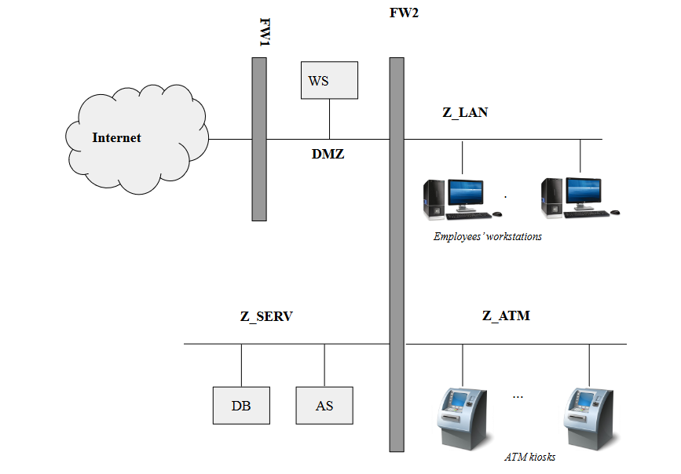](../../../images/5c66c4a79c_xLosS7SDQbuqXac1-image-1655733922048.png)

Write the firewall rules, assuming firewalls to be
stateful packet filters (i.e. you can consider the response
rules implicit)
<details>
  <summary>Solution</summary>

[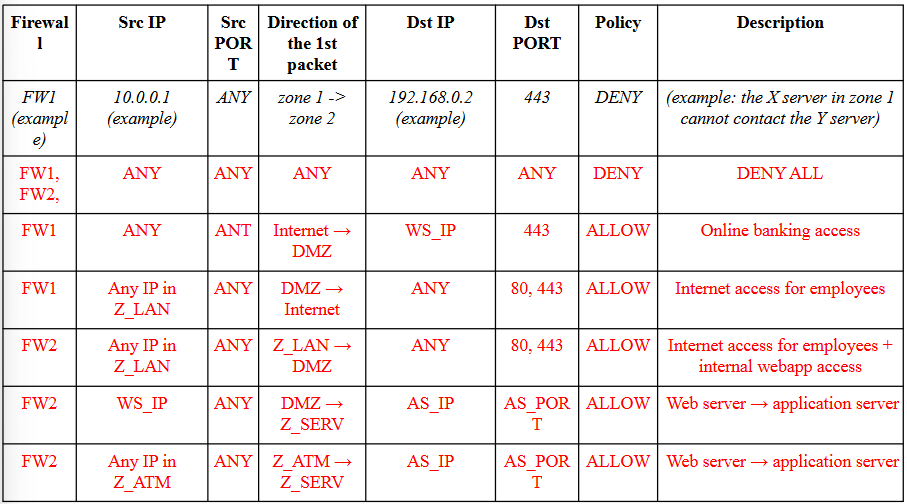](../../../images/805007ee18_T0xiiIPf5j9931Mx-image-1655733989192.png)
</details>

Let’s consider a more realistic scenario: the bank is now part of a larger
banking group. While keeping its own web server locally, the application server and
database server are now shared among various branches and kept in a central location,
where they need to be made remotely accessible from each branch (and from the bank
branches only).

How would you securely realize this architecture? Please state your assumption and detail
any changes to the network diagram for this scenario.
<details>
  <summary>Solution</summary>

The AS and DB are now in a remote location. As we don’t want to expose them over the
Internet, we need to set up a VPN between our network and the central branch.
Basically we can accomplish this by setting up a VPN between the remote location and
placing the VPN client in Z_SERV to bridge the Z_SERV network with the remote
network (or assuming to set up a firewall-to-firewall VPN with the appropriate policies).
As the overall network structure is unchanged, except for the VPN tunnel, the firewall
policies would be the same.
</details>

The bank is worried that, as employees have full access to the Internet, their
computer could become infected with malware. Thus, he decides to install a system to
analyze the content of any HTTP response and scan it with an anti-virus for the presence of
known malware. Assume we’re interested in filtering traffic to HTTP pages only. What
kind of packet filter should the bank put between the employees’ LAN and the Internet
zone? Why?
<details>
  <summary>Solution</summary>

As we need to analyze the content, we need an application proxy (an HTTP proxy in
particular).
</details>

Is it possible to reach the same goal if the pages are served via HTTPS? How?
<details>
  <summary>Solution</summary>

HTTPS man in the middle, trusted cert on employees computers.
</details>

Whoops! You discover that a network expert customer was able to enter the branch,
locate a spare network outlet connected to the employees network (Z_LAN), connect his\her
laptop and intercept all the HTTP communication between the a bank employee and the branch
web server exploiting the gateway, with terrible consequences! Now the bank CISO wants a
detailed report on what could have happened and on how we could prevent this to ever happen in
the future. Please answer the following questions:

(a) Can you guess a technique that the customer could have used to reach this goal? State the
name and briefly describe how it works in general.
<details>
  <summary>Solution</summary>

ARP spoofing
</details>

(b) Detail all the steps that the customer could have performed in order to intercept the
communication between a bank employee’s computer and the web server in this specific
scenario.
<details>
  <summary>Solution</summary>

The customer uses ARP spoofing to pose as the network gateway and sniff all the communication between the employee’s computer and the gateway, including the traffic to the WS.
1. The customer learns the IP address (e.g., by obtaining it via DHCP, or, if DHCP is not enabled, by passively sniffing the network broadcast traffic) and the real MAC address of the gateway (via ARP); 
2. The customer broadcasts ARP messages with the gateway IP address and the customer’s own MAC address; 
3. If the spoofing succeeds, the traffic to the gateway is directed to the customer (the customer also forwards traffic to the real gateway). This, way, the customer is able to sniff all the information between the client and the gateway and, thus, between the client and the local web server.
</details>

(c) Describe a possible way for the branch to prevent, or mitigate, this type of attack in this
specific scenario, besides disabling/locking/damaging the spare network outlet found by the
customer.
<details>
  <summary>Solution</summary>

From the application point of view: use HTTPS with a certificate trusted by the browsers of the
employee computers (BONUS: in this case it is important also to enable HSTS to prevent the
customer to try to downgrade the communication to unencrypted HTTP or to train the
employees to always check whether the communication is encrypted). From the network point
of view: various techniques; for example, 802.1x to authenticate clients connected to ethernet
ports or attempt, ... (in general this approach is complementary to the use of HTTPS).
</details>

(d) Can the same attack be used to intercept communication between the web server and the
application server?
<details>
  <summary>Solution</summary>

No, as they are on different networks.
</details>

### Question 3
An online shop offers to its customers a web application, publicly
reachable from the Internet, deployed on a web server. The web
server uses application logic deployed on an application server.
The application logic alone implements queries executed on a
database server. The application server must be able to initiate a
communication with a remote web service over HTTPS, and
receive the responses, to perform payment transactions.

Draw the network layout and assign distinct names to any
machine and zone.
<details>
  <summary>Solution</summary>

[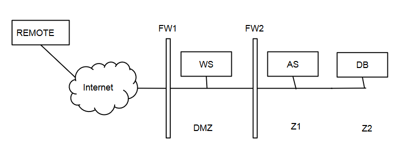](../../../images/80e1d49028_cRzWPjCpxqay4uzk-image-1655734495443.png)
</details>

Write the firewall rules, assuming firewalls to be stateful packet
filters (i.e. you can consider the response rules implicit)
<details>
  <summary>Solution</summary>

[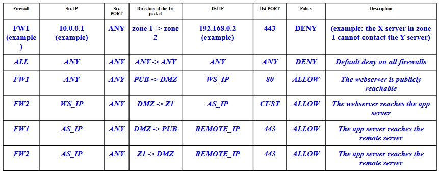](../../../images/0d6749b6be_9w4QJLX466QMeUYr-image-1655734527764.png)
</details>

### Question 4
You are the network administrator of a small LAN and you're
configuring the firewall. You want to allow the computers
connected to the LAN to browse the Web (HTTP, port 80), but you
want to avoid that they download known malware.
1. (2 points) What type of firewall do you need and why? We need a firewall capable of decoding the application layer in order to trigger on HTTP responses corresponding to HTTP requests initiated from the internal network. In this specific case an HTTP proxy could be used.
<details>
  <summary>Solution</summary>

We need a firewall capable of decoding the application layer in
order to trigger on HTTP responses corresponding to HTTP
requests initiated from the internal network. In this specific case an
HTTP proxy could be used.
</details>

2. (1 points) What does the firewall need to do in order to prevent downloading known malware? By parsing the HTTP response, the firewall extracts each file being downloaded and sends them to an AV for scanning.
<details>
  <summary>Solution</summary>

By parsing the HTTP response, the firewall extracts each file being
downloaded and sends them to an AV for scanning.
</details>

3. (3 points) Suppose now that you want to adapt the same solution to HTTPS (port 443). Explain how this can be done.
<details>
  <summary>Solution</summary>

Since the firewall needs to decrypt the application-level payload, it
must become a MITM during the SSL handshake. To achieve this,
we install another trusted CA in the certificate store of each client's
browser.
</details>

### Question 5
The Avengers Hotel has recently adopted a new domotic system that allows to control the
appliances inside your hotel rooms (e.g., air conditioner, refrigerator, lights, door locks,
gates) from your smartphone over the Internet. For example, you can turn on the air
conditioner or open the door when you're approaching the room. The system is composed
of a web server, which is connected to actuators (e.g., door lock, light on-off switch) over a
local network. You can assume that the actuators are TCP/IP-based devices communicating
on port 8080. You send commands to the web server over HTTP (on port 80) via
Internet-connected smartphones. The web server forwards the commands on port 9060
towards a centralized Application Server that interprets each command received. The
Application Server stores the data on a centralized DB on port 1433 and sends the
commands on port 8080 to the respective Room IoT gateway that, in turn, activates or
deactivates the actuators. The centralized application server communicates with a local
email server to send daily reports to the room owner (on port 25) about the conditions of
the room (e.g., temperature). Here is the network layout:
[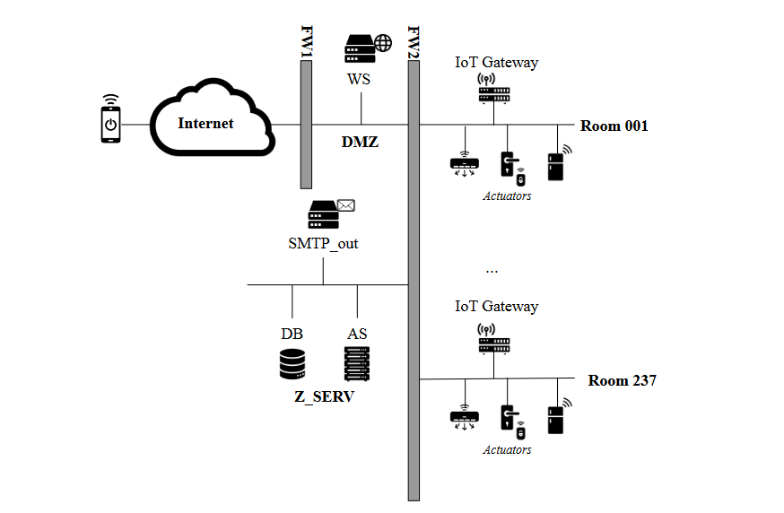](../../../images/0fb3440686_lv9EXsKPVXi2rxSB-image-1655734717931.png)

1. [2 points] Write the firewall rules, assuming firewalls to be stateful packet filters (i.e. you can consider the response rules implicit) and considering only one room.
<details>
  <summary>Solution</summary>

[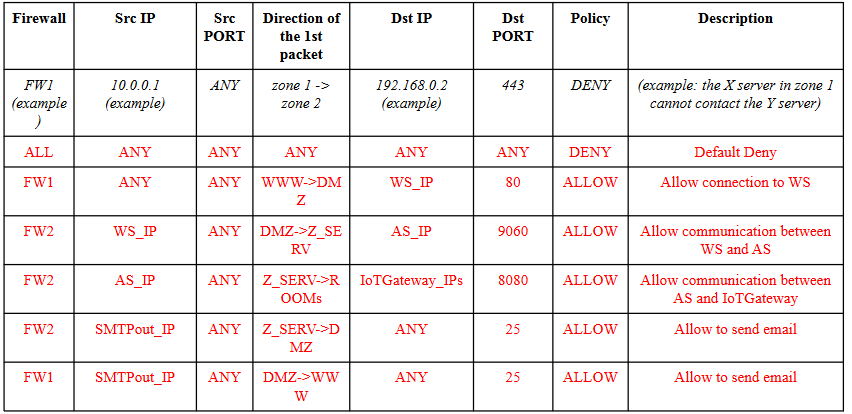](../../../images/23cd13119d_0ZGHFXjsfqztlJUW-image-1655734804634.png)
</details>
2. [2 points] (1) Identify the most valuable asset and (2) describe a risk scenario against that asset, clarifying the (3) threats and the (4) vulnerabilities that cause it.
<details>
  <summary>Solution</summary>

The most valuable asset is the actuator of the door lock or gates. In a hypothetical risk
scenario an attacker can open the door and break into the house. Specifically, a man in the
middle attacker (threat agent) can read the commands and authentication session over the
Internet. The vulnerability that caused this attack could be that the network traffic is not
encrypted.
</details>

3. [1 point] Propose any network-level security mechanism or protocol to ensure that the above risk scenario is properly mitigated.
<details>
  <summary>Solution</summary>

We propose to use HTTPS
</details>

After few days, the hotel was hit by a cyber attack: all clients were unable to connect to the web service to access their rooms by using the smartphone. You are a computer security expert of the S.H.I.E.L.D. (Security Homeland Intervention, Enforcement and Logistics Division). You and your team have been assigned to solve this case and discover what happened. You have obtained the following network logs towards the company web server (with IP 10.133.17.10) through FW
[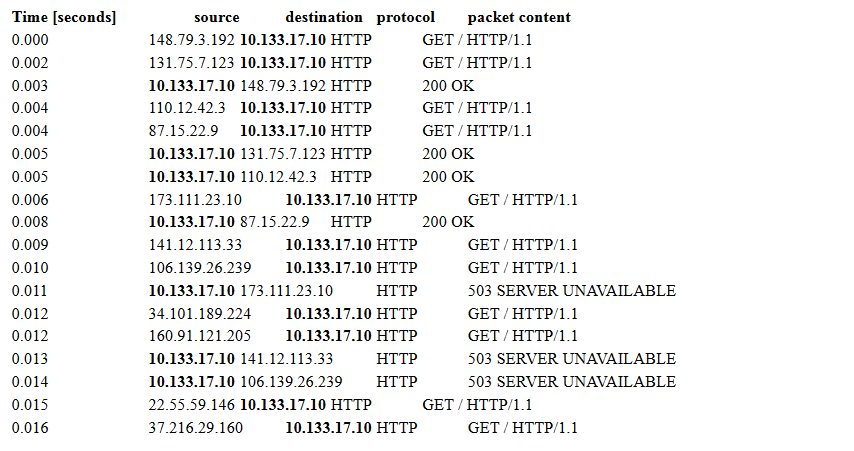](../../../images/530c07b262_aPHN4XPeCqL6ZDpD-image-1655734953596.png)
Tracking the IP addresses contacting the web server (148.79.3.192, 110.12.42.3, 173.111.23.10...), you were able to discover
that the vast majority of them came from smart cameras, routers, smart fridges and other IoT devices.

[2 points] Which attack has been implemented? Give a brief explanation of how it
works in general and in this specific case, focusing on what an attacker needs in order to
implement them.
<details>
  <summary>Solution</summary>

DDOS because many IPs are asking to retrieve data, though a botnet probably since the IoT
devices.
  
The attacker uses a network of (usually compromised) machines to flood the victim with large
amounts of unrequested network packets. The attacker needs access to many machines with
sizable internet connections.
  
Typically, trojans on compromised machines forming a botnet.
</details>

[1 points] Can you mitigate such attack? Motivate your answer.
<details>
  <summary>Solution</summary>

Overall, there is no solution to this class of attacks. These attacks can only be mitigated by
acting against botnets or by cleaning up infections on compromised machines.
</details>