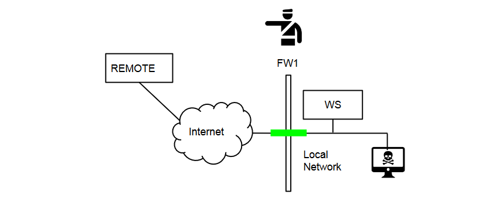
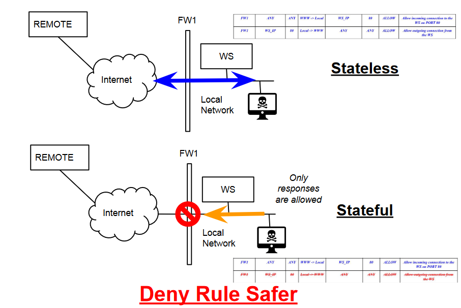
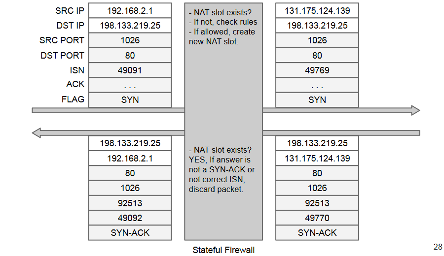
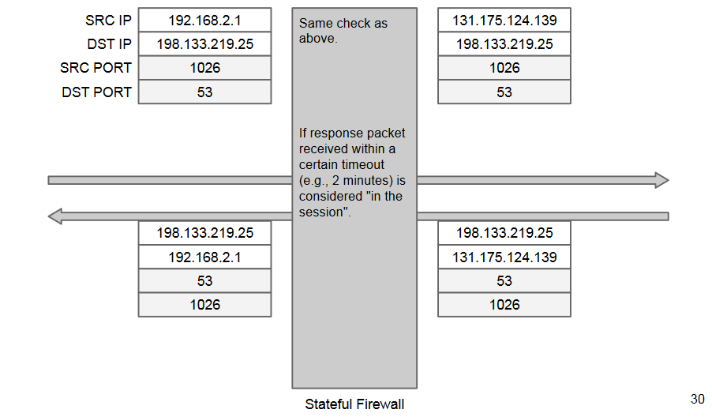

# Firewalls

Firewall: network access control system that
verifies all the packets flowing through it.

Its main functions are usually:
- IP packet filtering
- Network address translation (NAT)

Must be the single enforcement point between
a screened network and outside networks.

A firewall checks all the traffic flowing through
it, and only the traffic flowing through it.

Powerless against insider attacks (unless the
network is partitioned somehow). In general, powerless against unchecked
paths.

The firewall itself **is a computer**: it could have
vulnerabilities and be violated. Most of the times
- It's a single purpose machine, an embedded appliance with just a firmware.
- Usually offers few or no services

## Firewall rules
A firewall is a stupid “bouncer at the door”:
- Just applies rules
- Bad rules = no protection

Firewall rules are essentially the
**implementation of higher-level security
policies**.

Policy must be built on a **default deny base**.

## Firewall taxonomy
We divide them depending on their **packet
inspection capability**.

### Network layer firewalls
#### Packet filters firewall (network)
Packet by packet processing.

Decodes the IP (and part of the TCP) header:
- SRC and DST IP
- SRC and DST port
- Protocol type
- IP options

**Stateless**:
- cannot track TCP connections.
- No payload inspection.

Regardless of the specific syntax, every
network packet filter allows to express the
following concept: **if (packet matches certain condition) do this**.

#### Stateful packet filters firewall (network-transport)
Include network packet filters, plus:
- keep track of the TCP state machine
	- after SYN, SYN-ACK must follow
- we can track connections without adding a response rule.
- Make deny rule safer

**CONS**: Performance bounded on a per-connection
basis, not on a per-packet basis. The number of simultaneous connections are just as
important as packets per second. 

A **session** is an atomic, transport-layer
exchange of application data between 2 hosts.

Main transport protocols:
- TCP (Transmission Control Protocol)
	- session =~ TCP connection
- UDP (User Datagram Protocol)
	- session = this concept does not exist
    
Session-handling is fundamental for NAT.

NAT Session Initialization (TCP):

In UDP a “session” can be inferred
for NAT and controls:

Some protocols (e.g., DCC, RDT, instant
messengers, file transfer) transmit network
information data (e.g., port) at application layer.

For instance, FTP uses dynamic connections:
- Allocated for file uploads, downloads, output of commands
- "PORT" application command

### Application layer firewalls
#### Circuit level firewalls (transport-application)
Relay TCP connections.

Client connects to a specific TCP port on the
firewall, which then connects to the address
and port of the desired server (**not
transparent!**).

Essentially, a TCP-level proxy.

Only historical example: SOCKS

#### Application proxies (application)
Same as circuit firewalls, but at application
layer.

Almost never transparent to clients:
- May require modifications
- Each protocol needs its own proxy server

Inspect, validate, manipulate protocol
application data (e.g., rewrite HTTP frames)

Can authenticate users, apply specific filtering
policies, perform advanced logging, content
filtering or scanning (e.g., anti-virus/spam).

Can be used to expose a subset of the protocol:
- to defend clients,
- to defend servers (“reverse proxy”).

Usually implemented on COTS OSs.