# Network Protocol Attacks

## Denial of Service (against availability)
Make the service unavailable to legitimate users.

### Killer Packets
#### Ping of Death
Pathological ICMP echo request that exploit a
memory error in the protocol implementation.

> gazillions of machines can be crashed by sending IP packets that exceed the maximum legal length (65535 octets)

#### Teardrop
Exploit vulnerabilities in the TCP reassembly.

Fragmented packets with overlapping offsets.

While reassembling, kernel can hang/crash.

#### Land Attack
A long time ago, in a Windows 95 far, far away,
a packet with

- src IP == dst IP
- SYN flag set

could loop and lock up a TCP/IP stack.

### Flooding
[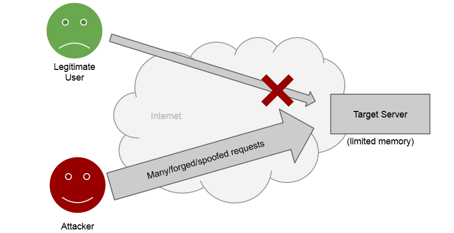](../../../images/b0074e06cc_KqXMQW5wOlbyrnQZ-image-1655677041202.png)

#### SYN Flood Attack
We recall how the TCP/IP three way handshake:
[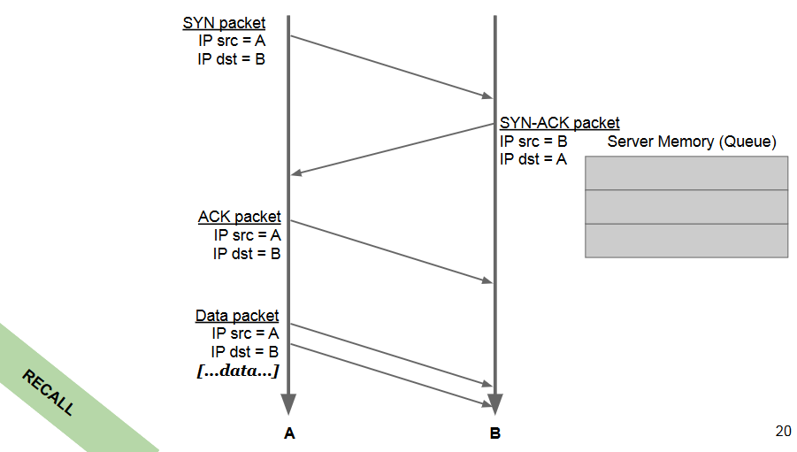](../../../images/1d713b268e_VlCm9owydLw83DwN-image-1655677097866.png)

Attacker generates a high volume of SYN requests
with spoofed source address.

Many half-open TCP/IP connections fill the queue.

SYN requests from legitimate clients dropped.
[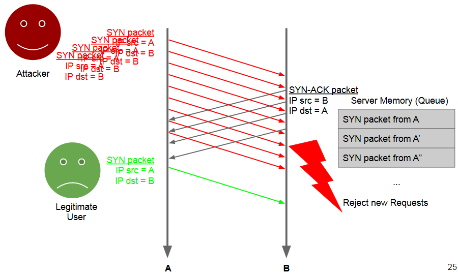](../../../images/2f25156829_aVJ2RHpt1af7yGuF-image-1655677141922.png)

Mitigation: **SYN-cookies** avoid this: reply with
SYN+ACK but discard the half-open connection,
and wait for a subsequent ACK.
[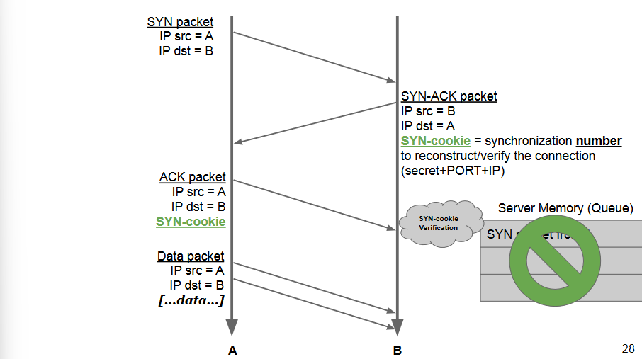](../../../images/907cef3f03_hejYGXjRwOdtSSfa-image-1655677181673.png)

### Distributed DoS (DDoS)
[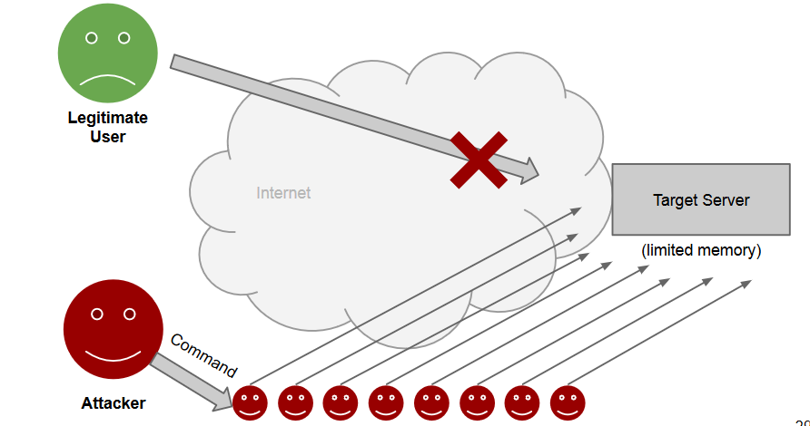](../../../images/a01f78fe1f_OkqLBznGD8jqY1J1-image-1655677211657.png)

**Botnet**: network of compromised computers,
called bots (i.e., infected by malware).

**C&C**: dedicated command-and-control
infrastructure so that the attacker (botmaster)
can send commands to the bots.

Various uses (e.g., spamming, phishing, info
stealing), including DDoS-ing.

#### Smurf
The attacker sends ICMP packets with spoofed
sender (victim) to a broadcast address.
[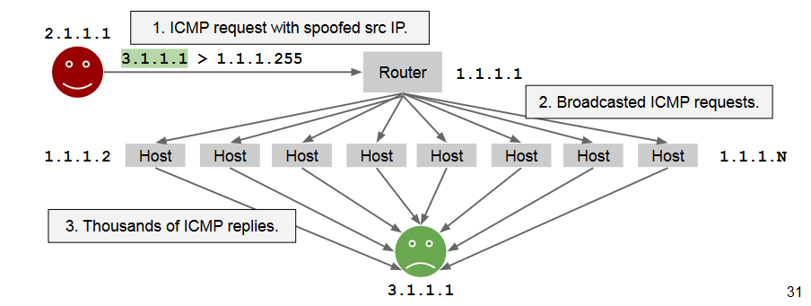](../../../images/7105c1fe5c_2Za4LNNZ6d0j4dnz-image-1655677349988.png)

This happens because ICMP requires no authentication.

## Sniffing (against confidentiality)
Abusive reading of network packets.

Normally, a network interface card (NIC)
intercepts and passes to the OS only the
packets directed to that host's IP.

**Promiscuous mode**: the NIC passess to the
OS any packet read off of the wire.

When hubs where used instead of switches it was very easy to sniff.

**Hubs** broadcast traffic to every host. NICs can
be in promiscuous mode. Broadcast domain.

**Switches** selectively relay traffic to the wire
corresponding to the correct NIC
(**ARP** address based).

## Spoofing (against integrity and authenticity)
Forging network packets.

### ARP spoofing
The ARP maps 32-bits IPv4 addresses to 48-bits
hardware, or MAC, addresses.

- ARP request "where is 192.168.0.1?"
- ARP reply "192.168.0.1 is at b4:e9:b0:c9:81:03"

First come, first trusted! An attacker can forge
replies easily: lack of authentication.

**Possible Mitigations**
- Check responses before trusting (if conflicts of addresses)
- Add a SEQ/ID number in the request

### Filling up a CAM Table
Switches use CAM tables to know (i.e.,
cache) which MAC addresses are on which
ports

Dsniff (macof) can generate ~155k spoofed
packets a minute: fills the CAM table in
seconds (**MAC flooding**).

CAM table **full**: cannot cache ARP replies
and must forward everything to every port
(like a hub does). 

A mitigation is to implement PORT security. Limit the number of MAC that can be learnt for
each port and\or predefine a set of MAC addresses for each port.

### Abusing the Spanning Tree Protocol
The STP (802.1d) avoids loops on switched
networks by building a spanning tree (ST).

Switches decide how to build the ST by
exchanging BPDU (bridge protocol data unit)
packets to elect the root node.

BPDU packets are not authenticated, so, an
attacker can change the shape of the tree for
sniffing or ARP spoofing purposes. 

### IP address spoofing (UDP/ICMP)
The IP source address is not authenticated.
Changing it in UDP or ICMP packets is easy.

However, the attacker will not see the answers (e.g.,
he/she is on a different network), because they will be
sent to the spoofed host (**blind spoofing**).

But if the attacker is on the same network, s(he) can
sniff the rest, or use ARP spoofing.

### IP Address Spoofing (TCP): TCP Sequence Number Guessing
TCP uses sequence numbers for
reordering and acknowledging packets.

A semi-random Initial Sequence Number
(ISN) is chosen.

If a blind spoofer can predict the ISN, he can
blindly complete the 3-way handshake
without seeing the answers.

However, the spoofed source needs not to
receive the response packets, otherwise it
might answer with a RST.

[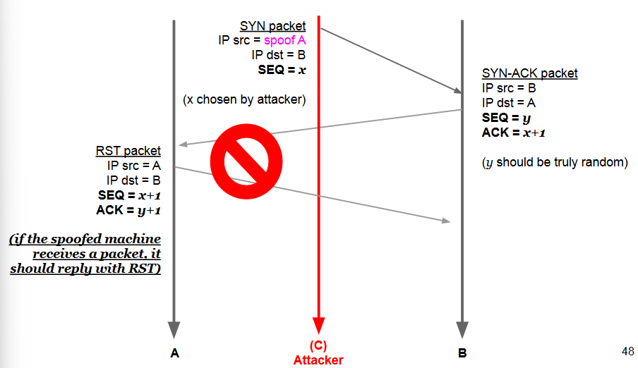](../../../images/f79ab52755_7UULuZZ6tP4Mqj73-image-1655718829354.png)

[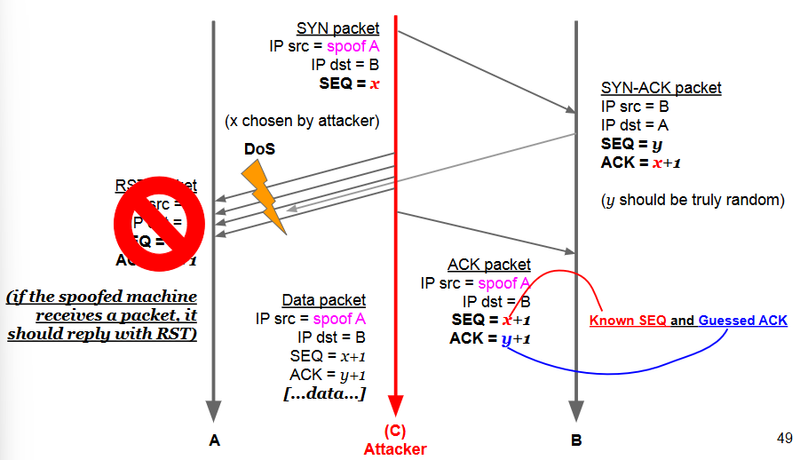](../../../images/9c5429ee75_2xOVxLqsOWaAdHdQ-image-1655718841036.png)

## TCP Session Hijacking
Taking over an active TCP session.

If the attacker (C) can sniff the packets:
1. C follows the conversation of A and B recording the sequence numbers.
2. C somehow disrupts A's connection (e.g., SYN Flood): A sees only a “random” disruption of service.
3. C takes over the dialogue with B by spoofing A address and using a correct ISN. B suspects nothing.

[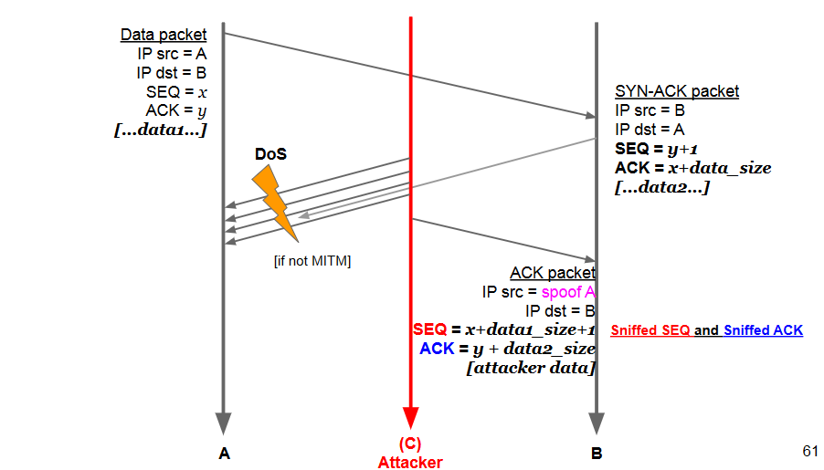](../../../images/c07a7a38df_so3bdvGfPx7J8Hgg-image-1655718915172.png)

The attacker can avoid disrupting B's session
and just inject things in the flow only if s(he) is a
**man in the middle**.

## MITM: Man In The Middle
A broad category comprising all the attacks
where an attacker can impersonate the server
with respect to the client and vice-versa.

[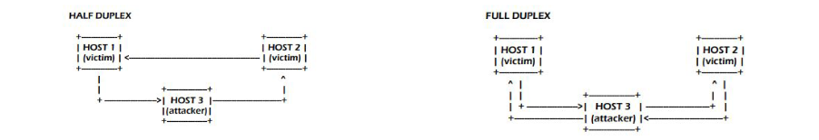](../../../images/9d9318f4c1_NPz7ZS18OnSpdL1q-image-1655718971764.png)

## DNS (Cache) Poisoning Attack
[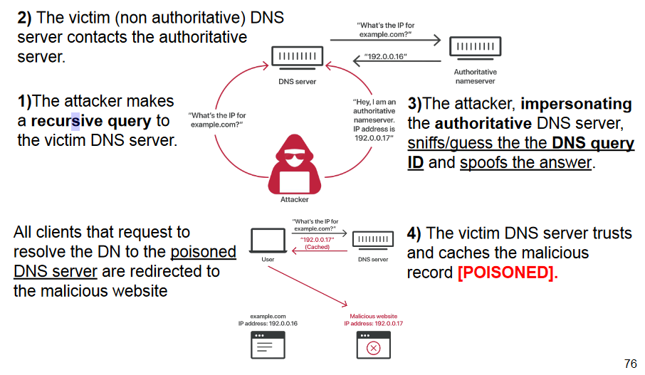](../../../images/76b0dedbd4_bF9g1n0ugeLnoPsf-image-1655719024244.png)

## DHCP Poisoning Attack
DHCP is an unauthenticated protocol

The attacker can intercept the “DHCP
requests”, be the first to answer, and client will
believe that answer tricking into beliving that the gateway is another machine.

With a (spoofed) “DHCP response”, the
attacker can set:
- IP address,
- DNS addresses,
- default gateway of the victim client.

## ICMP Redirect Attack
ICMP redirect tells an host that a better route exists for a
given destination, and gives the gateway for
that route.

When a router detects a host using a
non-optimal route it:
- Sends an ICMP Redirect message to the host and forwards the message.
- The host is expected to then update its routing table.

The attacker can forge a spoofed ICMP
redirect packet to re-route traffic on specific
routes or to a specific host that may be not a
router at all.

The attack can be used to:
- Hijack traffic (elect his/her computer as the gateway).
- Perform a denial-of-service attack.

The attacker needs to intercept a packet in the
“original” connection in order to forge the reply
(i.e., must be in the same network).

Creates a (half-duplex) MITM situation.