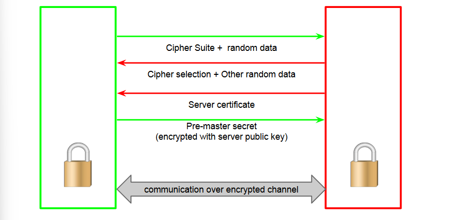
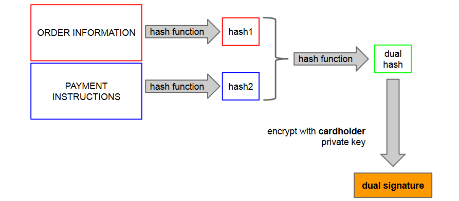
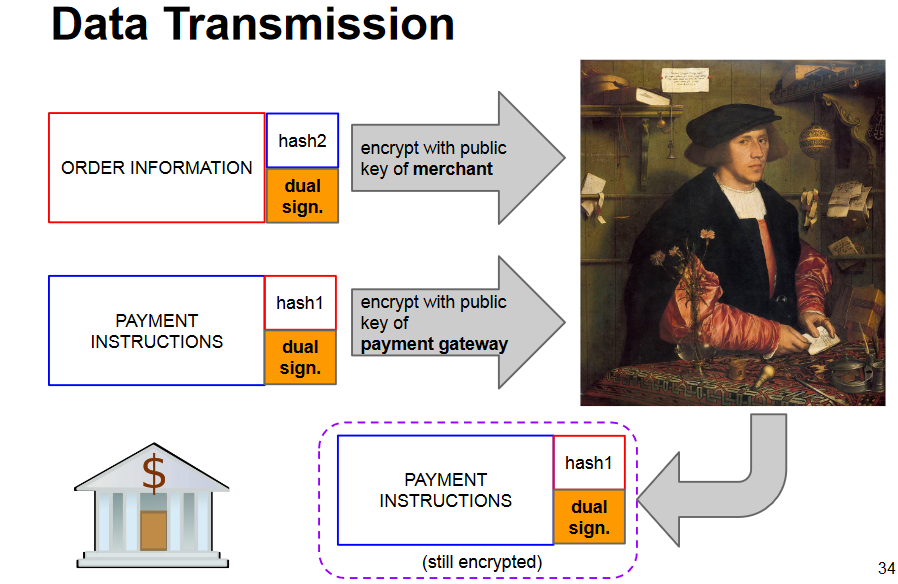
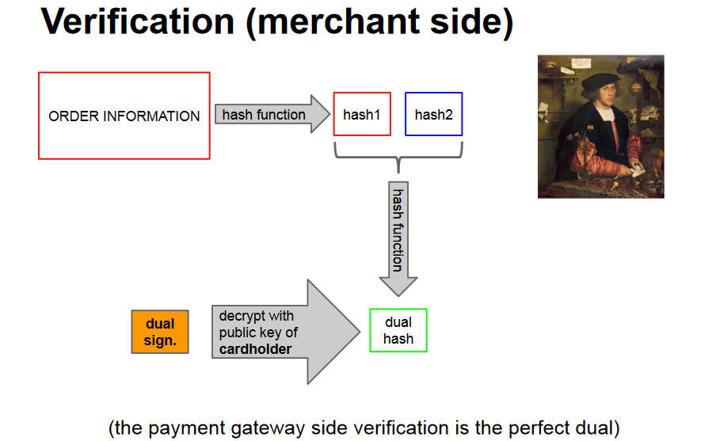

# TLS and SET

**Issues of Transactions Security**:
- Problems of remoteness
  - Trust factor between parties
  - Use of sensitive data
  - Atomicity of transaction
- Internet protocol problems
  - Authentication
  - Confidentiality
- Transparence and critical mass problem

Two valiant protocols fought against the
darkness:
1. **HTTP over SSL (Secure Socket Layer), or HTTPS**
   - Communication confidentiality and integrity
   - Mutual authentication
   - No guarantees on data usage
   - No strict authentication of client (in practice)
2. **SET (Secure Electronic Transaction)**
   - Guarantees on data usage and transaction security enforcement
   - Missing critical mass support 
   
## TLS (Transport Layer Security)
Transport Layer Security (TLS) is the successor protocol to SSL. TLS is an **improved version of SSL**. It works in much the same way as the SSL, using encryption to protect the transfer of data and information.

TLS enforces:
- Confidentiality and integrity of the communications
- Server authentication
- Client authentication (optionally)

TLS designed to be flexible with respect to technical evolution.
Clients and servers may use different suites of algorithms for
different functions
- key exchange algorithm
- bulk encryption algorithm
- message authentication code algorithm
- pseudorandom function

During handshake, cipher suites are compared to
agree on shared algorithms in order of preference.

### Is TLS resistant to MITM?
What could the MITM do?
- Let the original certificate through? No, because it needs to actually have the key on that cert.
- Send a fake certificate (i.e. signed by a non-trusted CA)? No, it will be rejected by the client
- Send a good certificate with a fake name? No, it will be rejected by the client
- Send a good certificate but substitute the public key (making it invalid)? No, it will be rejected by the client

**TLS is by design resistant to MITM**.

### Cons of TLS
- No protection before or after transmission
	- On server
	- On client (e.g., trojan)
	- By abuser (e.g., non-honest merchant)
- Relies on PKI: depend on the security and trust of the root and intermediate CAs
- Not foolproof

#### Overcoming TLS/PKI limitations
**HSTS (HTTP Strict Transport Security)**
- HTTP header to tell the browser to always connect to that domain using HTTPS
- Browsers (e.g., Chrome) implement a HSTS preload list: some websites are simply never loaded over plain HTTP
- Defends against SSL stripping

**HPKP (HTTP Public Key Pinning)**
- HTTP header to tell the browser to “pin” a specific certificate or a specific CA
- Browser will refuse certificates from different CAs for that origin
- Defends against trust cert mis-issuance
- **Deprecated**

**Certificate Transparency**
- CA submit the metadata of every issued certificate to a (independent, replicated) log
- Can be enforced by browsers
	- browsers refuse certs not logged in CA logs
- Defends against certificate misissuance: site owner can check \ be notified of certificates issued for the properties they manage
- You can look at the CT logs: https://crt.sh

## SET
SET was a joint effort VISA+MasterCard consortium with the goal to **protect transactions**, not connections.

Approach:
- Cardholder sends the merchant only the order of goods
- Send the payment data to the **payment gateway**
- Empower gateway to verify correspondence

Uses the concept of a **dual signature**: a signature that joins together the two pieces of a
message, directed to two distinct recipients

### The failure of SET
SET requires a digital certificate from:
- Merchant
- Payment Gateway
- Cardholder: impossible to scale!

Therefore, a pre-registration of the
cardholder is needed! (won't buy that book)

Nowadays a simple redirect with a token to
the website of the bank is commonly used