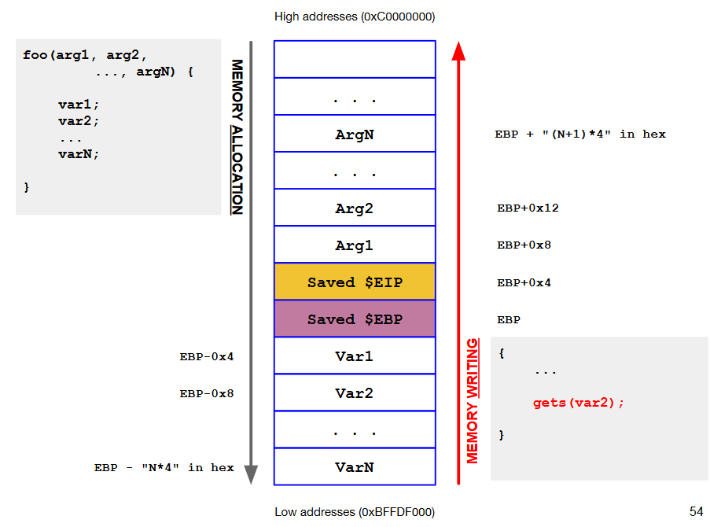
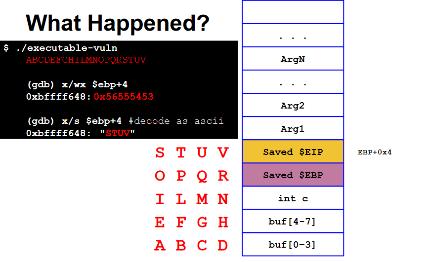
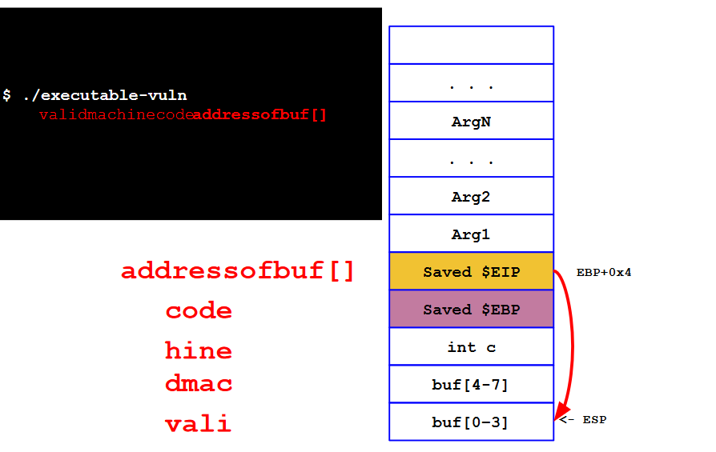
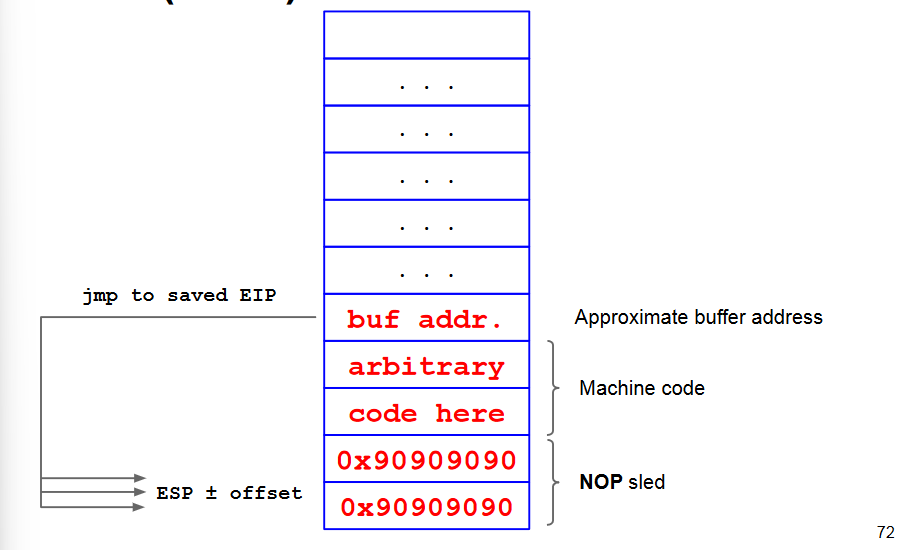
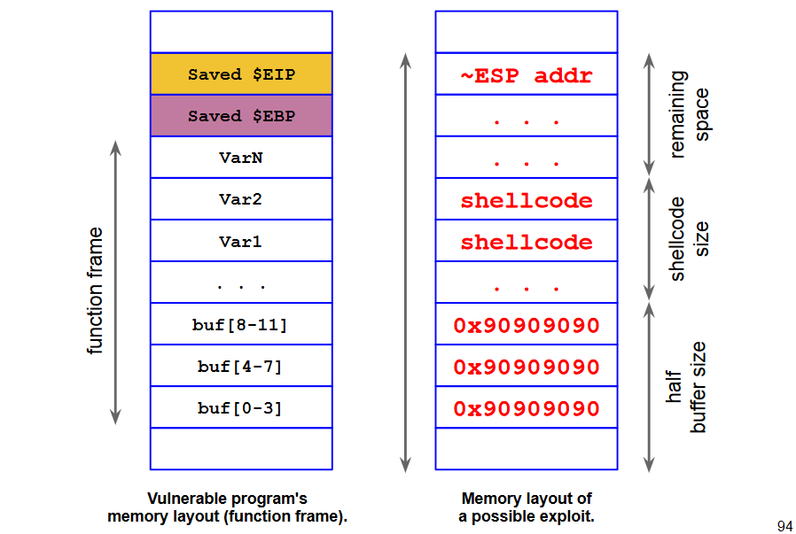
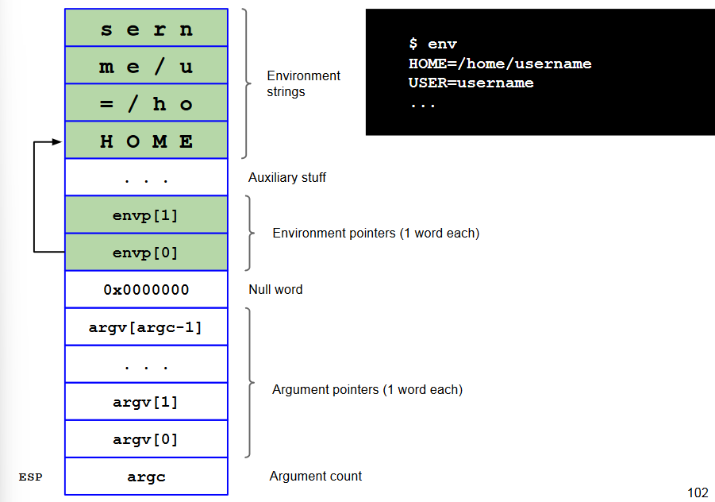
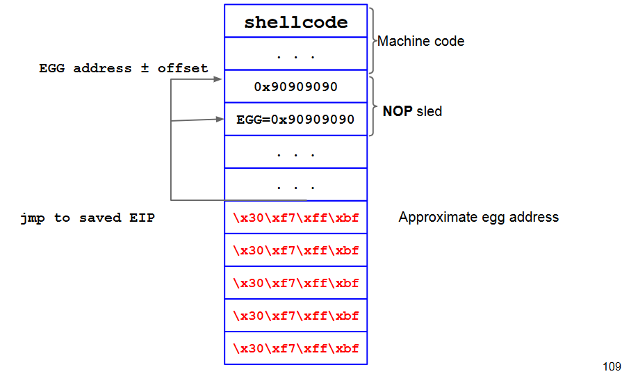
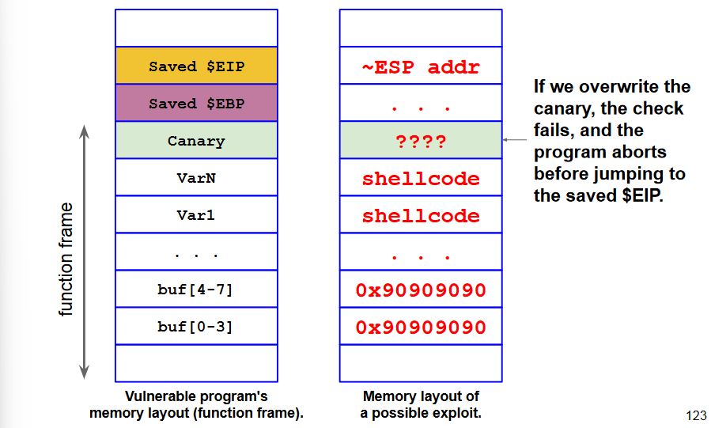

# Buffer overflows

A function `foo()` allocates a buffer, e.g., `char buf[8]`. `buf` is filled **without size checking**.

```c
int foo(int a, int b)
{
	int c = 14;
	char buf[8];
	gets(buf); //security bug -> vulnerability
	c = (a + b) * c;
	return c;
}
```
[](../../../images/b5a7252e1e_RIWJAntYbA9DCPny-image-1655632006818.png)

If we fille the buf and overwrite the saved EIP:
[](../../../images/8af7081437_MDdUbj1NgJ2OBo2U-image-1655632075674.png)

`jmp 0x56555453` jump to invalid address (for the current process) so the program crashes.

### Where to jump?
We need to jump to a **valid memory
location** that contains, or can be filled with,
**valid executable machine code**.

There are different exploitation techniques:
- Environment variable
- Built-in, existing functions
- Memory that we can control
	- The buffer itself (what we will see)
    - Some other variable
    
[](../../../images/9546247033_qvJtUrHo6FIoycds-image-1655632224643.png)

## Stack Smashing 101
Let's assume that the overflowed buffer has
enough room for our arbitrary machine code.

How do we guess the buffer address?
- Somewhere around ESP: gdb?
- unluckily, exact address may change at each execution and/or from machine to machine.
- the CPU is dumb: off-by-one wrong and it will fail to fetch and execute, possibly crashing.

In practice the ESP value is read:
- Use a debugger: `(gdb) p/x $esp`. Most debuggers add an offset, so the ESP differs a few words.
- Read from a process

### NOP Sled
A "landing strip" such that:
- Wherever we fall, we find a valid instruction
- We eventually reach the end of this area and the executable code

Sequence of NOP at the beginning of the buffer
- NOP is a 1-byte instruction (0x90 on x86), which does nothing at all

We will need to jump anywhere within the nopsled (somewhere in the middle).

[](../../../images/a68ced6e15_2j067KiiCXHE0Ut8-image-1655632374552.png)

### What to execute?
Historically, goal of the attacker: to spawn a
(privileged) shell (on a local/remote machine).

(Shell)code: sequence of machine instructions
(that are needed to open a shell)
In general, a shellcode may do just anything (e.g., open a
TCP connection, launch a VPN server, a reverse shell).

Basically: execute `execve("/bin/sh")` system call.

In Linux, a system call is invoked by executing
a software interrupt through the int instruction
passing the `0x80` value (or the equivalent
instructions):
1. `movl $syscall_number, eax`
2. Syscall arguments //GP registers (ebc, ecx,edx)
	1. `mov arg1, %ebx`
	2. `mov arg2, %ecx`
	3. `mov arg3, %edx`
3. `int 0x80` //Switch to kernel mode
4. Syscall is executed

The steps to write shellcode are:
1. Write high level code
2. Compile and disassembly
3. Analyze and clean up assembly
4. Extract Opcode
5. Create the shellcode

[](../../../images/3dbfa27c58_Yl3L6VZx3YKwqtgT-image-1655637124797.png)

### Alternative exploits
We showed this with the overflowed buffer, but
can be done with other memory areas too.

| PROS | CONS |
|-|-|
|Can do this remotely|Buffer could not be large enough<br>Memory must be marked as executable<br>Need to guess the address reliably|

#### Environment Variable
```c
int main(int argc, char *argv[], char *envp[])
```

We allocate an area of memory that contains
the exploit.

Then, we put the content of that memory in an
environment variable named $EGG.

Finally, we have to overwrite the EIP with the
address of $EGG by filling the buffer.

| PROS | CONS |
|-|-|
|Easy to implement<br>Easy to target|Works for local exploiting only!<br>The program may wipe the environment<br>Memory must be marked as executable|

[](../../../images/08220f7049_ZNfWzUbgutAvoh5V-image-1655637328012.png)

[](../../../images/6efca8f68a_uYSl23dc15JCgX6N-image-1655637378567.png)

#### Built-in, Existing Function
The address of a system library or function
(e.g., return to libc attack).

| PROS | CONS |
|-|-|
|Works remotely and reliably<br>No need for executable stack<br>A function is executable usually<br>|Need to prepare the stack frame carefully|

### Alternatives for overwriting
- Saved EIP (direct jump) (what we saw): `ret` will jump to our code
- Function Pointer (call another function): `jmp` to another function
- Saved EBP (frame teleportation): `pop $ebp` will restore another frame

## Defending against buffer overflows
A multilayered approach to defense is used:
- Defenses at **source code** level: finding and removing the vulnerabilities
- Defenses at **compiler** level: making vulnerabilities non exploitable
- Defenses at **operating system** level

### Defenses at Source Code Level
Programmer errors cause buffer overflows. It is possible to limit these errors:
- Education of developers
- System Dev. Life Cycle (SDLC)
- Targeted testing
- Use of source code analyzers
- Using safe(r) libraries: Standard Library str**n**cpy, str**n**cat, etc. (with length parameter)
- Using languages with Dynamic memory management (e.g., Java) that makes them more resilient to these issues.

### Compiler Level Defenses
- Warnings at compile time
- Randomized reordering of stack variables
- Embedding stack protection mechanisms at compile time

##### Canaries
Canaries are stack protection mechanisms embedded at compile time.

The goual is to verify, during the epilogue, that the frame has not
been tampered with.

Usually a canary is inserted between local
variables and control values (saved EIP/EBP) and when the function returns, the canary is checked
and if tampering is detected the program is killed.
[](../../../images/b7b9d29147_2WluLuDsojOIprFX-image-1655637856751.png)

There are different type of canaries:
- **Terminator canaries**: made with terminator characters (typically \0) which cannot be copied by string-copy functions and therefore cannot be overwritten
- **Random canaries**: random sequence of bytes, chosen when the program is run
- **Random XOR canaries**: same as above, but canaries XORed with part of the structure that we want to protect - protects against non-overflows

### OS Level Defenses
1. **Non-executable stack**
	- No stack smashing or local variables
    - The hardware **NX bit** mechanism is used
    - Bypass: don’t inject code, but point the return address to existing machine instructions (code-reuse attacks), called **return oriented programming (ROP)**
2. **Address Space Layout Randomization (ASLR)**
	- Repositioning the stack, among other things, at each execution at random; impossible to guess return addresses correctly