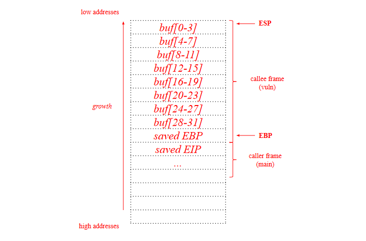
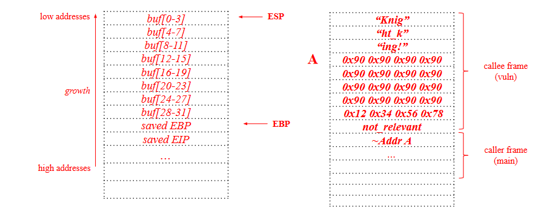
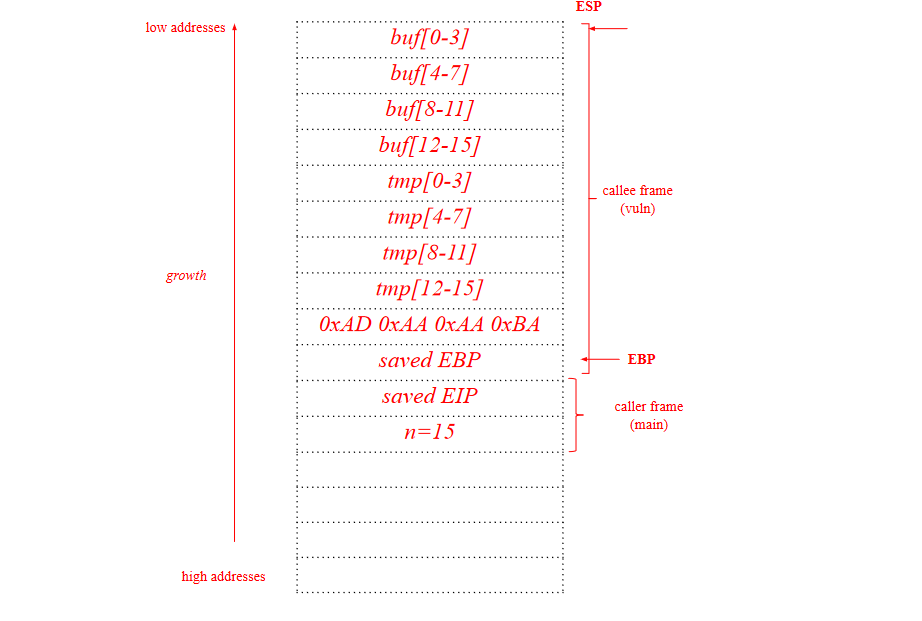
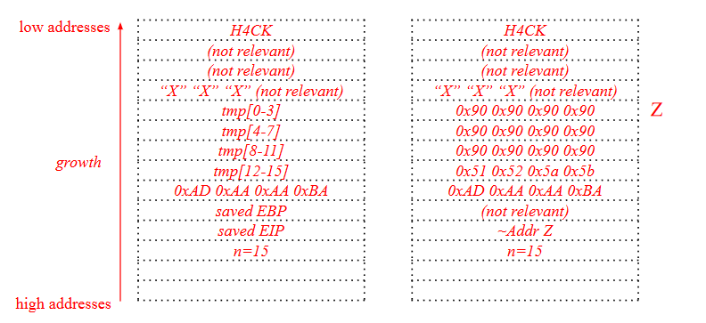
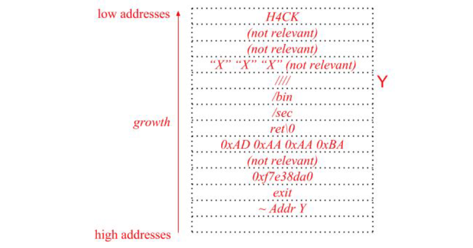
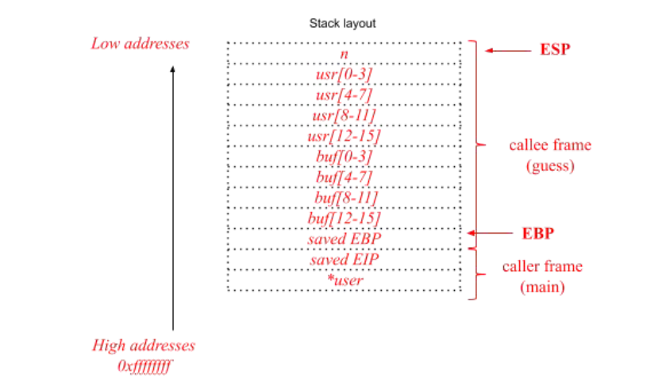
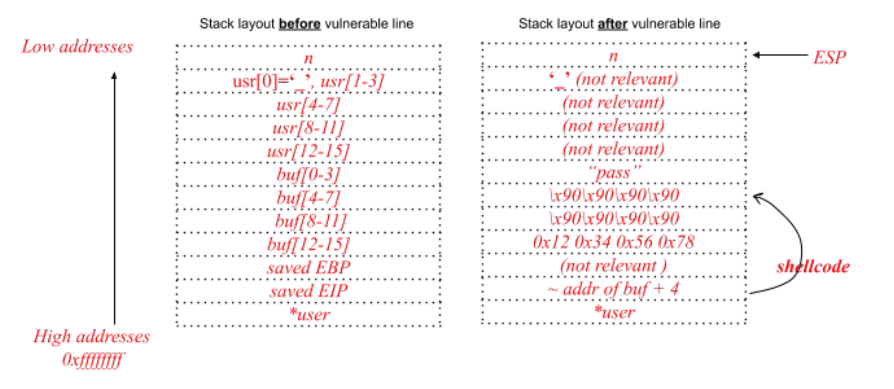

# Exercises on software security

## 2022-2021 DEMO Exam exercise 3 (6 points)
Assume that:
- The C standard library is loaded at a known address during every execution of the program, and that the address of the function `system()` is `0xf4d0e2d3`.
- Environment variables are located in the highest addresses.
- The program is compiled for the x86 architecture (32 bit) and for an environment that adopts the usual cdecl calling convention. Furthermore, assume that no compiler-level or OS-level mitigations against the exploitation of memory corruption errors are present (unless specified otherwise).

```c
#include <stdio.h>
#include <stdlib.h>
#include <string.h>
#include <time.h>

typedef struct {
  char base[8];
  int r;
  char buf[64];
  char *str_p;
  char canary[4];
} data_t;

void guess(int num, char *str, data_t *data) {

  snprintf(data->buf, num, str);

  if (strncmp(data->buf, "backdoor", 8) == 0){
    scanf("%8s", data->str_p);

    if (num == data->r){
      system("/bin/sh\0");
    }
  }
  if (strcmp(data->canary, "XXX") != 0)
  	abort();
}

int main(int argc, char** argv) {
  int num;
  data_t data;

  srand(time(NULL));
  num = atoi(argv[1]);

  data.r = rand();
  strcpy(data.canary, "XXX");
  data.str_p = data.base;

  guess(atoi(argv[1]), argv[2], &data);
}
```

1. [1 point] The program is affected by typical buffer overflow and format string vulnerabilities. Complete the following table, focusing on a vulnerability per row.

| Vulnerability | Line | Modify the line to solve the detected vulnerability |
| - | - | - |
| Buffer Overflow | | |
| Format String | | |

2. [2 points] 2. Focus only on the stack-based buffer overflow(s) you found. Write an exploit for this vulnerability that **must execute the following shellcode**, composed of 16 bytes, which opens a shell: `0x20 0x30 0x40 0x50 0x60 0x70 0x80 0x90`.
	1. Describe all the steps and assumptions required for the successful exploitation of the vulnerability. Include also any assumption on how you must call the program (e.g., the values for the command-line arguments required to trigger the exploit correctly and/or environment variables, if any).
    2. Make sure that you show how the exploit will appear in the process memory with respect to the stack layout right before and after the execution of the vulnerable line during the program exploitation showing:
		- Direction of growth and high-low addresses;
		- The name of each allocated variable;
        - The content of relevant registers (i.e., EBP, ESP);
		- The functions stack frames.
        - Show also the content of the caller frame.
        
3. [2 points] Focus only on the format string vulnerability you found. Assume that you were able to find this working exploit to execute a piece of shellcode saved in an environment variable. `\xb6\x06\x3a\x44\xb8\x06\x3a\x44%26543c%4$hn%9529c%5$hn`. Clearly detail all the components of the format string exploit:
	- The decimal components of the address of the environment variable containing your shellcode (i.e., what to write)
	- The address of the saved return address (i.e., the address where we want to write)
	- The displacement on the stack of your format string.
    
4. [1 point] *Consider ONLY the “Non-executable stack (NX)” mitigation technique*. A friend of yours suggests that there is an alternative way **to exploit the vulnerability/ies you found** to spawn a privileged shell in the program **without executing any shellcode or calling library functions**. If it is possible, please explain all the steps and assumptions required for a successful exploitation of the vulnerabilities detected. **Focus on one vulnerability at a time**. Include also any assumption on how you must call the program (e.g., the values for the command-line arguments required to trigger the exploit correctly and/or environment variables, if any). If it is not effective, please explain why.

## Question 1
Consider the C program below, which is affected by a typical buffer overflow vulnerability.

```c
#include <stdio.h>
#include <stdlib.h>
#include <string.h>

void vuln() {
  char buf[32];
  /* <---------------- here */
  scanf("%s", buf);
  if (strncmp(buf, "Knight_King!", 12) != 0) {
  	abort();
  }
}

int main(int argc, char** argv) {
	vuln();
}
```

Assume that the program runs on the usual IA-32 architecture (32-bits), with the
usual “cdecl” calling convention. Also assume that the program is compiled
without any mitigation against exploitation (ASLR is off, stack is executable,
and stack canary is not present).

Draw the stack layout when the program is executing the instruction at line 7, showing:
  1. Direction of growth and high-low addresses.
  2. The name of each allocated variable.
  3. The boundaries of frame of the function frames (main and vuln).
  
Show also the content of the caller frame (you can ignore the environment variables, just focus on what matters for the vulnerability and its exploitation).

<details>
  <summary>Solution</summary>
  
[](../../../images/7d24314337_esXHjzrvdWVL74VA-image-1655653965343.png)
</details>

Write an exploit for the buffer overflow vulnerability in the above program. Your
exploit should execute the following simple shellcode, composed only by 4
instructions (4 bytes): `0x12 0x34 0x56 0x78`.

Write clearly all the steps and assumptions you need for the exploitation, and
show the stack layout right after the execution of the `scanf()` during the program
exploitation.

<details>
  <summary>Solution</summary>
  
[](../../../images/03ae3c0da0_wXAHYoNz7rLCbIl8-image-1655655724330.png)

The function must return, this is the reason why `buf` must start with "Knight_King!". A is `ESP + 3*4`.
</details>

If address space layout randomization (ASLR) is active, is the exploit you
just wrote still working without modifications? Why?
<details>
  <summary>Solution</summary>
  
No, because the address of the stack would be randomized for every execution, and we
must have to have a leak in order to exploit it successfully.
</details>

If the stack is made non executable (i.e., NX, W^X), is the exploit you just
wrote still working without modifications? If not, propose an alternative solution to
exploit the program.
<details>
  <summary>Solution</summary>
  
No, we can use ret to libc technique in order to execute the system function in the libc and
obtain a shell.
</details>

## Question 2
BlaBlaStack is a new stack protection mechanism that is designed to
protect against local attackers (e.g., users that can have a shell and
launch binaries).

BlaBlaStack works by inserting instructions in the prologue that push a
value to the stack. This value is generated at compile time and is
hardcoded in the binary.

Then, during the epilogue, this value is popped from the stack and an
appropriate instruction compares it with the hardcoded, expected one.
In case of match, the program goes on, otherwise it is aborted.
- Why this mechanism does not provide proper protection against stack overflows?
<details>
  <summary>Solution</summary>
  
This is a compiler based protection mechanism, it is a variant of the stack
canary mechanism seen in class. The attacker can read the binary, for
example using a disassembler, obtain the hardcoded value and include it
as part of the exploit.
</details>

- How would you fix BlaBlaStack in order to protect from local attackers?
<details>
  <summary>Solution</summary>
  
Instead of hardcoding the canary value, the instructions in the prologue
should generate a random value and push it on a general purpose register.
During the epilogue, the register is used to compare the valued popped
from the stack.
</details>

## Question 2b
Consider the following assembly
code
- Describe in detail what the assembly code does and the name of the technique that is being implemented.
- Describe the weakness in this implementation.
- Describe, in common words, how would you fix the vulnerability.
```assembly
function_prologue:
	pushl $0x0000d00d
	pushl %ebp
	mov %esp, %ebp
	subl $4, %esp
    
function_foo:
	(functionbody)
    
function_epilogue:
  movl %ebp, %esp
  popl %ebp
  cmpl 0x0000d00d,(%esp)
  jne function_bar
  addl $4, %esp
  ret
  
function_bar:
	(functionbody)
```
<details>
  <summary>Solution</summary>
  
The assembly code implements a static canary. It pushes `0x0000d00d` in the stack in the prologue and it compare if the value is still there in the epilogue.
  
The implementation is vulnerable because the hardcoded value can be leaked reversing the binary and used in the exploit.
  
A correctly implemented canary: the instructions in the prologue
should generate a random value and push it on a general purpose register.
During the epilogue, the register is used to compare the valued popped
from the stack.
</details>

## Question 3
```c
#include <stdio.h>
#include <stdlib.h>
#include <string.h>

void vuln(int n) {
  struct {
    char buf[16];
    char tmp[16];
    int sparrow = 0xBAAAAAAD;
  } s;

  if (n > 0 && n < 16) {
    fgets(s.buf,n,stdin);
    if(strncmp(s.buf, "H4CK", 4) != 0 && s.buf[14] != “X”) {
    	abort();
    }
    scanf("%s", s.tmp);
    if(s.sparrow != 0xBAAAAAAD) {
      printf("Goodbye!\n");
      abort();
    }
  }
}

int main(int argc, char** argv) {
  vuln(argc);
  return 0;
}
```

Draw the stack layout when the program is executing the instruction at line 12, showing:

1. Direction of growth and high-low addresses;
2. The name of each allocated variable;
3. The boundaries of frame of the function frames (main and vuln).

Show also the content of the caller frame (you can ignore the environment
variables, just focus on what matters for the vulnerability and its exploitation).

<details>
  <summary>Solution</summary>
  
[](../../../images/6f9dfd04ed_1ukfenBPOSGoUHde-image-1655657859132.png)
</details>

The program is affected by a buffer overflow
vulnerability. Complete the following table.

| Vulnerability | Line | Motivation |
| - | - | - |
| Buffer Overflow | | |

<details>
  <summary>Solution</summary>
  
| Vulnerability | Line | Motivation |
| - | - | - |
| Buffer Overflow | 17 |  |
</details>

Line 18 attempt to mitigate the exploitation of the buffer
overflow vulnerability you just found.

Shortly describe what is the implemented technique, and how it works in
general. Describe the weaknesses in this specific implementation, and how you
would fix them.

<details>
  <summary>Solution</summary>
  
The underlined code implements a stack canary as a mitigation against
stack-based buffer overflows. When writing past the end of a stack-allocated
buffer, one would overwrite the variable x before overwriting the saved EIP. Before
returning from the function, the content of the variable x is checked against the
original value: if they differs, a buffer overflow is detected and the program aborts
without returning from the function (i.e., without triggering the exploit).
  
In this case, the stack canary is a static value (`0xBAAAAAAD`): if the binary is
available, it is enough to retrieve this value by reverse engineering the program;
then, during the exploitation it is enough to overwrite the stack canary with this
(known) value. To fix this issue, the stack canary should be randomized at the
program startup and placed in a register.
</details>

Write an exploit for the buffer overflow vulnerability in the above program to
execute the following simple shellcode, composed only by 4 instructions (4
bytes): `0x51 0x52 0x5a 0x5b`. Make sure that you show how the exploit will
appear in the process memory with respect to the stack layout right before and
after the execution of the detected vulnerable line during the program
exploitation. Ensure you include all of the steps of the exploit, ensuring that the
program and the exploit execute successfully. Include also any assumption on
how you must call the program (e.g., the values for the command-line arguments
required to trigger the exploit correctly, environment variables).

<details>
  <summary>Solution</summary>
  
[](../../../images/a99eb0d4a7_CHadHejDFoLqz2fi-image-1655658380801.png)
</details>

Assuming that W^X is enabled (i.e., non-executable stack): Is the exploit you just wrote still working? Why?

<details>
  <summary>Solution</summary>
  
No, because we can't jump to our shellcode (the stack is non-executable).
</details>

Let’s assume that the C standard library is loaded at a
known address during every execution of the program, and
that the (exact) address of the function `system()` is
`0xf7e38da0`. Explain how you can exploit the buffer overflow
vulnerability to launch the program `/bin/secret`.

<details>
  <summary>Solution</summary>
  
We write in `tmp` the string `/bin/secret`, and we overwrite the saved EIP with the address of `system()`. We then overwrite 8 bytes more for the `system()` EIP (to exit) and for the poiter to Y so that, when jumping into the `system()` function, this pointer will be where `system()` expects the parameter and will complete the execution.
  
[](../../../images/d6f7fcd016_N1Kk15eCmhusJC36-image-1655658719636.png)
</details>

Assuming that ASLR is enabled (i.e., randomized memory
layout): Is the exploit you just wrote still working? Why?

<details>
  <summary>Solution</summary>
  
No, because with ASLR enabled, we don’t know neither the address of `system()`
in the libc, nor the address of the string `/bin/secret` written in the buffer (both
the stack and the shared libraries are randomized)
</details>

Assume now that the program is compiled without any mitigation against
exploitation (the address space layout is not randomized, the stack is executable,
and there are no stack canaries). Propose the simplest modification to the C
code provided (i.e., patch) that solves the buffer overflow vulnerability
detected, motivating your answer.

<details>
  <summary>Solution</summary>
  
scanf("%15s", s.tmp);
fgets(s.tmp,15,stdin);
</details>

## Question 4
```c
#include <stdio.h>
#include <stdlib.h>
#include <string.h>

int guess(char *user) {
  struct {
    int n;
    char usr[16];
    char buf[16];
  } s;

  snprintf(s.usr, 16, "%s", user);

  do{
    scanf("%s", s.buf);
    if (strncmp(s.buf, "DEBUG", 5) == 0) {
      scanf("%d", &s.n);
      for(int i = 0; i < s.n; i++) {
      	printf("%x", s.buf[i]);
      }
    } else {
      if(strncmp(s.buf, "pass", 4) == 0 && s.usr[0] == '_') {
          return 1;
      } else {
        printf("Sorry User: ");
        printf(s.usr);
        printf("\nThe secret is wrong! \n");
        abort();
      }
    }
  } while(strncmp(s.buf, "DEBUG", 5) == 0);
}

int main(int argc, char** argv) {
	guess(argv[1]);
}
```

Assuming that the program is compiled and run for the usual
IA-32 architecture (32-bits), with the usual cdecl calling
convention, draw the stack layout just before the execution of line
11 showing:

- Direction of growth and high-low addresses;
- The name of each allocated variable;
- The boundaries of the function stack frames (main and guess)

Show also the content of the caller frame (you can ignore the
environment variables: just focus on what matters for the
exploitation of typical memory corruption vulnerabilities).
Assume that the program has been properly invoked with a single
command line argument.

<details>
  <summary>Solution</summary>
  
[](../../../images/7e3a6b1468_LL0IcWT3P9KFUS7T-image-1655659342726.png)
</details>

The program is affected by a typical buffer overflow and a
format string vulnerability. Complete the following table, focusing
on a vulnerability per row.

| Vulnerability | Line | Motivation |
| - | - | - |
| Buffer Overflow | | |
| Format String | | |

<details>
  <summary>Solution</summary>
  
| Vulnerability | Line | Motivation |
| - | - | - |
| Buffer Overflow | 15 | the scanf reads an user-supplied string of arbitrary length and copies it in a stack buffer |
| Format String | 26 | printf(s.usr) where the format string, s.usr, is directly supplied by the (untrusted) user from CLI argument. |
</details>

Assume that the program is compiled and run with no mitigation against
exploitation of memory corruption vulnerabilities (no canary, executable stack,
environment with no ASLR active).

Focus on the buffer overflow vulnerability. Write an exploit for the buffer overflow
vulnerability in the above program to execute the following simple shellcode, composed
only by 4 instructions (4 bytes): `0x58 0x5b 0x5a 0xc3`.

Make sure that you show how the exploit will appear in the process memory with respect
to the stack layout right before and after the execution of the detected vulnerable line
during the program exploitation.

Ensure you include all of the steps of the exploit, ensuring that the program and the exploit
execute successfully. Include also any assumption on how you must call the program (e.g.,
the values for the command-line arguments required to trigger the exploit correctly).

<details>
  <summary>Solution</summary>
  
[](../../../images/32eb141647_xslYFUAlPb50amea-image-1655659742383.png)
</details>

Now focus on the format string vulnerability you identified. We want to exploit this
vulnerability to overwrite the saved `EIP` with the address of the environment variable
`$EGG` that contain your executable shellcode. Assuming we know that:

- The address of `$EGG` (i.e., what to write) is `0x44674234` (`0x4467`(hex) = 17511(dec), `0x4234`(hex) = 16948(dec))
- The target address of the EIP (i.e., the address where we want to write ) is `0x42414515`
- The displacement on the stack of your format string is equal to 7 write an exploit for the format string vulnerability to execute the shellcode in the environment variable `EGG`.

Write the exploit clearly, detailing all the components of the format string, and detailing all
the steps that lead to a successful exploitation.

<details>
  <summary>Solution</summary>
  
The command line argument is directly fed as a format string to snprintf, and the format
string itself is on the stack with a given displacement: we just need to construct a standard
format string exploit.
  
- We need to write `0x44674234` to `0x42414515`(`tgt`)
- `0x4467` > `0x4234` -> we write `0x4234` first
  
The value of the command line argument will have the form
`tgttgt+2%N1c%pos$hn%N2c%pos+1$hn`
where
- `tgt` = 0x42414515
- `tgt+2` = 0x42414517
- `pos` = 7
- `N1` = dec(`0x4234`) - 8 (bytes already written) = 16948 - 8 = 16940
- `N2` = dec(`0x4467`) - 16948 (bytes already written) = 17511 - 16948 = 563
  
thus the final string is
`\x15\x45\x41\x42\x17\x45\x41\x42%16940c%7$hn%563c%8$hn`
  
Note that the program will `abort()` so the vulnerability is there but it is not exploitable.
  
Also the string is limited to 16 characters while the format string needed is longer, so it will not work (line 12).
</details>

Now consider that the program is compiled enabling the exploit mitigation technique
known as stack canary. Assume that the compiler and the runtime correctly implement this
technique with a random value changed at every program execution. Are the two exploits
you wrote still working without modifications? Why? 

If not working modify the exploit so
that it works reliably in this setting (i.e., enabled stack canaries). Please describe precisely
how you would modify the above exploit, and any further assumption you need to make it
work.

If your exploit needs to perform multiple iteration of any loop, please describe what
you would write to the standard input at every iteration of the loop(s).

If the exploit is working without modification, please describe precisely why the
vulnerability is still exploitable.

<details>
  <summary>Solution</summary>
  
**First exploit**: No. the first exploit would overwrite the stack canary (placed in the stack before the return
address). The code placed by the compiler in the function epilogue would detect the canary
overwrite and abort the execution of the program without jumping to the saved return
address, and without executing the attacker’s shellcode. We need to make the program
perform two iterations of the loop.
  
First iteration: write an argv[1] that starts with ‘_’ (e.g., ‘_dbg!\n’) and ‘DEBUG’ at line
16; the code at lines 17-21 will print n words from the stack. Assuming that n is sufficiently
high to print also the word containing the stack canary (or, if the attacker controls the
command line arguments, passing a sufficiently high n), this would leak the stack canary
value for that specific execution of the program.
  
Then, as strncmp(s.buf, "DEBUG", 5) == 0 , the do...while loop will not exit.
Second iteration: at this point, we know the value of the stack canary (read during the first
loop iteration). We write to stdin (i.e., we put in the buffer) the same exploit I wrote at
point 2, changing it slightly so that the stack canary gets overwritten by the value leaked
during the first iteration. Also, we need to ensure that strncmp(s.buf, "DEBUG", 5) == 1
so that the loop ends, the function returns, and the shellcode is executed.
  
**Second exploit**: Yes, the second exploit still work without modification...
</details>