# Format String Bugs

A format string is solution to the problem of allowing a string to
be output that includes variables formatted
precisely as dictated by the programmer.

The data format is specified into a string using placeholders.

For example in C we have the `printf` function, with some placeholders:
- `%d` or `%i` decimal
- `%u` unsigned decimal
- `%o` unsigned octal
- `%X` or `%x` unsigned hex
- `%c` char
- `%s` string (`char*`), prints chars until `\0`

Other functions use the same mechanism: `printf`, `fprintf`, `vfprintf`, `sprintf`, `vsprintf`, `snprintf`, `vsnprintf`, ...

## Example of vulnerable code
Consider the following example code:

```c
#include <stdio.h>
void test(char *arg) { 			/* wrap into a function so that */
	char buf[256]; 				/* we have a "clean" stack frame */
	snprintf(buf, 250, arg);
	printf("buffer: %s\n", buf);
}

int main (int argc, char* argv[]) {
	test(argv[1]);
	return 0;
}
```

```shell
$ ./vuln3 "%x %x %x" # The actual values and number of %x can change
buffer: b7ff0ae0 66663762 30656130 # depending on machine, compiler, etc
```

The intented use is to pass as `arg` the format string and the values to print:
[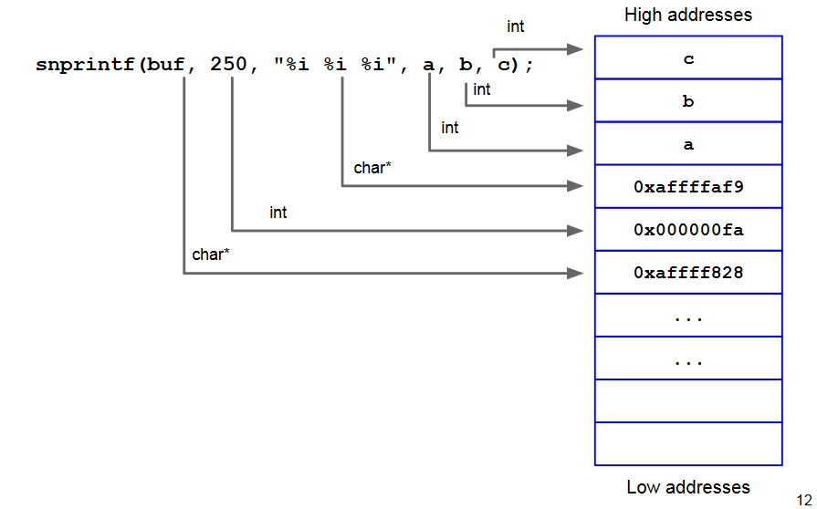](../../../images/983565874d_wN4aWN56SYoUffXQ-image-1655638782255.png)

When the format string is parsed, `snprintf()` expects three
parameters from the caller (to replace the three `%i`).

According to the calling convention, these are expected to be
pushed on the stack by the caller.

Thus, the `snprintf()` expects them to be on the stack, before
the preceding arguments.

[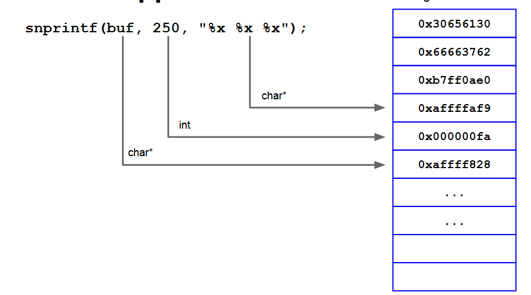](../../../images/7fc7dab661_DRn29peKS6LDOB4L-image-1655638842830.png)

When the format string is parsed, `snprintf()` expects three
more parameters from the caller (to replace the three `%x`).

According to the calling convention, these are expected to be
pushed on the stack by the caller.

Thus, the `snprintf()` expects them to be on the stack, before
the preceding arguments.

**So, we can read what is already on the stack!**

But **the format string itself is often on the stack**:

[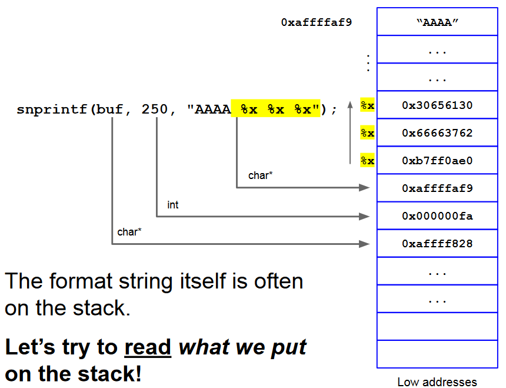](../../../images/d130cd4cb6_VWP8DvrGNo1fj3hc-image-1655638915178.png)

We can read the string with itself:
[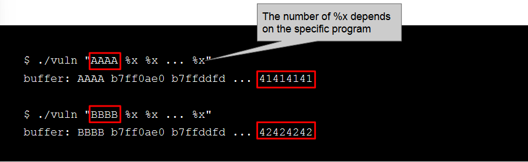](../../../images/ca191e3afe_f8YnD0mRMpDRP5wg-image-1655638947411.png)

**So, we can read what we put on the stack!**

## The `%N$x`placeholder
We can use the `%N$x` syntax (go to the Nth parameter

```shell
$ ./vuln "%x %x %x"
b7ff0590 804849b b7fd5ff4 # suppose that I want to print the 3rd

$ ./vuln "%3\$x" # N$x is the direct parameter access
b7fd5ff4 # (the \ is to escape the $ symbol)

$ for i in `seq 1 150`; do echo -n "$i " && ./vuln "AAAA %$i\$x"; done
1 AAAA b7ff0590
2 AAAA 804849b
# ........lots of lines...... # 1 dword from the stack per line
150 AAAA 53555f6e 

$ for i in `seq 1 150`; do echo -n "$i " && ./vuln "AAAB%$i\$x"; echo ""; done | grep 4141
114 AAAB42414141 # there is my cell I can read from! We had to go 114 positions up.

$ for i in `seq 1 150`; do echo -n "$i " && ./vuln "AAAB%$i\$x"; echo ""; done | grep 4141
114 AAAB42414141 # there is my cell I can read from! We had to go 114 positions up.

$ ./vuln "AAAB%114\$x"
AAAB42414141 # So, we can effectively read.
```

## Scan the stack: Information leakage vulnerability
We can use the same technique to search for
interesting data in memory.

## Executing with format strings
A useful placeholder is `%n`: write, in the address pointed to by the **argument**, the number of chars (bytes) printed so far.

For example:
```c
int i = 0;
printf("hello%n",&i);
```

At this point `i == 5`.

So in out vulnerable program:
```shell
$ ./vuln3 "AAAA %x %x %x"
buffer: AAAA b7ff0ae0 41414141 804849b

$ ./vuln3 "AAAA %x %n %x"
Segmentation fault # bingo! Something unexpected happened...
```

`%n` pulls an `int*` (address) from the stack, goes
there and writes the number of chars printed so
far. In this case, that address is `0x41414141`.

We can use this:
1. Put, on the stack, the address (addr) of the memory cell (target) to modify
2. Use `%x` to go find it on the stack (`%N$x`).
3. Use `%n` instead of that `%x` to write a number in the cell pointed to by addr, i.e. target.

We will use the placeholder `%c`:
```c
void main () {
	printf("|%050c|\n", 0x44);
	printf("|%030c|\n", 0x44);
	printf("|%013c|\n", 0x44);
}
```
```shell
$ ./padding
|0000000000000000000000000000000000000000000000000D| ~> 50
|00000000000000000000000000000D| 		     ~> 30
|000000000000D| 				     ~> 13
```

Let's assume that we know the target address: `0xbffff6cc`. Then:
```shell
$ ./vuln3 "$(python -c 'print "\xcc\xf6\xff\xbf%50000c%2$n"')"
```
With this code we wrote 50004 in `0xbffff6cc`.

## Writing, step by step
Consider:
- Target address = `0xbffff6cc` (Where to write)
- Arbitrary number = `0x6028` (What to write)

We need to:
1. Put, on the stack, the target address of the memory cell to modify (as part of the format string)
2. Use `%x` to go find it on the stack (`%N$x`) -> let’s call the displacement `pos`.
3. Use `%c` and `%n` to write `0x6028` in the cell pointed to by target (remember: parameter of `%c +len(target)`)

[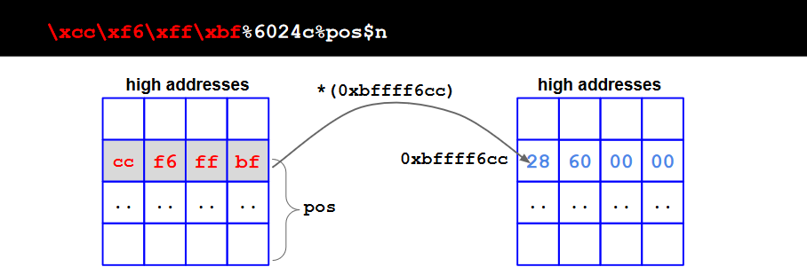](../../../images/601690f660_4WpBnO3YyqY2QE3Y-image-1655639827288.png)

### Writing 32 bit Addresses (16 + 16 bit)
**Problem**: We want to write a valid 32 bit address (e.g., of a valid memory location or function) as the Arbitrary number (What to write)

`0xbfffffff` == 3221225471

How can we write such a "big" number ?

`%c` accepts only a WORD (16-bit long)
parameter. We split each DWORD (32 bits, up
to 4GB) into 2 WORDs (16 bits, up to 64KB),
and write them in two rounds.

once we start counting up with `%c`,
we cannot count down. We can only keep
going up. So, we need to do some math.
- 1st round: word with lower absolute value.
- 2nd round: word with higher absolute value

We need to perform the writing procedure twice
in the same format string.

We need:
- The target addresses of the two writes (which will be at 2 bytes of distance)
- The displacements of the two targets
- Do some math to compute the arbitrary numbers to write (i.e., that summed results in the 32 bits address) 

The steps are:
1. Put, on the stack, the 2 target addresses of the memory cells to modify (as part of the format string)
2. Use `%x` to go find `<target_1>` on the stack (`%N$x`) -> let’s call the displacement `pos`. `<target_2>` will be at `pos+1` (i.e., it’s located one DWORD up)
[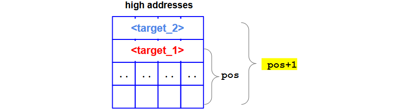](../../../images/a4c42d888e_fVvzT2oa8u301GoU-image-1655640129415.png)
3. Use `%c` and `%n` to write
	1. the lower absolute value in the cell pointed to by <target_1>
	2. The higher decimal value in the cell pointed by <target_2>
 
#### Example
Consider:
- Target address = `0xbffff6cc` (Where to write)
- Arbitrary number = `0x45434241` (What to write)
	- `0x4543` = 17731 higher decimal value -> Write 2nd
	- `0x4241` = 16961 lower decimal value -> Write 1st
    
In the first round we write `0x4241` = 16961 (word) at `*pos`:
[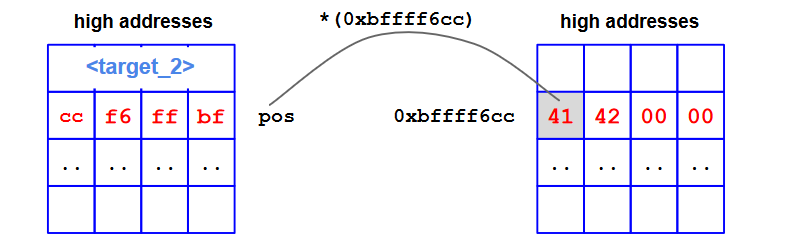](../../../images/76ec966421_9HsBg08gzILsmmCN-image-1655640266341.png)

In the second round: write `0x4543` = 17731 (word) at `*(pos + 1)`:
[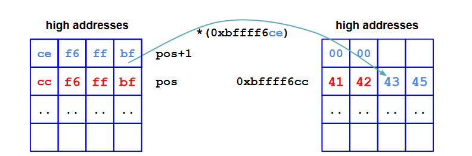](../../../images/0aeda0b8bc_oL3xNxzG5ZvC2Rgp-image-1655640340573.png)

So we used:
- `%16953c%pos$n` to write write `0x4241` = 16961 (word) at `*pos`. We already placed 8 bytes on the stack for the addresses, so to write 1961 we use `%(16961-8)c = %16953c`
- `%00770c%pos+1$n` to write `0x4543` = 17731 (word) at the `*(pos + 1)`. This is because the second round is incremental `0x4543-0x4241 = %00770c`

[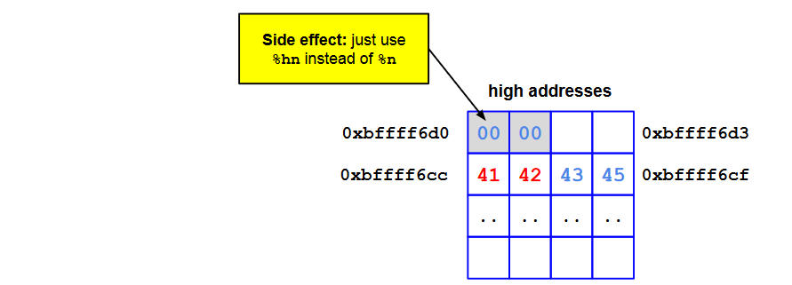](../../../images/07f68e6744_uelri5hUdaOmULtM-image-1655640574334.png)

The final exploit is: `\xcc\xf6\xff\xbf\xce\xf6\xff\xbf%16953c%pos$hn%00770c%pos+1$hn`

## Generic cases
We can define the two generic cases.

#### What to write: first_part > second_part
For example for `0x45434241`.

[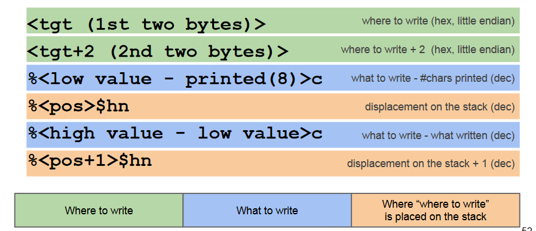](../../../images/fafff0a134_pM3LkXJbm00iPEfg-image-1655640695483.png)

#### What to write: first_part < second_part
For example for `0x42414543`.

[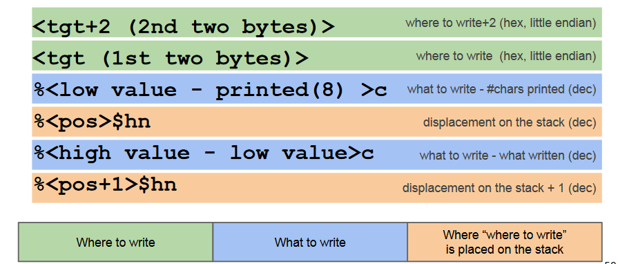](../../../images/3d6c688a59_Yi3N5HuwAvPxpFIb-image-1655640714359.png)

#### Example
[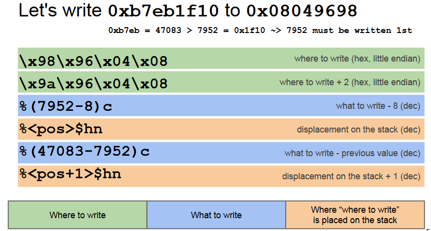](../../../images/ce3a44c014_xyfNZGhNX7LHa2TK-image-1655640761131.png)

## Possible target addresses
- The saved return address (saved EIP)
- The Global Offset Table (GOT)
- C library hooks
- Exception handlers
- Other structures, function pointers

## Countermeasures
- memory error countermeasures seen in the previous slides help to prevent exploitation
- modern compilers will show warnings when potentially dangerous calls to printf-like functions are found
- patched versions of the libc to mitigate the problem

## Essence of the Problem
Conceptually, format string bugs are not
specific to printing functions. In theory, any
function with a unique combination of
characteristics is potentially affected:
- a so-called **variadic** function
	- a variable number of parameters,
	- the fact that parameters are "resolved" at runtime by pulling them from the stack,
- a mechanism (e.g., placeholders) to (in)directly r/w arbitrary locations
- the ability for the user to control them