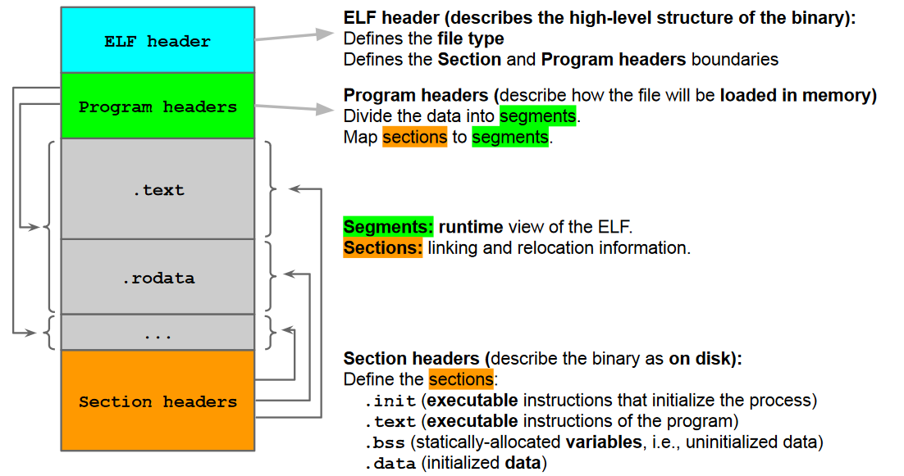
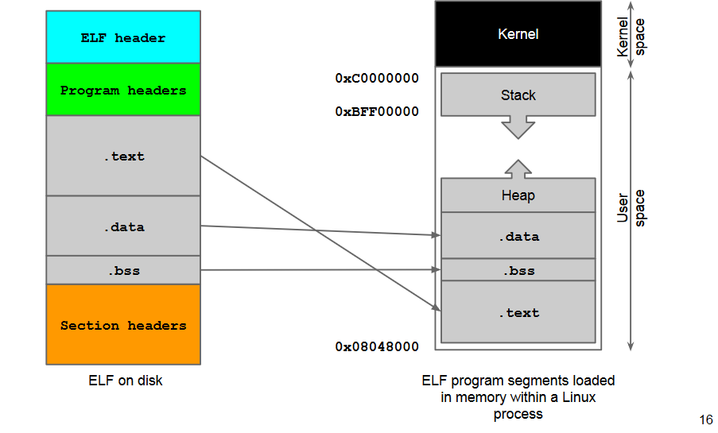
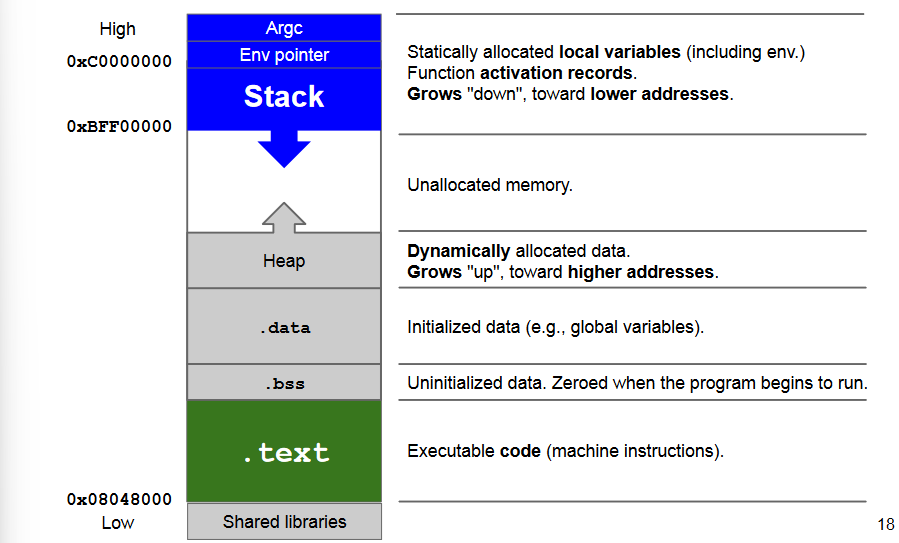
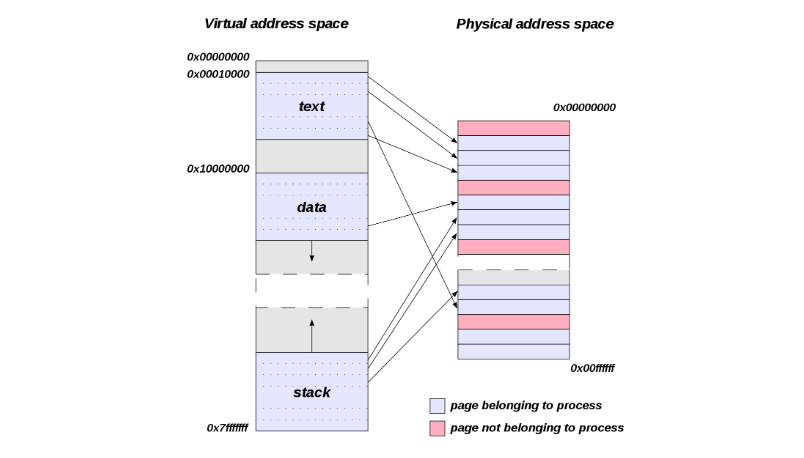
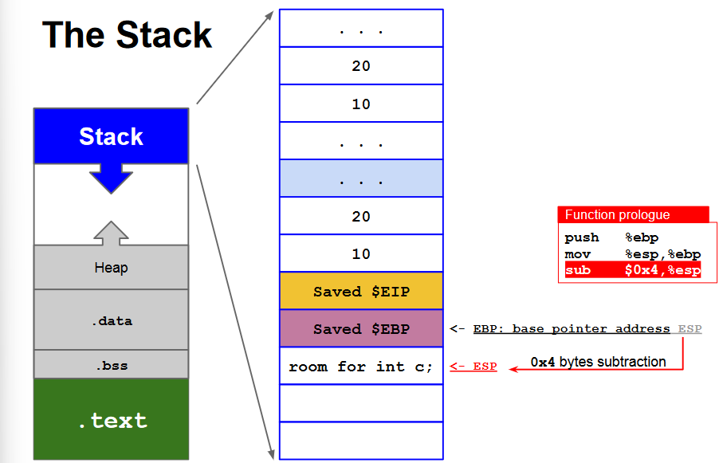
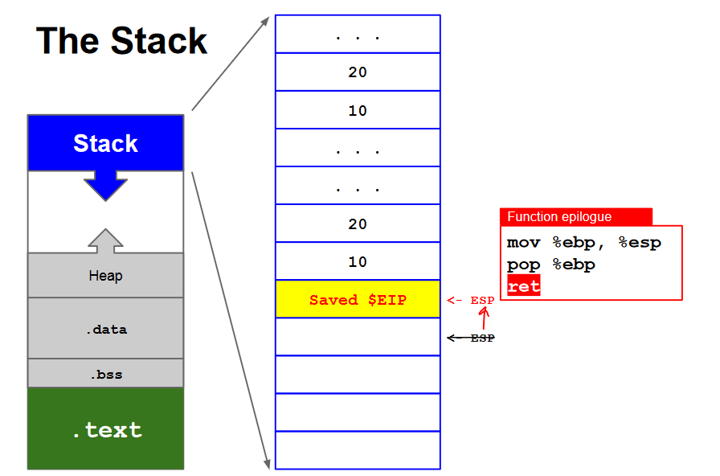

# Recalls of Linux

The following concepts apply, with proper modifications, to any machine architecture (e.g., ARM, x86), operating system (e.g., Windows, Linux, Darwin), and executable (e.g., Portable Executable (PE), Executable and Linkable Format (ELF)). For simplicity, we assume ELFs running on Linux >= 2.6 processes on top of a 32-bit x86 machine.

### ELF Binaries

### Process Creation in Linux
When a program is executed, it is mapped in memory and laid out in an organized manner.
1. The kernel creates a virtual address space in which the program runs.
2. Information is loaded from exec file to newly allocated address space: The dynamic linker, called by the kernel, loads the segments defined by the program headers.
3. The kernel sets up the stack and heap and jumps at the program's entry point.

### Virtual vs Physical Address Space

### Registers
The architecture provides the following registers:
- General Purpose: Common mathematical operations. They store data and addresses (EAX, EBX, ECX)
	- **ESP**: address of the last stack operation, the top of the stack.
	- **EBP**: address of the base of the current function frame
		- relative addressing
- **Segment**: 16 bit registers used for keep track of segments and backward compatibility (CD, DS, SS)
- **Control**: Control the function of the processor (execution)
	- **EIP**: address of the next machine instruction to be executed
- **Other**
	- EFLAG: 1 bit registers, store the result of test performed by the processor
    
### Calling functions
The CPU is about to call the `foo()` function. When `foo()` will be over, where to jump?

The CPU needs to **save the current EIP** on the stack.

#### Function Prologue 
When a function is called:
- its activation record is allocated on the stack.
- The control goes to the function called.

When a function ends,
- it returns the control to the original function caller

We need to remember where the caller’s frame is
located on the stack, so that it can be restored once
the callee's will be over.

#### Function Epilogue
When a function is called,
- its activation record is allocated on the stack.
- The control goes to the function called.

When a function ends,
- it returns the control to the original function caller

We must restore the caller’s frame on the stack.

