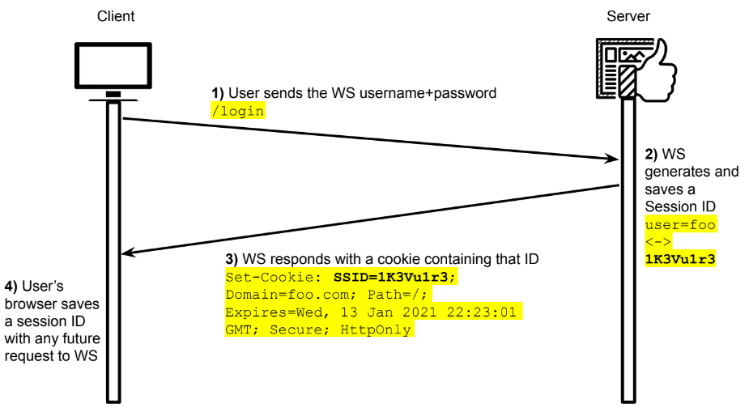

# Cookies and sessions

HTTP is stateless and almost uniderectionl. Web application, on the other hand, need to keep a state.

Cookies is a client side information storage, a reliable mechanism to keep stateful information.

Cookies are used for session creation:

The cookie will also be used for session identification.

## Issues with cookies and sessions
- Concurrency: what if two clients access the site simulaneously?
- Session termintation: when and how to terminate sessions?
- Data storage on the server side
- The token must be unpredictable