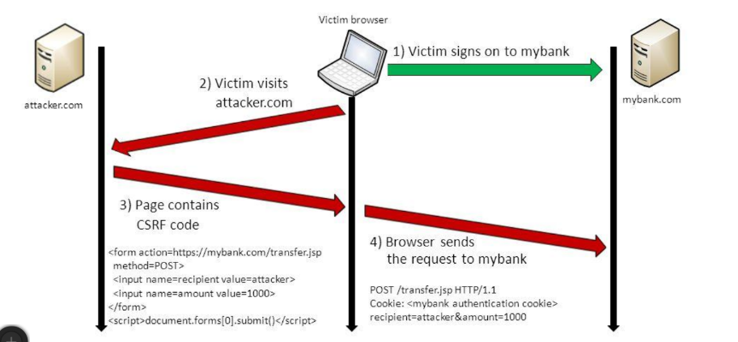
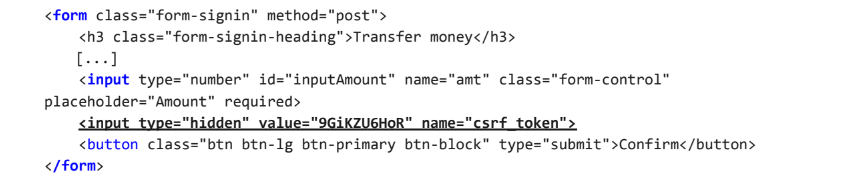

# Cross-Site Requests Forgery (CSRF)

Cross-site request forgery (also known as CSRF) is a web security vulnerability that allows an attacker to induce users to perform actions that they do not intend to perform. It allows an attacker to partly circumvent the same origin policy, which is designed to prevent different websites from interfering with each other. 

For a CSRF attack to be possible, three key conditions must be in place: 

- A **relevant action**. There is an action within the application that the attacker has a reason to induce. This might be a privileged action (such as modifying permissions for other users) or any action on user-specific data (such as changing the user's own password).
- **Cookie-based session handling**. Performing the action involves issuing one or more HTTP requests, and the application relies solely on session cookies to identify the user who has made the requests. There is no other mechanism in place for tracking sessions or validating user requests.
- **No unpredictable request parameters**. The requests that perform the action do not contain any parameters whose values the attacker cannot determine or guess. For example, when causing a user to change their password, the function is not vulnerable if an attacker needs to know the value of the existing password.

## Preventing CSRF attacks
### CSRF tokens
The most robust way to defend against CSRF attacks is to include a CSRF token within relevant requests. 

A CSRF token is a unique, secret, unpredictable value that is generated by the server-side application and transmitted to the client in such a way that it is included in a subsequent HTTP request made by the client. When the later request is made, the server-side application validates that the request includes the expected token and rejects the request if the token is missing or invalid.

CSRF tokens can prevent CSRF attacks by making it impossible for an attacker to construct a fully valid HTTP request suitable for feeding to a victim user. Since the attacker cannot determine or predict the value of a user's CSRF token, they cannot construct a request with all the parameters that are necessary for the application to honor the request. 
 
The token should be:
- Unpredictable with high entropy, as for session tokens in general.
- Tied to the user's session.
- Strictly validated in every case before the relevant action is executed.
- Treated as secrets and handled in a secure manner throughout their lifecycle.

An approach that is normally effective to transmit the token is to put it in the client within a hidden field of an HTML form that is submitted using the POST method. The token will then be included as a request parameter when the form is submitted:

When a CSRF token is generated, it should be stored server-side within the user's session data. When a subsequent request is received that requires validation, the server-side application should verify that the request includes a token which matches the value that was stored in the user's session. This validation must be performed regardless of the HTTP method or content type of the request. If the request does not contain any token at all, it should be rejected in the same way as when an invalid token is present. 

### SameSite cookies
The SameSite attribute can be used to control whether and how cookies are submitted in cross-site requests. By setting the attribute on session cookies, an application can prevent the default browser behavior of automatically adding cookies to requests regardless of where they originate.

The SameSite attribute is added to the Set-Cookie response header when the server issues a cookie, and the attribute can be given two values: 
- **Strict**: the browser will not include the cookie in any requests that originate from another site. This is the most defensive option, but it can impair the user experience, because if a logged-in user follows a third-party link to a site, then they will appear not to be logged in, and will need to log in again before interacting with the site in the normal way.
- **Lax** the browser will include the cookie in requests that originate from another site but only if The request uses the GET method and the request resulted from a top-level navigation by the user, such as clicking a link.