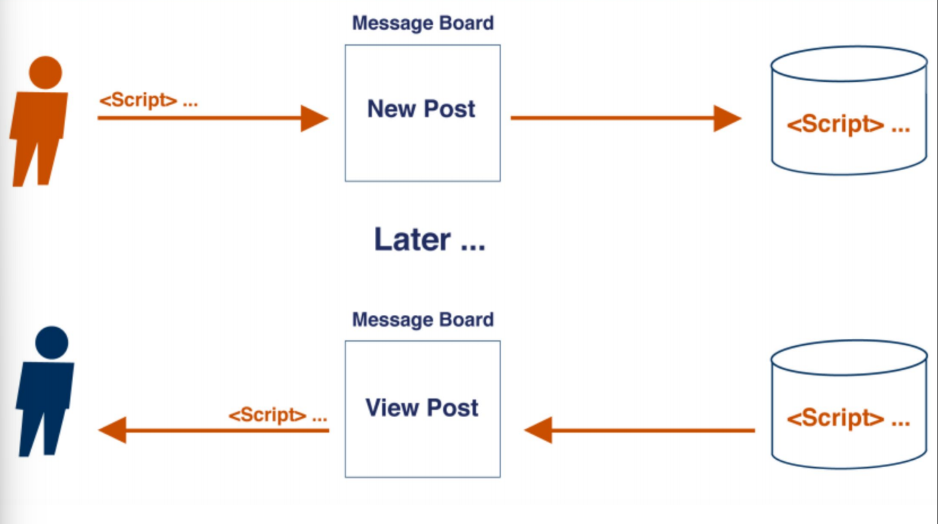
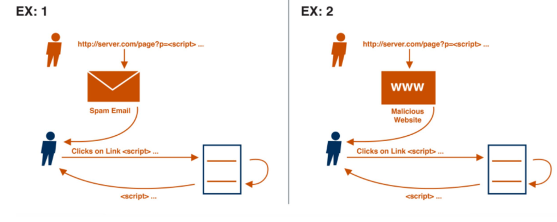

# Cross Site Scripting (XSS)

Cross site scripting is a vulnerability by means of which **client-side code** can be injected in a page.

For example, suppose we have a blog app which lets user post anything they want. A malicious user could embed some javascript in the post and this javascript would be executed by anyone who reads the post.

It can allow:
- Cookie theft or session hijack
- Manipulation of a session and execution of fraudulent transactions
- Snooping on private information
- Drive by download
- Bypass the **same-origin policy**, which states that all client-side code loaded from A should access only the data from A.

## Stored XSS
The attacker input is stored on the target server in a database. Then a victim retrives the stored malicious code from the we b application without the data being made safe to render in the browser.
[](../../../images/4e8e40d892_66hxaHVX19W6nuRf-image-1655480081059.png)

## Reflected XSS
It can happen when a response includes some or all of the input provided in the request, without being stored and made safe to render in the browser.
[](../../../images/66aa57c1ed_1S5oDTPTom6WXEx6-image-1655480208907.png)

For example the following server side code:
```php
<?php
  $var = $HTTP['variable_name'];
  echo $var;
?>
```
Can be exploited with the following url: `http://example.com/?variable_name=<script>alert('XSS');</script>`.

## DOM based XSS
The user input never leaves the victim's browser, the malicious payload is directly executed by client-sede script.

For example the following client side code:
```javascript
<script>
  document.write("Current URL: " + document.baseURI);
</script>
```
Can be exploited with the following url: `http://example.com/test.html#<script>alert('XSS');</script>`.

## Fighting XSS
It is easy to see that is impossible to filter out all malicius code using blacklists.

The only doable thing is to **escape** dangerous characters with less dangerous ones. For example we should swap > with &gt; HTML character.

### Content Security Policy (CSP)
Content Security Policy is a W3C specification to inform the browser on what should be trusted and what not.

Technically, it is a set of directives sent by the server to the client in the form of HTTP response headers. Many directives are aviable, for instance:
- `script-src`: load cliend code only from listed origins
- `form-action`: list valid endpoints for submission
- `frame-anchestors`: list sources that can be embedded in the current page as frames and applets
- `img-src`: defines the origins from which images can be loaded
- `style-src`: as `script-src` for stylesheets

If `unsafe-inline` is not defined, CSP will also block inline scripts.

But the **implementation is up to the browser**.

CSP is slowly gaining traction because:
- strict policies break functionalities
- relaxed policies can be bypasses
- there are some practical barriera and challanges: who writes and updates policies?