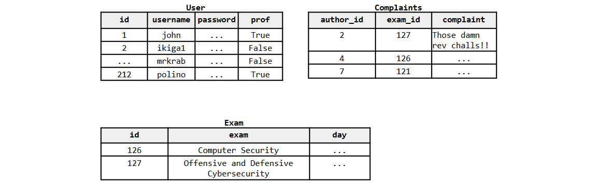
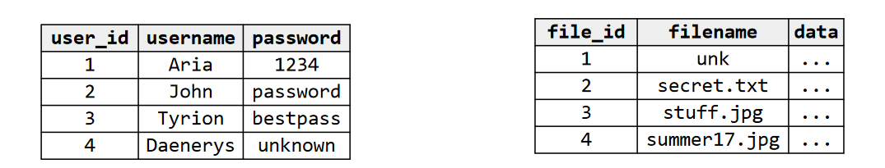
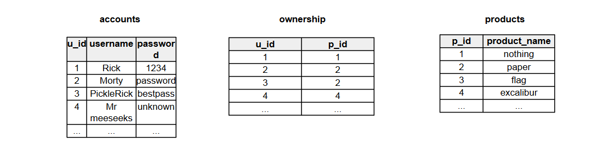
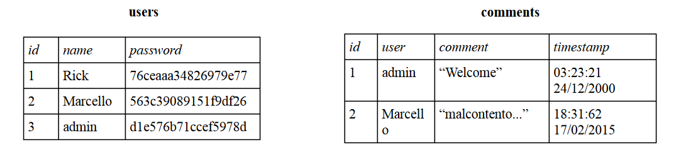
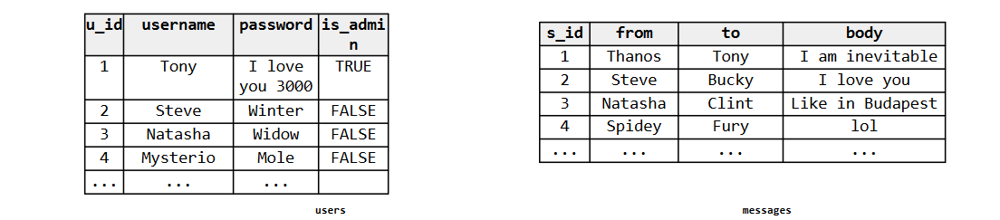

# Exercises on web security

## 2021-2022 Demo exam exercise 4 (6 points)
LetsComplain is a new website for students and profs. Students here can complain about exams and
professors can handle the complaints and register their exams.
Get ready to hack this website.

The relevant pseudo-code of the forum is the following:
```python
# https://letscomplain.com/register
def register():
  if request.method != "POST":
  	abort(403)
  username = request.form['username']
  password = request.form['password']

  if not is_alphanum_plus(username):
  	abort(400)

  q = "INSERT INTO User (username, password, prof) VALUES ('" + username + "','" +
  sword + "', False);"
  dbquery(q)

  return login_page()

# https://letscomplain.com/login
def login():
  if request.method != "POST":
  	abort(403)
  username = request.form['username']
  password = request.form['password']

  if not is_alphanum_plus(username) or not is_alphanum_plus(password):
  	abort(400)

  q = "SELECT id FROM User WHERE username='" + username + "' and password='" + password +

  result = dbquery(q)
  if result.empty():
  	return login_page(error="Wrong username or password.")

  id = result.get_text()

  return login_page(id=id)

# https://letscomplain.com/complain
def complain():
  if request.method != "POST":
  	abort(403)

  id = int(request.form.get("id"))
  complaint = html_escape_minimal(request.form['complaint'])
  exam_id = int(request.form['comment'])

  q = "INSERT INTO Complaints (author_id, exam_id, complaint) VALUES (" + id + "," +
  m_id + ",'" + complaint + "');"
  dbquery(q)

return

# https://letscomplain.com/personal_page
def personal_page():
  if request.method != "GET":
      abort(403)

  id = int(request.args.get("id"))
  q = "SELECT prof FROM User WHERE id='" + id + "'"
  prof = dbquery(q).get_text()
  if prof:
      return render_prof_page(id=id)

  return render_student_page(id=id)

# https://letscomplain.com/personal_page
def render_student_page(id):
  q = """SELECT U.username, E.exam, C.complaint FROM User as U
  N Complaint AS C ON U.id=C.author_id
  N Exam as E ON C.exam_id=E.id
  RE U.id='""" + id + "'"
  complaints = dbquery(q).get_text_list()

  html_page = """< ... """
  for i in range(len(comments)):
    html_page += """ ... """ + complaints[i].username """ ...""" complaints[i].exam +
     ... """ + complaints[i].complaint
    html_page += """...>"""

  return html_page
```

The website uses a relational database as a back-end. The relevant database info can be inferred from the
following sample table, as well as from the code:
[](../../../images/45e3ab90ad_McT1pyteTqzOiCRg-image-1655485180700.png)

Assume the following:
- The id in User is auto-incremental.
- The function **is_alphanum_plus()** returns true only if the input string contains only letters, numbers,
the whitespace, a comma, a full stop, and a question mark e.g., **is_alphanum_plus**(“Hey, Jim. Shall we
play 3 songs rather than 2?”) returns true.
- The function **html_escape_minimal** correctly escapes the angular brackets, the double quotes, and the
&. (e.g., > becomes &gt;). This is enough to prevent XSS
- The function int converts a string of digits into an integer and raises an exception if the string is not a
string of digits. E.g., int(“36”) == 36. But int(“a36”) raises an exception.
- The function **dbquery** sends a query to the database and returns the response. To check if the response is
empty one can call the method **empty** on the query response object.
- The library used to access the DBMS does not support stacked queries, i.e., the DBMS does not execute
multiple queries if asked on the same query and separated by a semicolon. For instance, the query “select
x from y where a=b; update k set [....] ” would trigger an error and not be executed.

1. [3 points] Based on the available pseudo-code and assumptions, fill out the following table by
answering the questions for each class of vulnerabilities. While answering the questions, be exhaustive,
concise, and straight to the point. If you believe there might be a vulnerability, specify all the
corresponding line/s of code.

| Vulnerability | Is there a vulnerability of this class in the code above? How could an adversary exploit it? | If the vulnerability is present, explain the simplest procedure to remove it. |
|-|-|-|
| SQL injections | | |
| cross-site scripting (XSS) | | |
| Cross-site request forgery (CSRF) | | |

2. [1.5 points] Can you register a user ‘ikiga1’ as a Professor? Discuss your exploit in detail and specify
the credentials you will use to login as a professor.
3. [1.5 points] Can you leak the id of Prof. Polino? Discuss your exploit in detail and why it works. State
all the relevant assumptions.

## Question 1
Watson Files is a new system that lets you store files in the cloud. Customers complain that old links often return a “404 File not found” error. Sherlock decides to fix this problem modifying how the web server responds to requests for missing files. The Python-like pseudocode that generates the “missing file” page is the following:
```python
def missing_file(cookie, reqpath):
  print "HTTP/1.0 200 OK"
  print "Content-Type: text/html"
  print ""
  user = check_cookie(cookie)
  if user is None:
    print "Please log in first"
    return

  print "<p>We are sorry, but the server could not locate file" + reqpath
  print "<br>Try using the search function.</p>"
```
where `reqpath` is the requested path (e.g., if the user visits https://www.watsonfiles.com/dir/file.txt, the variable `reqpath` contains `dir/file.txt`). The function check_cookie returns the username of the authenticated user checking the session cookie (this function is securely implemented and does not have
vulnerabilities).

| Vulnerability | Is there a vulnerability of this class in the code above? How could an adversary exploit it? | If the vulnerability is present, explain the simplest procedure to remove it. |
|-|-|-|
| cross-site scripting (XSS) | | |
| Cross-site request forgery (CSRF) | | |

<details>
  <summary>Solution</summary>
  
| Vulnerability | Is there a vulnerability of this class in the code above? How could an adversary exploit it? | If the vulnerability is present, explain the simplest procedure to remove it. |
|-|-|-|
| cross-site scripting (XSS)        | Yes, an attacker can supply a filename containing e.g., `<script>alert(document.cookie)</script>`, and the web server would print that script tag to the browser, and the browser will run the code from the URL. | The simplest procedure to prevent this vulnerability is to apply escaping/filtering to the “book” variable.     |
| Cross site request forgery (CSRF) | No, there is no state-changing action in the page that needs to be protected against CSRF.                                                                                                                      |
</details>

To download the files stored in Watson Files, users visit the page /download, which is processed by
the following server-side pseudocode:

```python
def download_file(cookie, params):
  # code to initialize the HTTP response
  user_id = check_cookie(cookie)
  if user is None:
  	print "Please log in first"
  	return
  filename = params['filename']
  query = "SELECT file_id, data FROM files WHERE FILENAME = '" + filename + "';"
  result = db.execute(query)
  # code to print result['data']
```
where params is a dictionary containing the GET parameters (e.g., if a user visits
/download?filename=holmes.txt, then `params['filename']` will contain 'holmes.txt').
The database queries are executed against the following tables:
[](../../../images/fe209595c6_o8LAmr0z20xxWlxi-image-1655486417580.png)

1. Identify the class of the vulnerability and briefly explain how it works in general.
<details>
  <summary>Solution</summary>
  
SQL Injection.
  
There must be a data flow from a user-controlled HTTP variable (e.g., parameter, cookie, or
other header fields) to a SQL query, without appropriate filtering and validation. If this
happens, the SQL structure of the query can be modified.
</details>

2. Write an exploit for the vulnerability just identified to get the password of user John.
<details>
  <summary>Solution</summary>
  
`/download?filename=' UNION SELECT user_id, password FROM users WHERE username='Jhon';--`

Assumption: password must be of the same type of data.
</details>

## Question 2
“SHIPSTUFF” is a new online service that allow registered users to send stuff to other
registered users by filling a form. The form must contain the product_id of the product
to send and the receiver_id of the receiver. After clicking on the submit button, the web
browser will make the following GET request to the web server:

`https://shipstuff.org/ship?product_id=<product_id>&receiver_id=<receiver_id>`

The Python-like pseudocode that will handle the shipment is the following:
```python
def ship_stuff(request):
  # ... code to send HTTP header (not relevant) ...
  user = check_cookie(request.cookie)
  if user is None:
    print "Please log in first"
    return

  product_id = request.params['product_id'] # GET parameter
  receiver_id = request.params['receiver_id'] # GET parameter

  query1 = 'SELECT p_id, product_name FROM warehouse, ownership \
  WHERE p_id = ' + product_id + \
  'AND user.id = ' + ownership.u_id + \
  'AND ownership.p_id = ' + warehouse.p_id + ';'
  db.execute(query)
  row = db.fetchone()
  if row is None:
    print "Product", product_id, "is not existent"
    return

  query2 = 'SELECT u_id, username FROM accounts \
  WHERE u_id = ' + receiver_id + ';'
  db.execute(query)
  row = db.fetchone()
  if row is None:
    print "User", receiver_id, "is not existent"
    return
  # ....... code to actually send the product (not relevant) .......
```

The above code checks if the user is logged in using the function check_cookie, which returns the username of the authenticated user checking the session cookie. Then, the code attempts to retrieve the product_id or the receiver_id from the database and, if they cannot be located the page will contain an error message.

Assume that `request.params['product_id']` and `request.params[receiver_id']` are controllable by the user, and that all the functionalities concerning the user authentication (i.e., check_cookie) are securely implemented and do not contain vulnerabilities.

Only considering the code above, identify which of the following classes of web application vulnerabilities are present:

| Vulnerability | Is there a vulnerability of this class in the code above? How could an adversary exploit it? | If the vulnerability is present, explain the simplest procedure to remove it. |
|-|-|-|
| stored cross-site scripting (XSS) | | |
| reflected cross-site scripting (XSS) | | |
| Cross-site request forgery (CSRF) | | |
| SQL injection | | |

<details>
  <summary>Solution</summary>
  
| Vulnerability                        | Is there a vulnerability belonging to this class in Sherlock’s code? If so, explain why it is present and specify how an adversary could exploit it.                                                                  | If the vulnerability is present in the code above, explain the simplest procedure to remove this vulnerability.                          |
| ------------------------------------ | --------------------------------------------------------------------------------------------------------------------------------------------------------------------------------------------------------------------- | ---------------------------------------------------------------------------------------------------------------------------------------- |
| stored cross-site scripting (XSS)    | No, the above code does not allow to store information on the server that can be exploited                                                                                                                            |                                                                                                                                          |
| reflected cross-site scripting (XSS) | Yes, an attacker can supply a product\_id or the receiver\_id containing e.g., `<script>alert(document.cookie)</script>`, and the web server would print that script tag to the browser, and the browser will run the code from the URL.                       | The simplest procedure to prevent this vulnerability is to apply escaping/filtering to the vulnerable variable. For example: product\_id |
| Cross-site request forgery (CSRF)    | Yes, an attacker can send a link to a victim and let the victim ship a product to him by just visiting the link. For example: `https://shipstuff.org/ship?product_id=a_product_i_ want>&receiver_id=my_u_id`) | Use CSRF token.                                                                                                                          |
| SQL injection                        | Yes, because user-controlled data is concatenated a query, allowing an attacker to modify such query.                                                                                                                 | The simplest procedure to prevent this vulnerability is to apply escaping/filtering to the vulnerable variable. For example: product\_id |
</details>
  
Now assume that SHIPSTUFF executes all the database queries against the following tables:
[](../../../images/88b3264332_ZLu6caoT64k4H7mL-image-1655489788995.png)

Write an exploit for one of the vulnerability/ies just identified to get the username and the
password of the only user that owns the product ‘excalibur’.
<details>
  <summary>Solution</summary>
  
In the `product_id` field:
```sql
' UNION SELECT a.u_id, a.password
FROM accounts AS a, ownership AS o, products AS p
WHERE a.u_id = o.u_id
AND p.p_id = o.p_id
AND p.product_name = "exalibur";--
```
```sql
' UNION SELECT a.u_id, a.username
FROM accounts AS a, ownership AS o, products AS p
WHERE a.u_id = o.u_id
AND p.p_id = o.p_id
AND p.product_name = "exalibur";--
```
</details>

## Question 3
A web application contains three pages to handle login, post comments, and read comments, all served over a secure HTTPS connection. Here you can find code snippet of these pages:

Show comments: handler for the GET request `/comments?id=<id>0`
```js
var id = request.get['id'];
var prep_query = prepared_statement("SELECT username FROM users WHERE id=? LIMIT 1");
var username = query(prep_query, id);
var prep_query = prepared_statement("SELECT * FROM comments WHERE username=?");
var comments = query(prep_query, username);
for comment in comments {
	echo htmlentities(comment);
}
```
Login: handler for the POST request `/login`
```js
var password = md5(request.post['password']);
var username = request.post['username'];
var prep_query = prepared_statement("SELECT username FROM users
	WHERE username=? AND password=? LIMIT 1");
var result = query(prep_query, username, password);
if (result) {
	session.set('username', username);
	echo "Logged in.";
} else {
	echo "User" + username + "does not exists!";
}
```
Write comment: handler for the GET request `/write?comment=<text_of_the_comment`
```js
var username = session.get['username']; // You need to be logged in
var comment = request.get['comment'];
var res = query("INSERT INTO comments (username, comment, timestamp)
	VALUES ( “ + username + ” , “+ comment + ” , NOW())");
echo "Comment saved.";
```

Assume the following:
- The framework used to develop the web application securely and transparently manages the users’ sessions through the object session;
- The dictionaries request.get and request.post store the content of the parameters passed through a GET or POST request respectively;
- the function `htmlentities()` converts special characters such as <, >, ", and ' to their equivalent HTML entities (i.e., &lt;, &gt;, &quot; and &apos; respectively).

As it is clear from the code, this application uses a database to store data.
These are tables of the database:

[](../../../images/5ac569fa9f_jiYh8Q438Q7JMYOt-image-1655490471178.png)

1. Only considering the code above, identify which of the following classes of web application vulnerabilities are present:

| Vulnerability | Is there a vulnerability of this class in the code above? How could an adversary exploit it? | If the vulnerability is present, explain the simplest procedure to remove it. |
|-|-|-|
| stored cross-site scripting (XSS) | Lines: | |
| reflected cross-site scripting (XSS) | Lines:| |
| Cross-site request forgery (CSRF) | Lines:| |
| SQL injection | Lines:| |

<details>
  <summary>Solution</summary>
  
| Vulnerability                        | Is there a vulnerability belonging to this class in Sherlock’s code? If so, explain why it is present and specify how an adversary could exploit it.                                                                                                                                    | If the vulnerability is present in the code above, explain the simplest procedure to remove this vulnerability.                         |
| ------------------------------------ | --------------------------------------------------------------------------------------------------------------------------------------------------------------------------------------------------------------------------------------------------------------------------------------- | --------------------------------------------------------------------------------------------------------------------------------------- |
| stored cross-site scripting (XSS)    |                                                                                                                                                                                                                                                                                         |                                                                                                                                         |
| reflected cross-site scripting (XSS) | Lines: B.10<br>Yes, an adversary can set up a form (hidden form) that submits a request with an username containing a malicious script e.g., <script>alert(document.cookie)</script>, and the web server would print that script tag to the browser, and the browser will run the code. | The simplest procedure to prevent this vulnerability is to apply escaping/filtering to the “username” variable.                         |
| Cross-site request forgery (CSRF)    | Lines: C01-C04<br>Yes, an adversary can set up a form that submits a request to send a message, as this request will be honored by the server.                                                                                                                                          | To solve this problem, include a CSRF token with every legitimate request, and check that cookie\[’csrftoken’\] ==param\[’csrftoken’\]. |
| SQL injection                        | Lines: C0.3-C0.4                                                                                                                                                                                                                                                                        | The simplest procedure to prevent this vulnerability is to apply escaping/filtering to the “comment/username” variable.                 |
</details>

Exploiting one of the vulnerability detected before, write down an exploit to get the hash of the password of admin. You must also specify all the steps and assumptions.

<details>
  <summary>Solution</summary>
  
Request on  `/write?comment=(SELECT password from users where name = "admin")` and the comment will contain the secret.
</details>

Consider the implementation of the session management mechanism:
```php
function session.set(key, value) {
	response.add_header("Set-Cookie: " + key + "=" + value);
}
```
Likewise, the `session.get()` function parses the Cookie header in the HTTP request
and returns the value of the cookie with the specified key. Describe how an attacker can
exploit a vulnerability in this implementation to authenticate as an existing user, and
suggest a way to change the function `session.set()` to fix this vulnerability.

<details>
  <summary>Solution</summary>
  
Cookie: username=any existing username.
  
Fix:
- Encrypt the cookie with a key stored on the server (with a nonce and an expiration to
avoid replay attacks)
- Store the session data somewhere (e.g., file, database, ...) indexed by a random value
and set the random value in the cookie instead of the username
</details>

## Question 4
“InfinityMessage” is a web messaging application where logged in users can exchange messages containing text as well as basic HTML formatting (such as `<b>bold</b>` or `<i>italic</i>`). Furthermore, the web application includes a functionality to manage an user’s personal contact list.

Assume the following:
- the function check_session() securely manages the users’ sessions
- the function htmlentities() converts special characters such as <, >, ", and ' to their equivalent HTML entities (i.e., &lt;, &gt;, &quot; and &apos; respectively)

Consider the following code snippets:
1. Display messages - https://chat.example.com/msgs
```python
def display_message(request):
  user = check_session(request.cookies['session'])
  if user is None or request.method != "GET":
  	abort(403)
  q = prepared_stmt("select * from messages where inbox_user = :user")
  msg = query(q, user.username)
  if msg is None:
  	abort(403)
  page = "<h1>From: " + htmlentities(msg.from) + "</h1>"
  page = page + "<div>" + msg.body + "</div>"
  return render(page)
```
2. Send a message - https://chat.example.com/send
```python
def send(request):
  user = check_session(request.cookies['session'])
  if user is None:
  	abort(403)
  if request.method == "POST":
  	q = "insert into messages (from, to, body)
  		values ( ‘ " + user.username + " ’, ‘ " + request.to + " ’ , ‘ " + request.text + " ’)"
    if query(q) == True:
      return "<p>Message sent!</p>"
    return "<p>Error sending message</p>"
  else if request.method == "GET":
    return """
      <form method="POST" action="/send">
        <p>To: <input type="text" name="to"></input></p>
        <textarea name="text">Your message...</textarea>
        <button type="submit">Send</button>
      </form>
    """
```

Considering only the information given in the previous page, identify which of the following common classes of web vulnerabilities are for sure present in the “InfinityMessage” application.

| Vulnerability | Is there a vulnerability of this class in the code above? How could an adversary exploit it? | If the vulnerability is present, explain the simplest procedure to remove it. |
|-|-|-|
| Cross-site scripting (XSS) | (please specify the subclasss) | |
| Cross-site request forgery (CSRF) | | |
| SQL injection | | |

<details>
  <summary>Solution</summary>
  
| Vulnerability                     | Is there a vulnerability belonging to this class in Sherlock’s code? If so, explain why it is present and specify how an adversary could exploit it.                                                                                                                                                                                                                                       | If the vulnerability is present in the code above, explain the simplest procedure to remove this vulnerability.                                                                                                                                                                                                                                                                                                                                                                                                                                                                                                                                                                                                                                                                                                           |
| --------------------------------- | ------------------------------------------------------------------------------------------------------------------------------------------------------------------------------------------------------------------------------------------------------------------------------------------------------------------------------------------------------------------------------------------ | ------------------------------------------------------------------------------------------------------------------------------------------------------------------------------------------------------------------------------------------------------------------------------------------------------------------------------------------------------------------------------------------------------------------------------------------------------------------------------------------------------------------------------------------------------------------------------------------------------------------------------------------------------------------------------------------------------------------------------------------------------------------------------------------------------------------------- |
| Cross-site scripting (XSS)        | Yes, there is a stored XSS vulnerability in the body of the displayed chat messages. An adversary can exploit it by sending to a contact a malicious chat message containing arbitrary Javascript code (e.g.., `<script>...</script>`).                                                                                                                                                      | The simplest solution would be to wrap the display of the message body with htmlentities(), i.e., htmlentities(msg.body), as the code already does for the sender. However, this solution does not fulfill the requirement of displaying limited HTML markup, thus it doesn’t entirely preserve the intended functionalities of the page. To tackle this, we could, e.g., create a whitelist (not a blacklist!) of non-malicious tags, e.g., `<b></b>`, `<i></i>` as well as allowed characters, run the whitelist against the message body and subsequently deleting or escaping any other special character that is not forming a whitelisted tag. Alternatively, we can use a HTML parser and remove (or render as text, i.e., converting special characters to HTML entities) any node or attribute not in the whitelist. |
| Cross-site request forgery (CSRF) | Yes, there is a CSRF in the message sending functionalities. Adversaries can send email messages to logged in users, e.g., by luring them into opening links to their websites (hosted wherever the attackers want) that auto-submit a form to https://chat.example.com/send. The form will be submitted with the correct user’s cookies, and a message will be sent on the user’s behalf. | Implement an anti-CSRF token, e.g., as an hidden input field in the send message form                                                                                                                                                                                                                                                                                                                                                                                                                                                                                                                                                                                                                                                                                                                                     |
| SQL injection                     | Yes, request.to and request.text while sending a message are concatenated with the SQL query                                                                                                                                                                                                                                                                                               | Filter, sanitize and escape request.to and request.text                                                                                                                                                                                                                                                                                                                                                                                                                                                                                                                                                                                                                                                                                                                                                                   |
</details>

The web application uses a relational DBMS. All the queries are executed against the
following tables:
[](../../../images/97b8968be0_7N98Wg2iYf2ubEJY-image-1655495503812.png)

Assuming that you are logged in as Mysterio, write an exploit for the
vulnerability you just identified to disclose the password of the user 'Tony'.
Please specify all the steps and assumptions you need to make for a successful
exploitation.
<details>
  <summary>Solution</summary>
  
Send a post request to https://chat.example.com/send with the following parameters:
- to = "Mysterio"
- text = "not_relevant')('not_relevant', 'Mysterio', (SELECT password FROM users WHERE username = 'Tony'));--"
  
The attacker visits https://chat.example.com/msgs and sees, among the others, a message with the password of the user Tony.
</details>

Write an exploit that results in Tony executing the following code as soon as it visit a certain URL:
```js
alert(document.cookie)
```
<details>
  <summary>Solution</summary>
  
Send a post request to https://chat.example.com/send with the following parameters:
- to = Tony
- text = `<script>alert(document.cookie);</script>`
  
The victim visits https://chat.example.com/msgs and execute the code.
</details>

InfinityMessage implemented a mitigation for a specific vulnerability: the application
includes, in each HTTP response from each page served from their domain, the following
additional HTTP header:
```
Content-Security-Policy: "script-src 'self'; img-src *"
```
Briefly explain, in general, what is the purpose of a Content Security Policy (CSP) header.
<details>
  <summary>Solution</summary>
  
The CSP is meant to limit the provenance of the resources embedded in a webpage, such as
scripts, fonts, images or stylesheet, form targets, ....; It is mainly used as a mitigation
against XSS (or similar) vulnerabilities as it can define some scripts or origins as trusted
or not for serving scripts.
</details>

Which of the vulnerabilities you identified in the InfinityMessage application is the
above CSP header supposed to mitigate? Is this implementation effective in this specific
context? (if you think the mitigation is effective, explain why; otherwise, please briefly
describe a way to bypass it).
<details>
  <summary>Solution</summary>
  
The above CSP header is supposed to mitigate the stored XSS in InfinityMessage, by
restricting the origins allowed to serve trusted Javascript code.
  
If we assume that there is no vulnerable Javascript loaded in the page or present on the
server, this mitigation is effective -- a `<script></script>` (inline script) injection would be
blocked by the CSP as the unsafe-inline directive is not present.
</details>