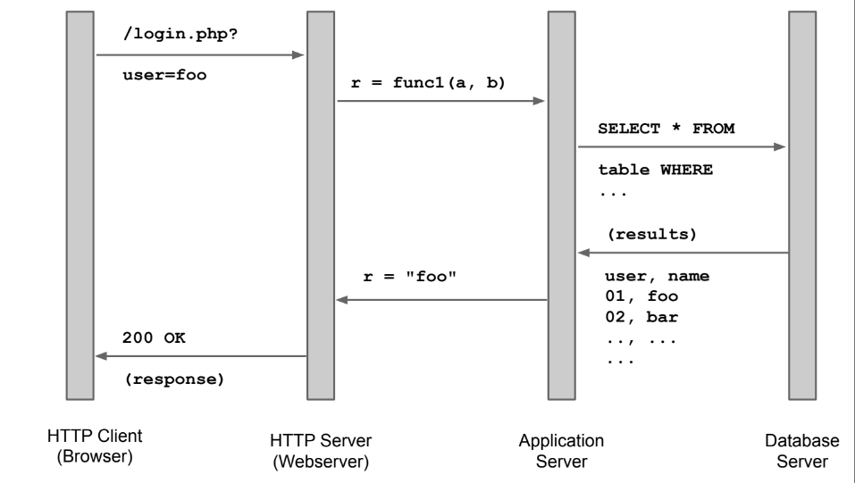

# Introduction to web security

Web application are built on top of HTTP, which is a **stateless** protocol that has only weak authentication built in. State and authentication are emulted by the application, they are not embedded in the protocol.

In this environment the golden rule is that the **client is never trustworthy**: we need to **filter** anche check carefully anything that it is sent to us.

The problem is that **filtering is hard**. There are varius way of filtering:
- **whitelisting**: only allowing through what we expect
- **blacklisting**: discard known bad stuff
- **escaping**: transform special characters into something else less dangerous

The basic rule is that *whitelisting is safer than blacklisting**.