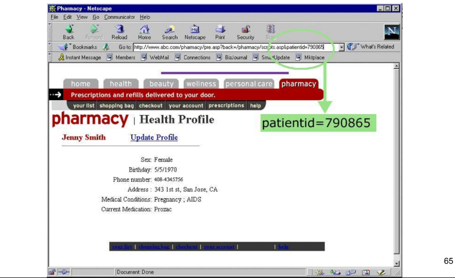
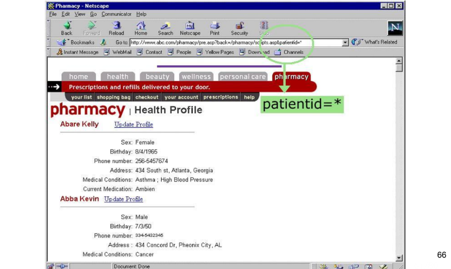
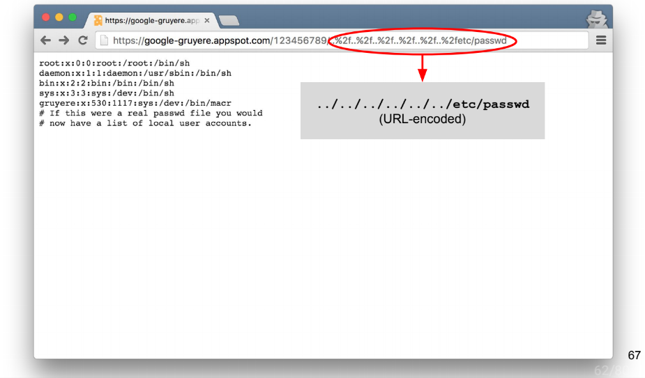

# Other vulnerabilities

## Freudian slips (information leaks)
- Dettailed error messages
- Display user-supplied data in errors
- Side-channels (e.g. "user not found" vs "password mismatch")
- Debug in production

## Url parameter tampering

## Directory/Path traversal
