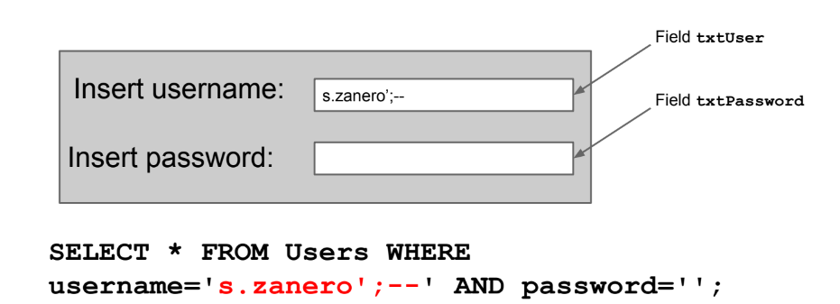

# SQL injection

SQL injection is a web security vulnerability that allows an attacker to interfere with the queries that an application makes to its database. It generally allows an attacker to view data that they are not normally able to retrieve. This might include data belonging to other users, or any other data that the application itself is able to access. In many cases, an attacker can modify or delete this data, causing persistent changes to the application's content or behavior. 

This query gets executed and, if the user exists, it grants access.

### Blind injections
Some SQL queries do not display returned values but we can infer the data observing how the application behaves.

For example if login is granded, or if the page takes a lot to load insering a `SLEEP(2)`.

## Fighting SQL injections
- Using **input sanitization** (validation and filtering)
- Using **prepared statements** (parametic query) instead of building "query strings"
- Not using table names as field names
- Limit query privileges