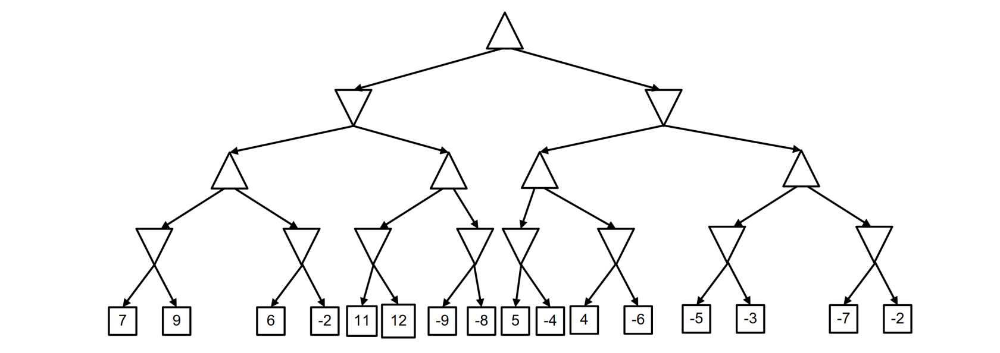
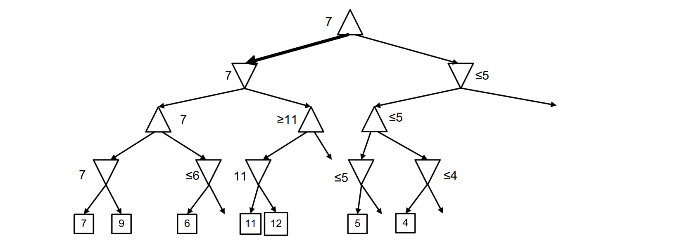

# alpha-beta pruning

Reduces the complexity of the minimax search by not considering
branches of the game tree that cannot influence the final decision

Alpha-beta pruning returns the same
outcome of the “vanilla” minimax search.

Two parameters:
- $\alpha$: It represents the value of the best move found so far for MAX (“at least”)
- $\beta$: It represents the value of the best move found so far for MIN ("at most")

The pruning works as follow:
- Update the a and b values as soon as possible
- Interrupt the search below a MAX node when the a value is larger or equal to the b value
- Interrupt the search below a MIN node when the b value is smaller or equal to the a value

Alpha–beta pruning can be applied to trees of any depth, and it is often possible to prune
entire subtrees rather than just leaves. The general principle is this: consider a node $n$
somewhere in the tree such that Player has a choice of moving to $n$. If
Player has a better choice either at the same level or at any point
higher up in the tree, then Player will never move to $n$.

## Complexity
Given the maximum number of legal moves in a state is b, minimax search will expand $O(b^h)$ nodes but the efficiency of alpha-beta pruning depends on the order in which nodes are examined. In the best case, alpha-beta pruning expands $O(b^{h/2})$ nodes.

In the average case (nodes considered in random order), alpha-beta pruning expands $O(b^{3h/4})$ nodes

# Exam questions
### 2017 02 03 Q2 (6 points)
Consider the following tree representing a zero-sum game, where triangles
pointing up are max nodes, triangles pointing down are min nodes, and squares are terminal nodes with
the corresponding value of utility function for max player.

Apply the minimax algorithm with alpha-beta pruning for finding the best action for the max player
at the root. Clearly report the parts of the tree that are pruned and best action found.

  
Solution

  
  

