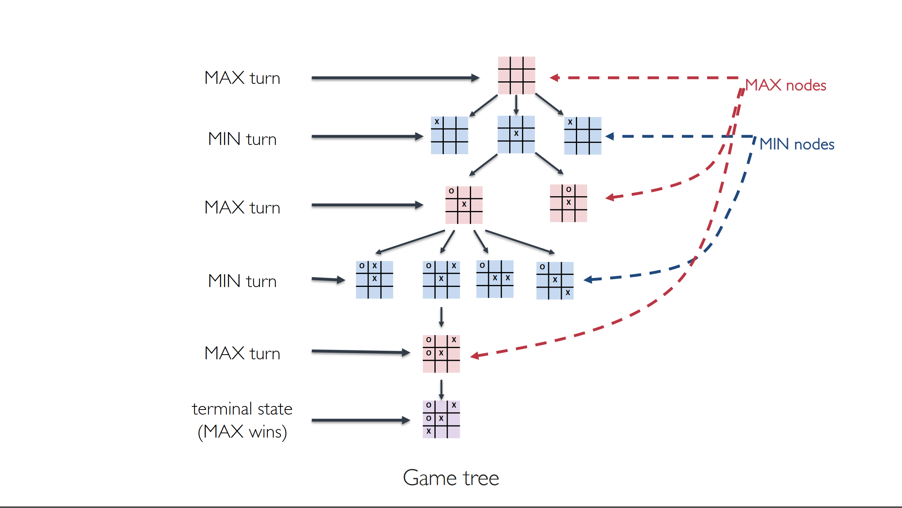

# Introduction

In this chapter we cover **competitive environments**, in which two or more agents have
conflicting goals, giving rise to adversarial search problems.

We consider games with
- two players
- turn-taking
- zero sum
- perfect information
- deterministic and stochastic (they can include elements of chance)
- Zero sum: if a player wins (+1), the other player looses (–1); the sum is thus zero
- Perfect information: The agent has perfect information about the game state
which is fully observable (like chess, unlike poker)

## Games as Search Problems
Games can be formulated as search problems with an element
of uncertainty due to the actions (moves) of the opponent

At each turn, a player must choose the action to play without
the possibility to explore the whole state space and, in general, there is no sequence of actions that makes a player win independently of the actions of the opponent.

- Two players, **MAX** and **MIN**, that take turn. **MAX moves first**.
- **Intial set up** of the game (initial configuration of the board) is known.
- Function **Action(s)**: Given a state s, returns the set of legal moves in s
- Function **Result(s)**: Defines the state resulting from taking action a in state s
- **Goal test**: Given a state, returns true if the game is over
- **Utility(s,p)**:  Returns the numerical value to player p in terminal state s (e.g., +1, 0, or –1)

Solving the game corresponds to finding the best
action for MAX (or for MIN) in a given state.