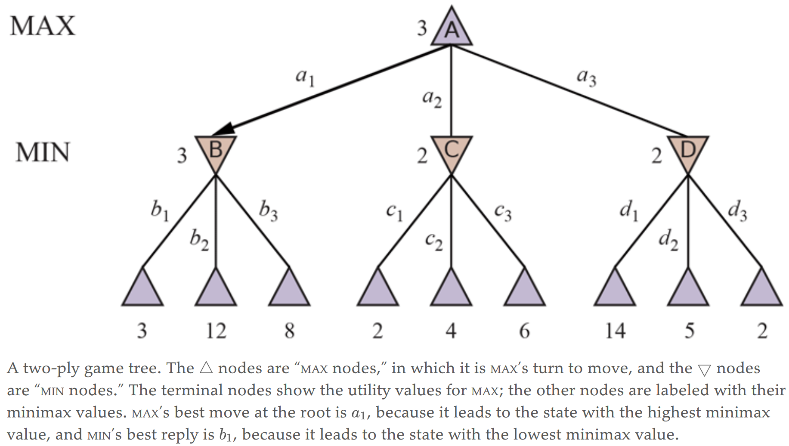
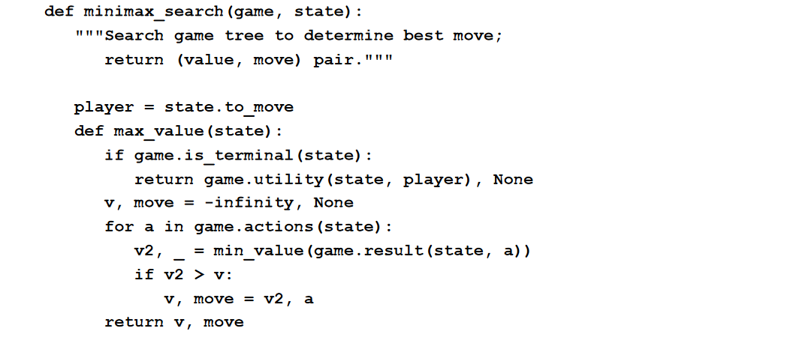
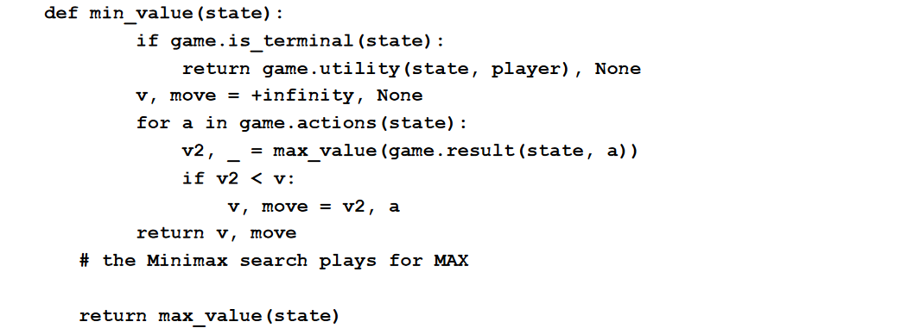
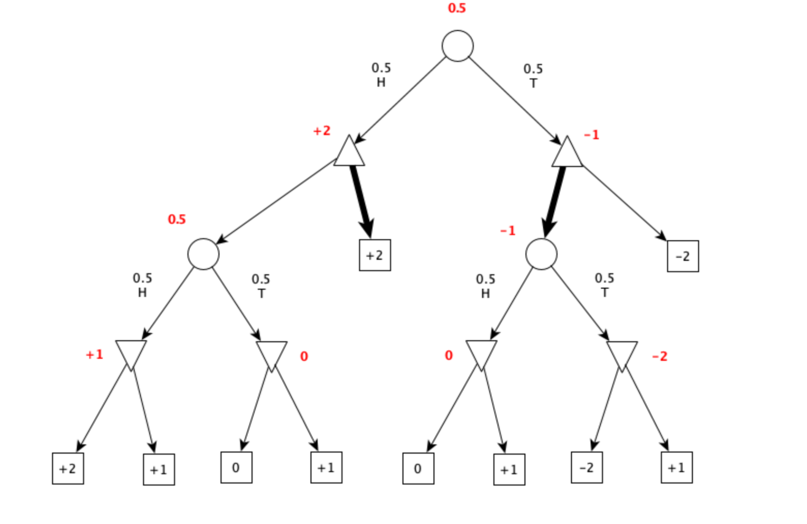

# Minimax search

MAX wants to find a sequence of actions leading to a win, but MIN has something to say about
it. This means that MAX’s strategy must be a conditional plan—a contingent strategy
specifying a response to each of MIN’s possible moves.

Given a game tree, the optimal strategy can be determined by working out the **minimax
value** of each state in the tree, which we write as MINIMAX(s). The minimax value is the utility
(for MAX) of being in that state, assuming that both players play optimally from there to the end
of the game.

## Algorithm
It is a recursive algorithm that
proceeds all the way down to the leaves of the tree (like depth-first) and then **backs up** the minimax values
through the tree as the recursion unwinds. 

## Complexity
The minimax algorithm performs a complete depth-first exploration of the game tree. 

If the
maximum depth of the tree is $m$ and there are $b$ legal moves at each point, then the time
complexity of the minimax algorithm is $O(b^m)$. The space complexity is $O(bm)$ for an
algorithm that generates all actions at once, or $O(m)$ for an algorithm that generates actions
one at a time.

## Evaluation
Minimax is **optimal when using the utility function**
(when the entire game tree is built)

## Evaluation function
To make use of our limited computation time, we can cut off the search early and apply a
heuristic **evaluation function** to states, effectively treating nonterminal nodes as if they were
terminal. In other words, we replace the UTILITY function with EVAL, which estimates a state’s
utility. We also replace the terminal test by a **cutoff test**, which must return true for terminal
states, but is otherwise free to decide when to cut off the search, based on the search depth
and any property of the state that it chooses to consider.

A heuristic evaluation function $Eval(s,p)$ returns an estimate of the expected utility of state $s$ to player $p$. For terminal states, it must be that $Eval(s,p) = Utility(s,p)$ and for nonterminal
states, the evaluation must be somewhere between a loss and a win:
$$Utility(loss,p) \le Evals(s,p) \le Utility(min,p)$$

What makes for a good evaluation function? First, the
**computation must not take too long**! (The whole point is to search faster.) Second, the
evaluation function should be **strongly correlated with the actual chances of winning**.

Most evaluation functions work by calculating various
features of the state—for example, in chess, we would have features for the number of white
pawns, black pawns, white queens, black queens, and so on.

# Exam questions
### 2020 02 13 Q2
Consider the following game with chance between two players, Max and Min. At start a coin is flipped
and the outcome is either head (H) or tail (T). Then Max plays by either stopping or continuing the game. If Max stops on H,
the game ends and Max gets 2 euros from Min. If Max stops on T, the game ends and Max loses 2 euros to Min. If Max continues
the game, either on H or on T, the coin is flipped again. If the outcome of the two coin flips is HH, Max could get 2 euros from
Min. If the outcome of the two coin flips is TT, Max could lose 2 euros to Min. If the outcome of the two coin flips is HT or TH,
both players could get 0 euros. At this point, the game continues and Min ends the game deciding whether to keep the current
outcome (values as above) or to pay to Max 1 euro.
Apply the expectiminimax algorithm to the above game, show the game tree, the values of nodes, and illustrate the best
strategy for Max.

