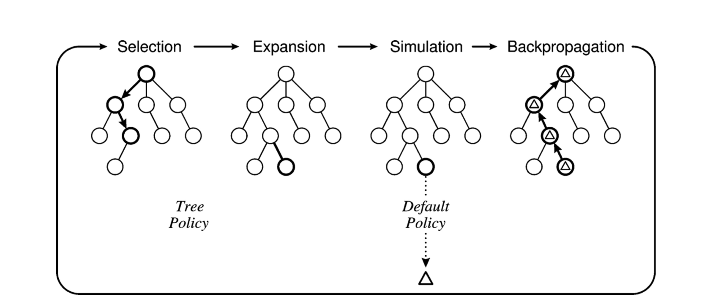

# Monte Carlo Tree Search

The basic MCTS strategy does **not use a heuristic evaluation function**. Instead, the value of a
state is estimated as the average utility over a number of **simulations of complete games**
starting from the state. A simulation (also called a playout or rollout) chooses moves first
for one player, than for the other, repeating until a terminal position is reached.

To get
useful information from the playout we need a **playout policy** that biases the moves towards
good ones. For Go and other games, playout policies have been successfully learned from
self-play by using neural networks.

Need to balance exploration of states that have had few playouts, and exploitation of states that have done
well in past playouts, to get a more accurate estimate of their value. 

Montecarlo does that maintaining a search tree and growing it on each iteration of the following four steps:
- **Selection**: It descends the game tree selecting successors using a selection policy until either a node
with an unexpanded branch or a leaf is reached
- **Expansion**: We grow the search tree by generating a new child of the selected node.
- **Simulation**: We perform a playout from the newly generated child node, choosing
moves for both players according to the playout policy. These moves are not recorded in
the search tree.
- **Backpropagation**: We now use the result of the simulation to update all the
search tree nodes going up to the root.

## UCB1
UCB1(n) is a common solution to balance
exploration and exploitation in MCTS. The node with the largest UCB1(n) is selected
where UCB1(n) is:
$$UCB1(n) = \frac{U(n)}{N(n)}+C \cdot \sqrt{\frac{log(N(Parent(n))}{N(n)}}$$
- $U(n)$: Utility of node $n$ (number of wins)
- $N(n)$: Number of simulation involving $n$
- $Parent(n)$: Number of simulation involving the parent of $n$
- $C$: Exploration parameter

# Exam questions
### 2018 02 22 Q3
Clarify the main ideas underlying Monte Carlo Tree Search (MCTS): explain what
MCTS is, what it is used for, and describe its main features.

  
Solution

  
MCTS is a method for finding optimal solutions by randomly sampling the solution space and building a
search tree accordingly. For example, it is used in games with very large configuration spaces.
MCTS works by iterating four steps, as shown in the figure:
- selection: a child selection policy is recursively applied to descend through the tree until the most
urgent expandable node is reached (a node is expandable if it represents a nonterminal state and
has unexpanded children),
- expansion: one (or more) child nodes are added to expand the tree, according to the available
actions,
- simulation: a simulation is run from the new node(s) according to the default policy to produce
an outcome,
- backpropagation: the simulation result is “backed up” (i.e., backpropagated) through the
selected nodes to update their statistics.
  
Tree policy selects or creates a leaf node from the nodes already contained within the search tree
(selection and expansion).
Default policy plays out the problem (game) from a given non-terminal state to produce a value
estimate (simulation).

