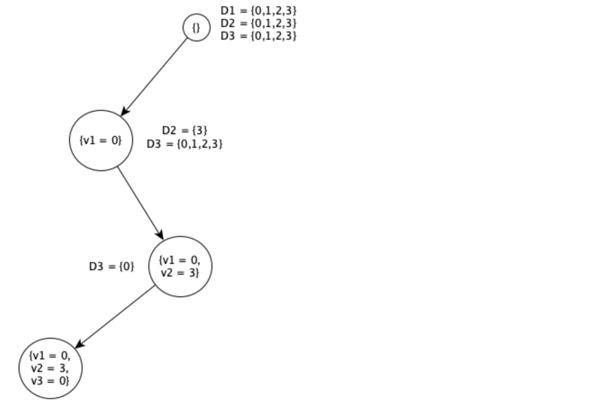

# Backtracking Search for CSPs

Sometimes we can finish the constraint propagation process and still have variables with
multiple possible values. In that case we have to search for a solution.

CSP is **commutative**: the order of application of any given set of actions does not
matter. We need only consider a *single* variable at each node in the
search tree.

With this
restriction, the number of leaves is $d^n$, as we would hope (instead of $n! \cdot d^n$). At each level of the tree we do
have to choose which variable we will deal with, but we never have to backtrack over that
choice.

Backtracking repeatedly chooses an
unassigned variable, and then tries all values in the domain of that variable in turn, trying to extend each one into a solution via a recursive call. If the call succeeds, the solution is
returned, and if it fails, the assignment is restored to the previous state, and we try the next
value. If no value works then we return failure.

## Variable and value ordering
Which variable $X$ should be assigned next?
- The current assignment could not bring to any solution, but we might need time to
discover this
- Choose the right variable in order to discover inconsistencies in the current assignment
as soon as possible

Two heuristics:
- minimum-remaining-values (MRV)
- Degree 

In what order should the values of $X$ be considered?
- The current assignment could bring to a solution (could be part of a solution)
- Choose the right value to assign to $X$ in order to reach the solution as quickly as
possible

One heuristic:
- Least-constraining-value

*These aspects are domain-independent and made possibile by the factored representation
of the state*

### minimum-remaining-values (MRV) heuristic
It also has been called the “most constrained
variable” or “fail-first” heuristic, the latter because it picks a variable that is most likely to
cause a failure soon, thereby pruning the search tree. 

If some variable $X$ has no legal values
left, the MRV heuristic will select $X$ and failure will be detected immediately—avoiding
pointless searches through other variables. The MRV heuristic usually performs better than
a random or static ordering, sometimes by orders of magnitude, although the results vary
depending on the problem.

### Degree heuristic
Choose the variable that is involved in the largest number of constraints with unassigned
variables and it's used to break ties of the MRV heuristic.

### Least-constraining-value heuristic
Choose the value that gives «more freedom» to the variables that are not yet assigned

## Interleaving search and inference
We saw how AC-3 can reduce the domains of variables *before* we begin the search. But
inference can be even more powerful *during* the course of a search: every time we make a
choice of a value for a variable, we have a brand-new opportunity to infer new domain
reductions on the neighboring variables.

One of the simplest forms of inference is called **forward checking**. Whenever a variable $X$ is
assigned, the forward-checking process establishes arc consistency for it: for each
unassigned variable $Y$ that is connected to $X$  by a constraint, delete from $Y$’s domain any
value that is inconsistent with the value chosen for $X$.

A more powerful approach is to use AC-3, but instead
of a queue of all arcs in the CSP, we start with only the arcs $(X_j, X_i)$ for all $X_j$ that are
unassigned variables that are neighbors of $X_i$. From there, AC-3 does constraint
propagation in the usual way, and if any variable has its domain reduced to the empty set,
the call to AC-3 fails and we know to backtrack immediately.

# Exam questions
### 2020 01 20 Q2 (8 points)
Consider the following Constraint Satisfaction Problem (CSP):
- variables: $v_1$, $v_2$, $v_3$
- domains: $D_1$ = $D_2$ = $D_3$ = $\lbrace 0, 1, 2, 3, 4, 5 \rbrace$,
- constraints: $v_1 + v_2 = 3$, $v_1 \le v_3$, $v_2 +v_3 \le 3$.

After AC-3 the domain have been restricted to: $D_1 = D_2 = D_3 = \lbrace 0, 1, 2, 3 \rbrace$..

2. Then solve the above CSP using backtracking search with forward checking and Minimum Remaining Value (MRV) heuristic. Ties are broken lexicographically.
Report the search tree and, for each node, the updated domains of unassigned variables.
Report also the solution found.

  
Solution

  
- Assign in lexicographical order $v_1 = 0$. The domain: $D_2 = \lbrace 3 \rbrace, D_3 = \lbrace 0,1,2,3 \rbrace$
- $v_2 = 3$ because it is the most constrained variable. Then $D_3 = \lbrace 0 \rbrace$
- $v_3 = 0$ because it is the only unassigned variable. We found a solution.

