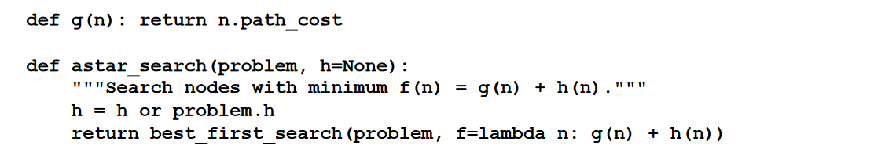
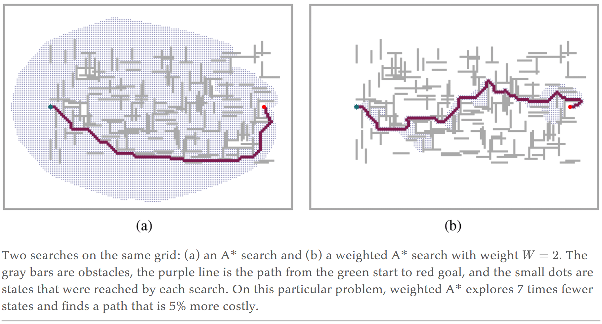
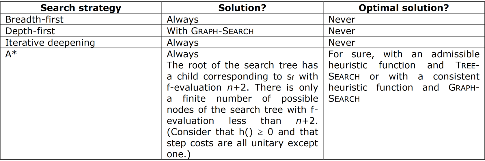

# A* search

The most common informed search algorithm is A* search (pronounced “A-star search”), a
best-first search that uses the evaluation function:
$$f(n) = g(n) + h(n)$$

Where $g(n)$ is the path cost from the initial state to the node $n$, and $h(n)$ is the estimated cost of the shortest path from $n$ to the goal state, so we have:

$f(n) = $ estimated cost of the best path that continues from $n$ to a goal.

## Evaluation
### Tree search
A* search is **complete** with tree search.

Whether A* is cost-optimal depends on certain properties of the
heuristic. A key property is **admissibility**: an admissible heuristic is one that never
overestimates the cost to reach a goal. (An admissible heuristic is therefore optimistic.) **With
an admissible heuristic, A\* is cost-optimal with tree-search**.

### Graph search
A slightly stronger property is called **consistency**. A heuristic $h(n)$ is consistent if, for every
node $n$ and every successor $n'$ of $n$ generated by an action $a$, we have:
$$h(n) ≤ c(n, a, n^′) + h(n^′)$$

This is a form of the **triangle inequality**, which stipulates that a side of a triangle cannot be
longer than the sum of the other two sides.

Every consistent heuristic is admissible (but not vice versa), so with a consistent heuristic,
A* is cost-optimal.

In addition, with a consistent heuristic, the first time we reach a state it
will be on an optimal path, so we never have to re-add a state to the frontier, and never
have to change an entry in *reached*. But with an inconsistent heuristic, we may end up with
multiple paths reaching the same state, and if each new path has a lower path cost than the
previous one, then we will end up with multiple nodes for that state in the frontier, costing
us both time and space. **A\* search with graph-search is guaranteed to be cost-optimal and complete only if h() is consistent**

In summary:
- Complete and optimal for tree-search when h(n) admissible
- Complete and optimal for graph-search when h(n) consistent
- With an inadmissible heuristic, A* may or may not be cost-optimal

## Efficiency
We say that A* with a consistent heuristic is **optimally efficient** in the sense that any
algorithm that extends search paths from the initial state, and uses the same heuristic
information, must expand all nodes that are surely expanded by A* (because any one of
them could have been part of an optimal solution).

## Weighted A* search
Weight the heuristic value more heavily, giving us the
evaluation function $f(n) = g(n) + W \times h(n)$, for some $W>1$.

## Iterative deepening A* (IDA*) search
Iterative-deepening A* search (IDA*) is to A* what iterative-deepening search is to depthfirst: IDA* gives us the benefits of A* without the requirement to keep all reached states in
memory, at a cost of visiting some states multiple times. It is a very important and
commonly used algorithm for problems that do not fit in memory.

### Evaluation
- Complete when h(n) is admissible
- Optimal when h(n) is admissible
- Complexity
	- IDA* search requires less memory than A* search and avoids to sort the frontier
	- However, IDA* cannot avoid to revisit states not on the current path, because it uses too little memory (it just remembers the current cutoff)
	- Thus, it is very efficient memory-wise but not time-wise since it revisits states.
    
# Exam questions
### 2020 02 12 Q1.3
Assume that you solve the problem using TREE-SEARCH and A* search strategy with two heuristic functions, both of them
admissible. Is it possible that using the two heuristic functions you find two different solutions? Explain why.

  
Solution

  
The solutions found by using two different admissible heuristic functions can be different, but they are guaranteed to have
the same cost, because they are both optimal.

### 2018 01 29 Q1 (8 points)
Consider the search problem described by the state space represented below,
where s0 is the initial state, sf is the only state that satisfies the goal test, all step costs are unitary if not
indicated, and n is a fixed integer number (n > 1).

Discuss the conditions under which the breadth-first, depth-first, iterative deepening, and A* search
strategies guarantee to find a solution to the above problem.
Discuss the conditions under which the same search strategies guarantee to find the optimal solution to
the above problem.
When relevant, distinguish between TREE-SEARCH (i.e., without elimination of repeated states) and
GRAPH-SEARCH (i.e., with elimination of repeated states)

  
Solution

  

