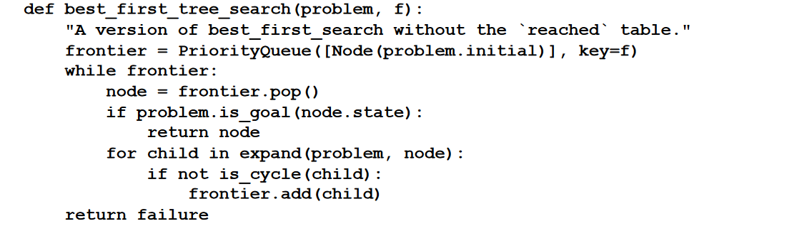
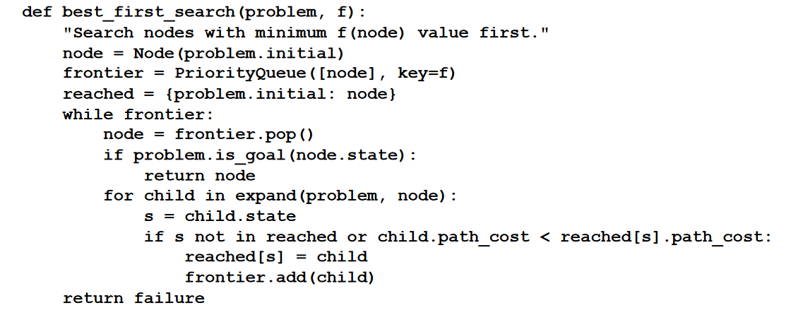

# Introduction

An informed search uses domain-specific hints
about the location of goals to find solutions more efficiently than an uninformed strategy.

The hints come in the form of a **heuristic function**, denoted $h(n)$:

$h(n) =$ stimated cost of the cheapest path from the state at node $n$ to a goal state.

For example, in route-finding problems, we can estimate the distance from the current state
to a goal by computing the straight-line distance on the map between the two points.

# Greedy best-first search
Greedy best-first search is a form of best-first search that expands first the node with the
lowest $h(n)$ value — the node that appears to be closest to the goal — on the grounds that this
is likely to lead to a solution quickly. So the evaluation function $f(n) = h(n)$.

- Tree best-first is not complete if there are cycles or if the space is infinite, complete if there are not or I check for them and the space is finite. Complexity, both time and space, is $O(b^{\min \lbrace m, |S| \rbrace })$.
- Graph is complete for finite state spaces but not for infinite ones. Complexity, both time and space, is $O(b^{\min \lbrace m, |S| \rbrace })$.