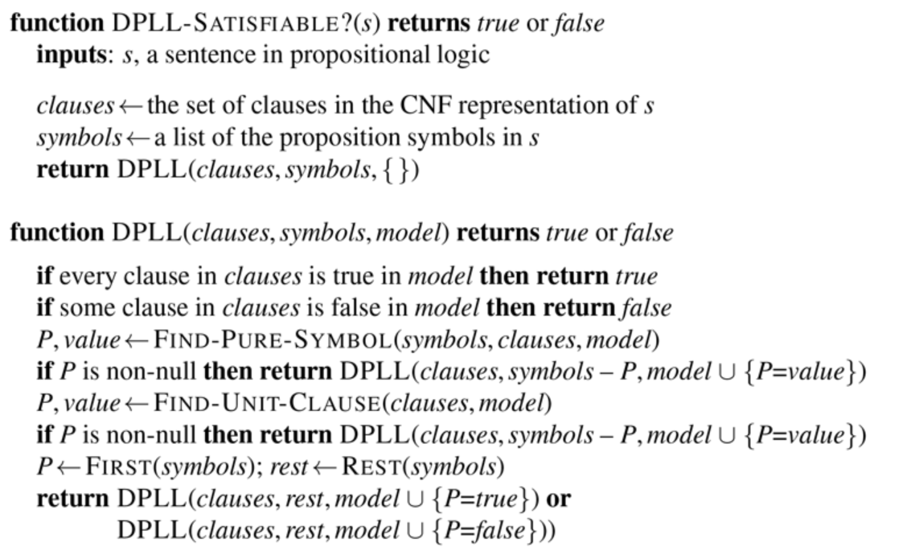

# Model checking

Our goal now is to decide whether $KB \models \alpha$ for some sentence $\alpha$.

## Reasoning with truth tables
Reasoning with truth tables is a form of semantic reasoning, in the sense that it directly exploits
the definition of entailment: 𝛼 ⊨ 𝛽 holds when 𝛽 in every model that makes 𝛼 true.

In PL, a model is an assignment of truth values (1 or 0, true or false, 𝑇 or ⊥) to every
propositional symbol that appears in 𝛼 or 𝛽 (or both)

Therefore, with $𝑛$ symbols we have $2^𝑛$ different models, which correspond to the rows of the
truth table

For every model (row), we compute the truth vales of 𝛼 and 𝛽 (by recursively computing the
truth values of all the subsentences of 𝛼 and 𝛽)
Then we have that 𝛼 ⊨ 𝛽 if, and only if, every model (row) that assigns 1 to 𝛼 also assigns 1 to 𝛽

### Properties
This reasoning procedure is **sound and complete**. It always terminates, making reasoning in PL decidable.

However, it is **inefficient** when many propositional symbols are involved, because it has to
compute a table of size $2^𝑛×𝑀$, where $𝑛$ is the number of propositional symbols and $𝑀$ is the
number of subsentences the appear in the premises and the conclusion

## Propositional satisfiability
Certain applications of PL require an agent to establish whether a set of sentences 𝛼 is or is not
**satisfiable**

The problem of establishing the satisfiability of a set of propositional sentences is known as **SAT**
Many interesting problems, including establishing propositional entailment, can be reduced to
SAT.

The problem of establishing propositional entailment can be reduced to a SAT problem, because
𝛼 ⊨ 𝛽 holds:
- if, and only if, every models that satisfies 𝛼 also satisfies 𝛽
- equivalently if, and only if, no model satisfies both 𝛼 and ¬𝛽
- equivalently if, and only if, 𝛼 ∧ ¬𝛽 is unsatisfiable

A (rather inefficient) solution of SAT is given by truth tables: 𝛼 is satisfiable if, and only if, it has
truth value 1 in at least one row of its truth table

### DPLL
Establish whether a set of sentences 𝛼 is or is not satisfiable

Preprocessing: convert every sentence in **CNF (Conjunctive Normal Form)**

Body of the procedure: from an empty assignment, incrementally try to build a model of 𝛼
- if a model is built, 𝛼 is satisfiable
- if the algorithm terminates without being able to build a model, 𝛼 is unsatisfiable
    
### DPLL algorithm
Essentially a backtracking (depth-first) search over models with some extras:
- **Early termination**: stop when
	- all clauses are satisfied: (𝐴 ∨ 𝐵) ∧ (𝐴 ∨ ¬𝐶) is satisfied by {𝐴 = 1}
	- any clause is falsified: (𝐴 ∨ 𝐵) ∧ (𝐴 ∨ ¬𝐶) is falsified by {𝐴 = 0, 𝐵 = 0}
- **Pure literals**: if all occurrences of a symbol in yet-unsatisfied clauses have the same sign, then give the
symbol that value
	- in (𝐴 ∨ 𝐵) ∧ (𝐴 ∨ ¬𝐶) ∧ (𝐶 ∨ ¬𝐵), 𝐴 is pure and positive, so set it to true
	- if there is a model, then there is a model also with {... , 𝐴 = 1, ... }
- **Unit clauses**: if a clause has a single literal, set the corresponding symbol to satisfy clause
	- in (𝐴 ∨ 𝐵) ∧ ¬𝐶, ¬𝐶 must be set to true {𝐶 = 0}
    

    
### DPLL Example
Check if the set of sentences 𝛼 = {𝐴 → 𝐵 ∨ 𝐶, ¬𝐶, 𝐴 ∧ 𝐵 → 𝐷, 𝐶 → ¬𝐷} is satisfiable

Convert in CNF
- 𝐴 → 𝐵 ∨ 𝐶 becomes ¬𝐴 ∨ 𝐵 ∨ 𝐶
- ¬𝐶 becomes ¬𝐶
- 𝐴 ∧ 𝐵 → 𝐷 becomes ¬𝐴 ∨ ¬𝐵 ∨ 𝐷
- 𝐶 → ¬𝐷 becomes ¬𝐶 ∨ ¬𝐷

| Assignments | Clauses | Rule |
| - | - | - |
|  | ¬A ∨ B ∨ C, ¬C, ¬A ∨ ¬B ∨ D, ¬C ∨ ¬D | unit clause ¬C |
| ¬C | ¬A ∨ B T ¬A ∨ ¬B ∨ D T | pure literal ¬A |
| ¬A | T T T T | early termination |

Conclusion: the set of sentences 𝛼 = {𝐴 → 𝐵 ∨ 𝐶, ¬𝐶, 𝐴 ∧ 𝐵 → 𝐷, 𝐶 → ¬𝐷} is satisfiable
(because it is satisfied by any complete assignment extending {¬𝐶 = 1, ¬𝐴 = 1})

# Exam questions
### 2020 02 13 Q3
Explain the purpose and functioning of the DPLL algorithm, clarifying the meaning of the technical terms
of Propositional Logic that you use in your explanation. Then describe (either in pseudocode or by a clear and unambiguous
description in ordinary language) how the algorithm works. For each main step of the algorithm, provide a justification based
on the laws of Propositional Logic.

### 2019 01 18 Q3
Define the following concepts in the context of Propositional Logic, clarifying the meaning of
the main technical terms that you use:
- Sentence $\alpha$ is satisfiable.
- Sentence $\alpha$ entails sentence $\beta$.

On the basis of the previous definitions, explain how (and justify why) a procedure able to establish whether a
sentence is or is not satisfiable can be used to establish whether sentence $\alpha$ entails sentence $\beta$.

  
Solution

  
Sentence $\alpha$ is satisfiable iff there is a model that satisfies it. In Propositional Logic, a model is an assignment of
truth values to all propositional symbols. A model satisfies a sentence if the sentence is true under the
assignment.
  
Sentence $\alpha$ entails sentence $\beta$ iff every model of $\alpha$ is also a model of $\beta$.
  
$\alpha$ entails $\beta$ iff $\alpha \land \lnot\beta$ is unsatisfiable. In fact, that $\alpha \land \lnot\beta$ is unsatisfiable means that no model satisfies $\alpha$ and $\lnot\beta$
at the same time; therefore, if a model satisfies $\alpha$, it also satisfies $\beta$.

Finally, use the DPLL algorithm to establish whether the set of premises
$A \to B \lor C, B \to A \lor D, C \to B \lor D, D \to C$
entails the conclusion $¬A$