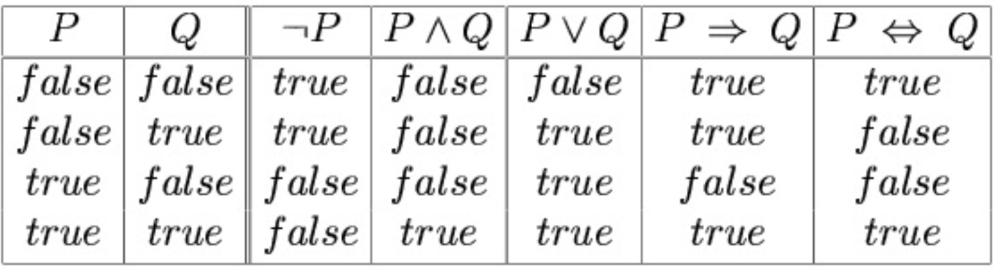

# Propositional Logic

## Syntax
The syntax of propositional logic defines the allowable **sentences**. The **atomic sentences**
consist of a single proposition symbol. Each such symbol stands for a proposition that can
be **true or false**. We use symbols that start with an uppercase letter and may contain other
letters or subscripts.

There are two proposition symbols with fixed
meanings: *True* is the always-true proposition and *False* is the always-false proposition.

**Complex sentences** are constructed from simpler sentences, using parentheses and
operators called logical connectives:
- **negation**: If $\alpha$ is a sentence, $\neg\alpha$ is a sentence
- **conjunction**: If $\alpha$ and $\beta$ are sentences, $\alpha \land \beta$ is a sentence
- **disjunction**: If $\alpha$ and $\beta$ are sentences, $\alpha \lor \beta$ is a sentence
- **implication**: If $\alpha$ and $\beta$ are sentences, $\alpha \implies \beta$ is a sentence
- **biconditional**: If $\alpha$ and $\beta$ are sentences, $\alpha \iff \beta$ is a sentence

## Validity and satisfiability
A sentence is valid if it is true in all models. Validity is connected to entailment via the **deduction theorem**:  $KB \models \alpha$ if and only if $KB \implies \alpha$ is valid.

- A sentence is **satisfiable** if it is true in some model
- A sentence is **unsatisfiable** if it is true in no models
- Satisfiability is connected to entailment via the following (refutation or contradiction): $KB \models \alpha$ if and only if $KB \land \lnot\alpha$ is unsatisfiable

## Conjunctive normal form (CNF)
CNF (Conjunctive Normal Form) represents a sentence as a conjunction of clauses, where a clause is a
disjunction of literals and a literal is either a propositional symbol or the negation of a symbol.

*Every sentence of propositional logic is logically equivalent to a conjunction of clauses.*

- 𝐴 → 𝐵 ∨ 𝐶 becomes ¬𝐴 ∨ 𝐵 ∨ 𝐶
- 𝐶 → ¬𝐷 becomes ¬𝐶 ∨ ¬𝐷
- (𝐴 → 𝐵 ∨ 𝐶) ∧ (𝐶 → ¬𝐷) becomes ¬𝐴, 𝐵, 𝐶 , {¬𝐶, ¬𝐷}

**Unit clause**: clause with only one literal; e.g., ¬𝐶, 𝐶

The steps to convert to CNF are (Consider 𝐴 ↔ (𝐵 ∨ 𝐶)):
1. Eliminate ↔, replacing α ↔ 𝛽 with α → 𝛽 ∧ 𝛽 → α
	- (𝐴 → 𝐵 ∨ 𝐶 ) ∧ ( 𝐵 ∨ 𝐶 → 𝐴)
2. Eliminate →, replacing α → 𝛽 with ¬α ∨ 𝛽
	- (¬𝐴 ∨ 𝐵 ∨ 𝐶) ∧ (¬ 𝐵 ∨ 𝐶 ∨ 𝐴)
3. Move ¬ inwards using de Morgan's rules (¬ 𝛼 ∧ 𝛽 is equivalent to ¬α ∨ ¬𝛽 and
¬ 𝛼 ∨ 𝛽 is equivalent to ¬α ∧ ¬𝛽) and double-negation (¬¬𝛼 is equivalent to 𝛼)
	- (¬𝐴 ∨ 𝐵 ∨ 𝐶) ∧ ((¬𝐵 ∧ ¬𝐶) ∨ 𝐴)
4. Apply distributivity law (∧ over ∨) and flatten
	- (¬𝐴 ∨ 𝐵 ∨ 𝐶) ∧ (¬𝐵 ∨ 𝐴) ∧ (¬𝐶 ∨ 𝐴)