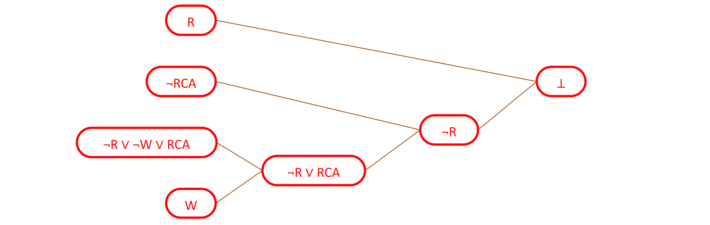
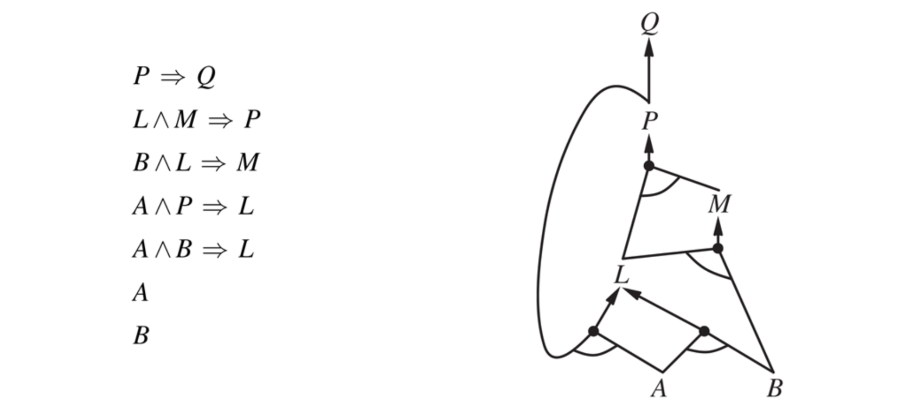
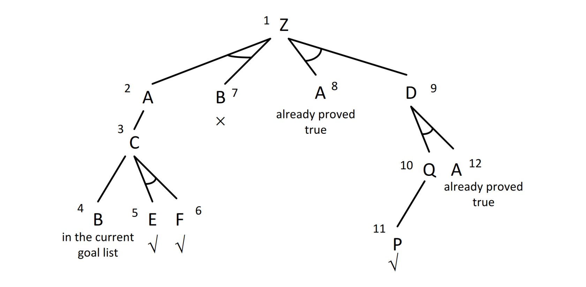

# Theorem proving

Other than model checking entailment can be done by theorem proving—applying rules of inference directly to the
sentences in our knowledge base to construct a proof of the desired sentence without
consulting models. If the number of models is large but the length of the proof is short, then
theorem proving can be more efficient than model checking.

### Horn and definite clause
We define an **Horn clause** as a special PL sentence in one of the two following forms:
- (conjunction of symbols) → symbol, for example $𝐶 ∧ 𝐷 → 𝐵$
- propositional symbol, for example $A$. It is equivalent to $True \to A$.

A Horn clause is a clause with **at most** one positive literal, while a **definite clause** has **exactly one** positive
literal.

### 1) Resolution
Resolution is similar to DPLL (when this is used to establish entailment): it starts from a CNF
representation of the premises and the negation of the conclusion

Resolution applies (in all the possible ways) the resolution rule to the clauses (original ones and
those derived by the previous applications of the resolution rule)

Suppose 𝐶1, 𝐶2 are clauses such that literal ℓ1 in 𝐶1 and literal ℓ2 in 𝐶2 are complementary
(same propositional symbol with different sign), then clauses 𝐶1, 𝐶2 can be resolved into a
new clause 𝐶 called resolvent
C = (𝐶1 − {ℓ1}) ∪ (𝐶2 − {ℓ2})

The resolution clause *should only contain only one copy of each literal*. The removal of multiple copies of literals is called **factoring**. For example, if we resolve $A \lor B$ with $A \lor \lnot B$, we obtain $A \lor A$, which is reduced to just $A$ by factoring.

#### Resolution properties
- Propositional resolution is an extremely powerful rule of inference for PL
- It works by refutation: to prove that KB ⊨ 𝛼 it proves that KB ∧ ¬𝛼 is unsatisfiable, namely it builds a
refutation for KB ∧ ¬𝛼 by looking for the empty clause
- Using propositional resolution, it is possible to build a theorem prover that is sound and complete for PL
	- **Resolution rule is sound**
	- Theorem: resolvent 𝐶 is satisfiable if and only if clauses 𝐶1, 𝐶2 are simultaneously satisfiable
	- Since resolvent is smaller than parent clauses, resolution stops at some point
- Propositional resolution works on any set of sentences in clausal form (CNF)

#### Resolution strategies
We can define some different resolution strategies and their completeness:
- **Unit resolution**: at least one of the parent clauses is a unit clause (it contains a single literal). *Incomplete in general, but complete for Horn clauses*.
- **Input resolution**: at least one of the two parent clauses is a member of the initial (i.e., input) set of clauses ($KB ∧ \lnot \alpha$). *Incomplete in general, but complete for Horn clauses*.
- **Linear resolution**: generalization of input resolution in which at least one of the parents is either
in the initial set of clauses or is an ancestor of the other parent. *Complete*.
- **Set of support resolution**: given a set of support 𝑆 (which is a subset of the initial clauses such
that the clauses not in 𝑆 are satisfiable), every resolution involves a clause in 𝑆 (the resolvent is
added to 𝑆).
- ...

### 2) Forward chaining
The forward-chaining algorithm determines if a single proposition
symbol —the query—is entailed by a knowledge base of definite clauses.
It begins from
known facts (positive literals) in the knowledge base. If all the premises of an implication
are known, then its conclusion is added to the set of known facts. For example, if $A$ and $B$ are known and $A \land B \to C$ is in the knowledge base then $C$ can be added.
This process continues until the query q is added or until no further inferences can
be made. 

In an **AND-OR graph** multiple edges joined by an arc indicate a conjunction while without an arc a disjunction. For example:

#### Properties of forward chaining
Forward chaining is *sound and complete for KBs composed of definite clauses*
- Soundness: follows from soundness of Modus Ponens (easy to check)
- Completeness: the algorithm reaches a a fixed point from where no new atomic sentences can
be derived

Forward chaining can only derive new positive literals (facts), it cannot derive new rules

### 3) Backward chaining
The backward-chaining algorithm, as its name suggests, works backward from the query. 

If
the query $q$ is known to be true, then no work is needed. Otherwise, the algorithm finds
those implications in the knowledge base whose conclusion is $q$. If all the premises of one of
those implications can be proved true (by backward chaining), then $q$ is true.

In summary:
- Start from the goal (query) 𝑞, which is a positive literal
- To prove 𝑞, check if 𝑞 is already in the KB, otherwise prove all the premises of a rule concluding
𝑞
- Avoid loops: check if new subgoal is already on the goal stack
- Avoid repeated work: check if new subgoal has already been proved true, or has already failed

*Backward chaining is sound and complete for KBs composed of definite clauses*

# Exam questions
### 2017 02 23 Q3 (7 points) Resolution
Consider the following knowledge base (KB) in propositional logic:
1. $A \to \lnot B$
2. $\lnot A \to \lnot B$
3. $A \lor B$

Prove, using resolution with the input resolution strategy, $A \to B$ can be derived from the KB.

  
Solution

  
The first step is to trasform in CNF and add the negation of the solution:
1. $\lnot A \lor \lnot B$
2. $A \lor \lnot B$
3. $A \lor B$
4. $\lnot (\lnot A \lor B)$, with De Morgan's rules:
	1. $A$
    2. $\lnot B$

Then apply resolution:

(1) $\lnot A \lor \lnot B$ and (3) $A \lor B$ become $B \lor \lnot B$ and $A \lor \lnot A$

We have reached a fixed point because any other application of the resolution rule with the input
resolution strategy will not produce any new knowledge.
  
  
So, $A \to B$ cannot be derived from the KB using resolution with the input resolution strategy.

### 2017 02 03 Q3 (6 points) Backward chaining
Consider the following knowledge base (KB) in propositional logic:

Prove, using backward chaining, if KB logically entails $Z$. Everything else being equal, apply the rules
in the order given above.
Report the generated tree and the order of expansion of its nodes.

  
Solution

  

  
Since $Z$ can be derived from KB using backward chaining, which is a sound inference procedure for propositional logic, then $Z$ is logically entailed by the KB.

### 2016 03 03 Q4 (6 points) Resolution with set of support
Consider the following knowledge base (KB) composed of formulas of propositional
logic:
1. $BatteryOK \land BulbsOK \to HeadlightsWork$
2. $BatteryOK \land StarterOK \to EmptyGasTank \lor EngineStarts$
3. $EngineStarts \to FlatTire \to CarOk$
4. $HeadlightsWork$
5. $BatteryOK$
6. $StarterOK$
7. $\lnot EmptyGasTank$
8. $\lnot CarOK$

Prove if $FlatTire$ is true or false, by using the resolution inference procedure with the set of support
strategy (considering the set of support composed of the goal clause and of any other clause already
derived). Use the unit resolution strategy to break ties.

  
Solution

  
The KB converted in conjunctive normal form becomes:
1. $\lnot BatteryOK \lor \lnot BulbsOK \lor HeadlightsWork$
2. $\lnot BatteryOK \lor \lnot StarterOK \lor EmptyGasTank \lor EngineStarts$
3. $\lnot EngineStarts \lor FlatTire \lor CarOk$
4. $HeadlightsWork$
5. $BatteryOK$
6. $StarterOK$
7. $\lnot EmptyGasTank$
8. $\lnot CarOK$

The negation of the formula we would like to prove is:

9. $\lnot FlatTire$

Applying resolution with set of support, considering initially $S=\lbrace\lnot FlatTire\rbrace$, and unit resolution to break
ties, we get:

10. $(3,9) \lnot EngineStarts \lor CarOk$$
11. $(8,10) \lnot EngineStarts$
12. $(2,11) \lnot BatteryOK \lor \lnot StarterOK \lor EmptyGasTank$
13. $(5,12) \lnot StarterOK \lor EmptyGasTank$
14. $(6,13) EmptyGasTank$
15. $(7,14) \bot$

### 2015 02 07 Q4 (6 points) Forward chaining
Consider the following knowledge base (KB) composed of sentences of first-
order logics modeling a plumbing system:

1) $Pressurized(P1)$
2) $Pressurized(P1) \land On(T1) \to Pressurized(P2)$
3) $Pressurized(P2) \land On(T2) \to FlowShower$
4) $FlowShower \to WetBathTube$
5) $WetBathTube \land UnpluggedBathTube \to Flow(D2)$
6) $Flow(D2) \to Flow(D1)$
7) $Pipe(P1)$
8) $Tap(T1)$
9) $Tap(T2)$
10) $Pipe(D2)$
11) $On(T1)$
12) $On(T2)$
13) $UnpluggedBathTube$

Then solve the following questions:
1. Apply forward chaining to the KB reported above to derive all the sentences entailed by the KB.

  
Solution

  
14) $Pressurized(P2)$ from 1 + 11 + 2
15) $FlowShower$ from 12 + 14 + 3
16) $WetBathTubre$ from 15 + 4
17) $Flow(D2)$ from 16 + 13 + 5
18) $Flow(D1)$ from 17 + 6

2. Modify (change, add, or remove sentences) the above KB to model that, when the bath tube is
plugged and the shower flows, the floor is wet. If new predicates are introduced, the (intuitive)
consistency with existing predicates should be explicitly enforced. For example, the bath tube cannot be
both wet and dry. Hint: the KB does not need to contain only definite clauses.

  
Solution

  
$\lnot UnpluggedBathTube \land FlowShower \to WetFloor$

