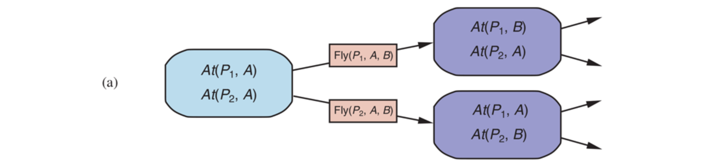
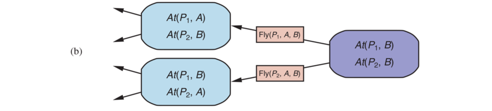
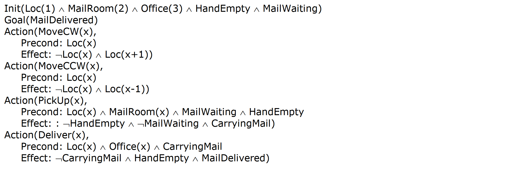
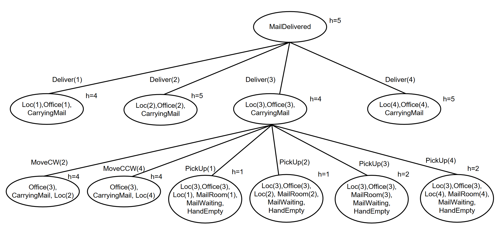
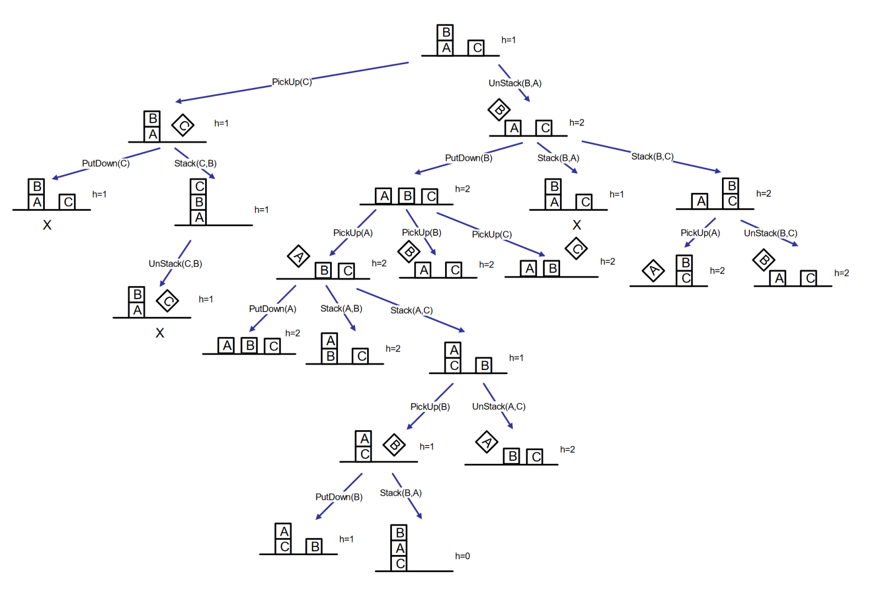

# Algorithms for Classical Planning

The description of a planning problem provides an obvious way to search from the initial
state through the space of states, looking for a goal. A nice advantage of the declarative
representation of action schemas is that we can also search backward from the goal, looking
for the initial state. A third
possibility is to translate the problem description into a set of logic sentences, to which we
can apply a logical inference algorithm to find a solution.

## Forward planning

Search in the state space from the initial state to a state satisfying the goal and the formulation is the one of a classical search problem.

| Search problem | Forward planning |
| - | - |
|initial state | initial state|
|ACTIONS(s) | instances of action schemas applicable in 𝑆|
|RESULT(s,a) | application of 𝐴 in 𝑆|
|goal test | is the goal satisfied in the current state?|
|step cost | cost of applying actions (unitary, in some cases)|

We can solve planning problems by applying any of the heuristic search algorithms.

The states in this search state space are ground states, where
every fluent is either true or not. The goal is a state that has all the positive fluents in the
problem’s goal and none of the negative fluents. The applicable actions in a state, Actions(s), are grounded instantiations of the action schemas—that is, actions where the variables
have all been replaced by constant values.

To determine the applicable actions we unify the current state against the preconditions of
each action schema. For each unification that successfully results in a substitution, we apply
the substitution to the action schema to yield a ground action with no variables.

### Forward planning problems
1. Forward planning can be inefficient, for example when the number of possible actions is large and the branching factor is large.
2. Usually, there are much more actions that are applicable in a state than actions that are relevant
to reach a goal
3. Need for accurate heuristics 

## Backward planning

In backward search (also called regression search) we start at the goal and apply the actions
backward until we find a sequence of steps that reaches the initial state. At each step we
consider **relevant actions** (in contrast to forward search, which considers actions that are
applicable). This reduces the branching factor significantly, particularly in domains with
many possible actions.

A relevant action is one with an effect that unifies with one of the goal literals, but with no
effect that negates any part of the goal.

The regression of a goal 𝐺 through a relevant action 𝐴 is the less constraining goal 𝑅[𝐺, 𝐴] such
that, given a state 𝑆 that satisfies 𝑅\[𝐺, 𝐴]:
- The preconditions of 𝐴 are satisfied in 𝑆
- The application of 𝐴 in 𝑆 reaches a state 𝑆’ that satisfies 𝐺

That is, the preconditions must have held before, or else the action could not have been
executed, but the positive/negative literals that were added/deleted by the action need not
have been true before.

| Search problem | Backward planning |
| - | - |
|initial state | goal |
|ACTIONS(s) | actions that allow the regression of a sub-goal 𝐺 |
|RESULT(s,a) | regression of a sub-goal 𝐺 through an action 𝐴 |
|goal test | is the goal satisfied in the initial state? |
|step cost | cost of applying actions (unitary, in some cases) |

# Exam questions
### 2017 02 23 Q5 (6 points) Backward planning
Consider the problem of delivering mail using a mobile robot in a building with 4
rooms, which is represented as the following planning problem in STRIPS:

Solve the problem with **backward planning** in the goal space using the **greedy best-first search**
strategy **with elimination of repeated states**.

Consider a heuristic function h() that returns the
number of literals unsatisfied. Everything else being equal, consider actions in the order provided above,
the lexicographic order for the arguments, and the last generated node. For the effect of MoveCW
consider that 4 + 1 = 1; for MoveCCW consider that 1 – 1 = 4.
Report the search tree after the expansion of two nodes (including the root)

  
Solution

  

### 2016 03 03 Q5 (6 points) Theory: forward vs backward planning
Explain the differences between forward planning and backward planning
for solving planning problems formulated in STRIPS.
Then, answer the following questions:
1. Why are forward planning and backward planning said to search in the space of states and in the space
of goals, respectively?
2. Which one of the two approaches (forward planning and backward planning) can generate inconsistent
situations? Why? How can these inconsistencies be managed?

  
Solution

  
Forward planning formulates a search problem that starts from the initial state of the planning problem
and applies all the applicable actions, in order to reach a state that satisfies the goal of the planning
problem.
  
Backward planning, instead, formulates a search problem that starts from the goal of the planning problem
and applies all the regressions of the goal through relevant and consistent actions, in order to reach a
state that is satisfied by the initial state of the planning problem.
1. The states of the search problem formulated by forward planning are states of the planning problem.
The states of the search problem formulated by backward planning are goals of the planning problem.
2. Backward planning can generate states of the search problem (= goals of the planning problem) that
are inconsistent (for example, they can contain On(A,B) and On(B,A) literals).
This situation can be managed by resorting to procedures that are external to the planning process. These
procedures check the consistency of goals and allow to stop the search if a goal refers to inconsistent
situations, because that goal cannot be satisfied.

### 2015 02 07 Q5 (6 points) Forward planning
Consider the following planning problem relative to the block world and
formulated in STRIPS.
- Init: $OnTable(A) \land OnTable(C) \land On(B,A) \land GripperEmpty \land Clear(B) \land Clear(C)$
- Goal: $On(B,A) \land On(A,C)$

- Action $PickUp(x)$:
	- Precond: $GripperEmpty \land Clear(x) \land OnTable(x)$
	- Effect: $Gripping(x) \land \lnot OnTable(x) \land \lnot Clear(x) \land \lnot GripperEmpty$
- Action $PutDown(x)$:
	- Precond: $Gripping(x)$
	- Effect: $OnTable(x) \land GripperEmpty \land Clear(x) \land \lnot Gripping(x)$
- Action $Stack(x,y)$:
	- Precond: $Clear(y) \land Gripping(x)$
	- Effect: $On(x,y) \land GripperEmpty \land Clear(x) \land \lnot Clear(y) \land \lnot Gripping(x)$
- Action $UnStack(x,y)$:
	- Precond: $Clear(x) \land GripperEmpty \land On(x,y)$
	- Effect: $Gripping(x) \land Clear(y) \land \lnot GripperEmpty \land \lnot On(x,y) \land \lnot Clear(x)$

Solve the problem by **forward planning** using a **greedy best-first** search strategy **with elimination
of repeated states** (graph search). 

Heuristic function returns the number of unsatisfied goal
conjuncts. Everything else being equal, consider the earliest generated node, the actions in the order in
which they are written above, and the alphabetical order for arguments.
Report the search tree and the solution.

  
Solution

  

